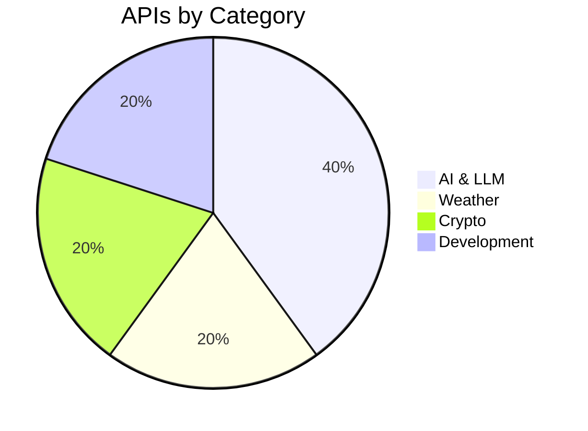

  
  <h1>🌍 Free APIs Universe</h1>
  
<b>The Ultimate Hybrid API Database: Visual, Curated, and Technical.</b>

  

    
    
    
  

## 🌟 Featured API of the Day

> ### GitHub 🚀
> API for GitHub repositories, users, and organizations.
> - **Category:** development
> - **Auth:** `OAuth` | **Free Tier:** Unlimited (Authenticated 5000/hr)
> - **Docs:** [Read Here](https://docs.github.com/en/rest)

## 👨‍💻 Hardcore Technical Metrics
Real-time telemetry and raw integration snippets for top-scoring APIs.

| Rank | API | Uptime (30d) | Avg Latency | Score | Integration Snippet |
| ---- | --- | ------------ | ----------- | ----- | ------------------- |
| 1 | **GitHub** | 99.99% | 120ms | 99/100 | 

cURL
`curl https://api.github.com/users/octocat`
 |
| 2 | **Open-Meteo** | 99.99% | 130ms | 95/100 | 

cURL
`curl https://api.open-meteo.com/v1/forecast?latitude=52.52&longitude=13.41&current_weather=true`
 |
| 3 | **Google Gemini** | 99.99% | 140ms | 93/100 | 

cURL
`curl https://generativelanguage.googleapis.com/v1beta/models/gemini-pro`
 |
| 4 | **CoinGecko** | 99.95% | 150ms | 85/100 | 

cURL
`curl https://api.coingecko.com/api/v3/ping`
 |
| 5 | **OpenAI** | 99.95% | 160ms | 83/100 | 

cURL
`curl https://api.openai.com/v1/models`
 |

## 🗂 Category Overview & Exploration
Click a category to expand its APIs.

<h3>📁 AI & LLM (2 APIs)</h3>

| API | Description | Auth | Free Tier | Docs | Website |
| --- | ----------- | ---- | --------- | ---- | ------- |
| **Google Gemini** | Google's most capable and general model for text, vision, and audio. | `apiKey` | Generous Free Tier | [Docs](https://ai.google.dev/docs) | [Site](https://ai.google.dev) |
| **OpenAI** | API for accessing OpenAI's powerful language models like GPT-4. | `apiKey` | No | [Docs](https://platform.openai.com/docs/api-reference) | [Site](https://openai.com) |

[View Full AI & LLM Category Page](categories/ai-llm.md)

<h3>📁 Weather (1 APIs)</h3>

| API | Description | Auth | Free Tier | Docs | Website |
| --- | ----------- | ---- | --------- | ---- | ------- |
| **Open-Meteo** | Free open-source weather API with no API key required. | `No` | 10,000 requests/day | [Docs](https://open-meteo.com/en/docs) | [Site](https://open-meteo.com) |

[View Full Weather Category Page](categories/weather.md)

<h3>📁 Crypto (1 APIs)</h3>

| API | Description | Auth | Free Tier | Docs | Website |
| --- | ----------- | ---- | --------- | ---- | ------- |
| **CoinGecko** | Cryptocurrency price and market data API. | `No` | 10-50 calls/minute | [Docs](https://www.coingecko.com/en/api/documentation) | [Site](https://www.coingecko.com) |

[View Full Crypto Category Page](categories/crypto.md)

<h3>📁 Development (1 APIs)</h3>

| API | Description | Auth | Free Tier | Docs | Website |
| --- | ----------- | ---- | --------- | ---- | ------- |
| **GitHub** | API for GitHub repositories, users, and organizations. | `OAuth` | Unlimited (Authenticated 5000/hr) | [Docs](https://docs.github.com/en/rest) | [Site](https://github.com) |

[View Full Development Category Page](categories/development.md)

## 📊 APIs by Category Distribution

## 🔍 Advanced Search
Use these tags to filter the repository natively in GitHub search:

`#no-auth` `#api-key` `#oauth` `#graphql` `#rest` `#open-source` `#student-friendly` `#high-rate-limit` `#web3` `#real-time` 

## 💯 API Quality Score Matrix
Every API in this repository is strictly graded algorithmically out of 100 points:
| Metric | Max Points | Weighting |
| ------ | ---------- | --------- |
| Documentation | 20 | ⭐⭐⭐⭐⭐ |
| Reliability | 20 | ⭐⭐⭐⭐⭐ |
| Popularity | 20 | ⭐⭐⭐ |
| Free Tier | 20 | ⭐⭐⭐⭐ |
| Developer Experience | 20 | ⭐⭐⭐⭐ |