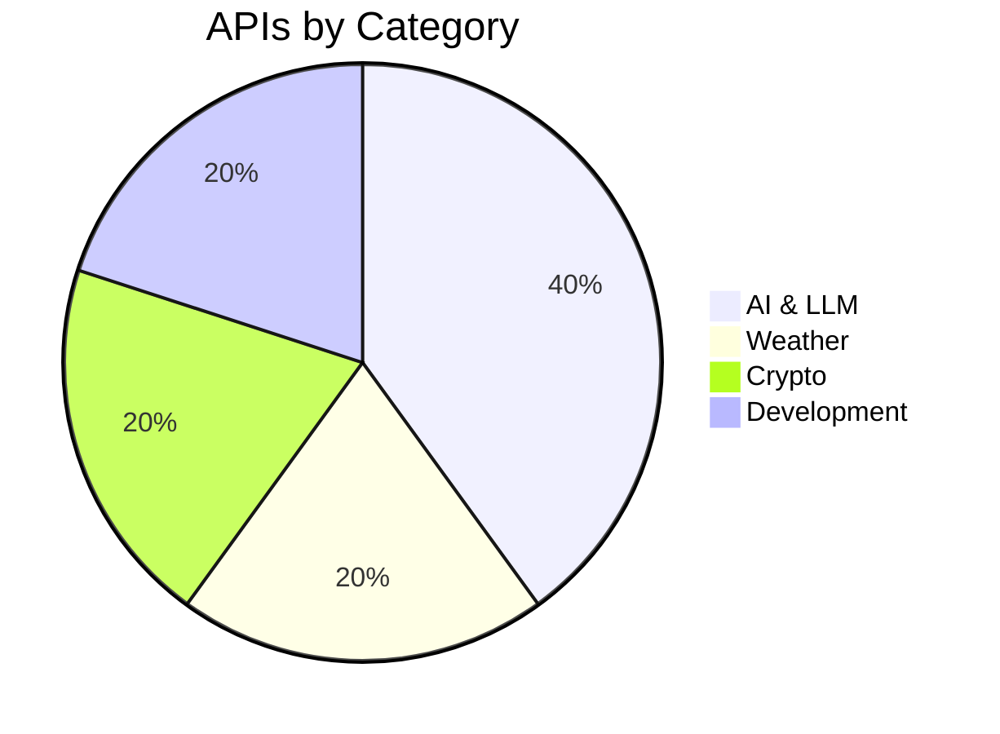

# 🌍 Free APIs Universe
> The most advanced API database for developers, researchers, and startups.

## Repository Statistics
| Metric | Value |
| ------ | ----- |
| Total APIs | 5+ |
| Categories | 13 |
| Verified APIs | 100% |
| No Auth APIs | 2 |
| Open Source APIs | 1 |
| Last Verification | 2026-06-14 |

## Category Overview
| Category | APIs |
| -------- | ---- |
| [AI & LLM](categories/ai-llm.md) | 2 |
| [Weather](categories/weather.md) | 1 |
| [Crypto](categories/crypto.md) | 1 |
| [Development](categories/development.md) | 1 |
| [Finance](categories/finance.md) | 0 |
| [Sports](categories/sports.md) | 0 |
| [Movies](categories/movies.md) | 0 |
| [Books](categories/books.md) | 0 |
| [Maps](categories/maps.md) | 0 |
| [Space](categories/space.md) | 0 |
| [News](categories/news.md) | 0 |
| [Government](categories/government.md) | 0 |
| [Security](categories/security.md) | 0 |

## APIs by Category

## Top 50 APIs Overall
| Rank | API | Score | Docs |
| ---- | --- | ----- | ---- |
| 1 | GitHub | 99/100 | [Docs](https://docs.github.com/en/rest) |
| 2 | Open-Meteo | 95/100 | [Docs](https://open-meteo.com/en/docs) |
| 3 | Google Gemini | 93/100 | [Docs](https://ai.google.dev/docs) |
| 4 | CoinGecko | 85/100 | [Docs](https://www.coingecko.com/en/api/documentation) |
| 5 | OpenAI | 83/100 | [Docs](https://platform.openai.com/docs/api-reference) |

## Advanced Search
### Search by Category
- [AI & LLM](categories/ai-llm.md)
- [Weather](categories/weather.md)
- [Finance](categories/finance.md)
- [Crypto](categories/crypto.md)
- [Sports](categories/sports.md)
- [Movies](categories/movies.md)
- [Books](categories/books.md)
- [Maps](categories/maps.md)
- [Space](categories/space.md)
- [News](categories/news.md)
- [Government](categories/government.md)
- [Development](categories/development.md)
- [Security](categories/security.md)

### Search by Tags
#no-auth 
#api-key 
#oauth 
#graphql 
#rest 
#open-source 
#student-friendly 
#high-rate-limit 
#web3 
#real-time 

## API Quality Score
Every API gets strictly graded:
| Score Component | Points |
| --------------- | ------ |
| Documentation | 20 |
| Reliability | 20 |
| Popularity | 20 |
| Free Tier | 20 |
| Developer Experience | 20 |