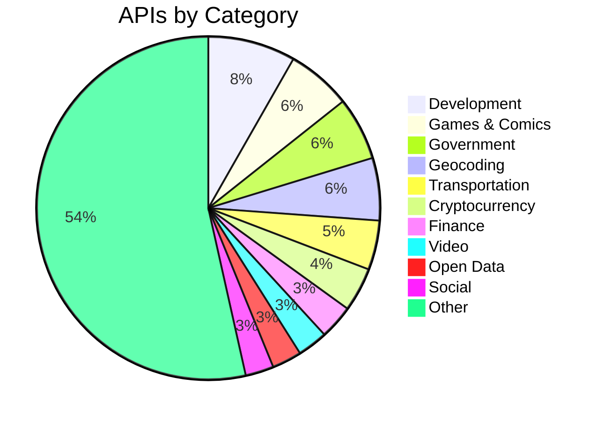
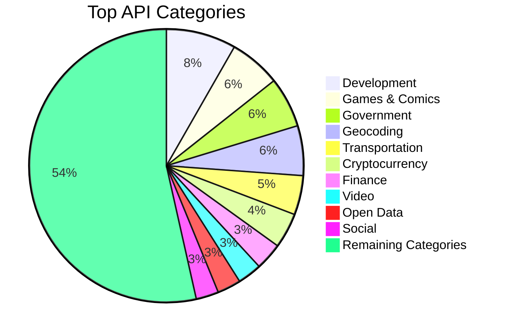
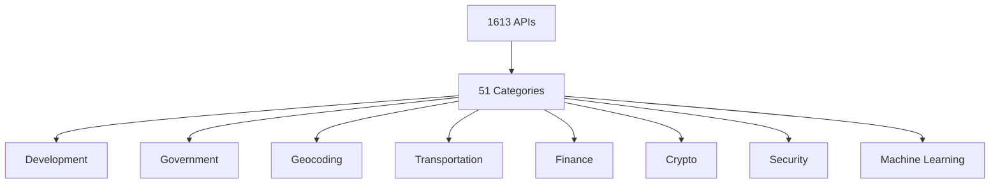

# Free APIs for Developers

The definitive collection of 1613 free and freemium APIs for developers.

| Metric       | Value        |
| ------------ | ------------ |
| Total APIs   | 1613 |
| Categories   | 51 |
| Last Updated | 2026-06-14  |

---

# CATEGORY INDEX

| Category | APIs |
| -------- | ---- |
| Animals | 28 |
| Anime | 20 |
| Anti-Malware | 16 |
| Art & Design | 23 |
| Authentication & Authorization | 8 |
| Blockchain | 14 |
| Books | 28 |
| Business | 27 |
| Calendar | 19 |
| Cloud Storage & File Sharing | 19 |
| Continuous Integration | 7 |
| Cryptocurrency | 67 |
| Currency Exchange | 19 |
| Data Validation | 8 |
| Development | 133 |
| Dictionaries | 14 |
| Documents & Productivity | 35 |
| Email | 21 |
| Entertainment | 17 |
| Environment | 19 |
| Events | 4 |
| Finance | 52 |
| Food & Drink | 26 |
| Games & Comics | 98 |
| Geocoding | 95 |
| Government | 96 |
| Health | 37 |
| Jobs | 21 |
| Machine Learning | 29 |
| Music | 36 |
| News | 22 |
| Open Data | 45 |
| Open Source Projects | 10 |
| Patent | 5 |
| Personality | 26 |
| Phone | 8 |
| Photography | 30 |
| Programming | 6 |
| Science & Math | 36 |
| Security | 42 |
| Shopping | 16 |
| Social | 43 |
| Sports & Fitness | 42 |
| Test Data | 28 |
| Text Analysis | 19 |
| Tracking | 11 |
| Transportation | 75 |
| URL Shorteners | 21 |
| Vehicle | 11 |
| Video | 46 |
| Weather | 35 |

---

# LEADERBOARDS

## Top 100 APIs Overall

| API Name | Category | Auth | HTTPS | Free Tier |
| -------- | -------- | ---- | ----- | --------- |
| :--- | Animals | :--- | :--- | Yes |
| AdoptAPet | Animals | `apiKey` | Yes | Yes |
| Axolotl | Animals | No | Yes | Yes |
| Cat Facts | Animals | No | Yes | Yes |
| Cat Facts | Animals | No | Yes | Yes |
| Cataas | Animals | No | Yes | Yes |
| Cats | Animals | `apiKey` | Yes | Yes |
| Dog Facts | Animals | No | Yes | Yes |
| Dog Facts | Animals | No | Yes | Yes |
| Dogs | Animals | No | Yes | Yes |
| eBird | Animals | `apiKey` | Yes | Yes |
| FishWatch | Animals | No | Yes | Yes |
| HTTP Cat | Animals | No | Yes | Yes |
| HTTP Dog | Animals | No | Yes | Yes |
| IUCN | Animals | `apiKey` | No | Yes |
| MeowFacts | Animals | No | Yes | Yes |
| Movebank | Animals | No | Yes | Yes |
| Petfinder | Animals | `apiKey` | Yes | Yes |
| PlaceBear | Animals | No | Yes | Yes |
| PlaceDog | Animals | No | Yes | Yes |
| PlaceKitten | Animals | No | Yes | Yes |
| RandomDog | Animals | No | Yes | Yes |
| RandomDuck | Animals | No | Yes | Yes |
| RandomFox | Animals | No | Yes | Yes |
| RescueGroups | Animals | No | Yes | Yes |
| Shibe.Online | Animals | No | Yes | Yes |
| The Dog | Animals | `apiKey` | Yes | Yes |
| xeno-canto | Animals | No | Yes | Yes |
| :--- | Anime | :--- | :--- | Yes |
| AniAPI | Anime | `OAuth` | Yes | Yes |
| AniDB | Anime | `apiKey` | No | Yes |
| AniList | Anime | `OAuth` | Yes | Yes |
| AnimeChan | Anime | No | Yes | Yes |
| AnimeFacts | Anime | No | Yes | Yes |
| AnimeNewsNetwork | Anime | No | Yes | Yes |
| Catboy | Anime | No | Yes | Yes |
| Danbooru Anime | Anime | `apiKey` | Yes | Yes |
| Jikan | Anime | No | Yes | Yes |
| Kitsu | Anime | `OAuth` | Yes | Yes |
| MangaDex | Anime | `apiKey` | Yes | Yes |
| Mangapi | Anime | `apiKey` | Yes | Yes |
| MyAnimeList | Anime | `OAuth` | Yes | Yes |
| NekosBest | Anime | No | Yes | Yes |
| Shikimori | Anime | `OAuth` | Yes | Yes |
| Studio Ghibli | Anime | No | Yes | Yes |
| Trace Moe | Anime | No | Yes | Yes |
| Waifu.im | Anime | No | Yes | Yes |
| Waifu.pics | Anime | No | Yes | Yes |
| :--- | Anti-Malware | :--- | :--- | Yes |
| AbuseIPDB | Anti-Malware | `apiKey` | Yes | Yes |
| AlienVault Open Threat Exchange (OTX) | Anti-Malware | `apiKey` | Yes | Yes |
| CAPEsandbox | Anti-Malware | `apiKey` | Yes | Yes |
| Google Safe Browsing | Anti-Malware | `apiKey` | Yes | Yes |
| MalDatabase | Anti-Malware | `apiKey` | Yes | Yes |
| MalShare | Anti-Malware | `apiKey` | Yes | Yes |
| MalwareBazaar | Anti-Malware | `apiKey` | Yes | Yes |
| Metacert | Anti-Malware | `apiKey` | Yes | Yes |
| NoPhishy | Anti-Malware | `apiKey` | Yes | Yes |
| Phisherman | Anti-Malware | `apiKey` | Yes | Yes |
| Scanii | Anti-Malware | `apiKey` | Yes | Yes |
| URLhaus | Anti-Malware | No | Yes | Yes |
| URLScan.io | Anti-Malware | `apiKey` | Yes | Yes |
| VirusTotal | Anti-Malware | `apiKey` | Yes | Yes |
| Web of Trust | Anti-Malware | `apiKey` | Yes | Yes |
| :--- | Art & Design | :--- | :--- | Yes |
| Améthyste | Art & Design | `apiKey` | Yes | Yes |
| Art Institute of Chicago | Art & Design | No | Yes | Yes |
| Colormind | Art & Design | No | No | Yes |
| ColourLovers | Art & Design | No | No | Yes |
| Cooper Hewitt | Art & Design | `apiKey` | Yes | Yes |
| Dribbble | Art & Design | `OAuth` | Yes | Yes |
| DummyImage | Art & Design | No | Yes | Yes |
| EmojiHub | Art & Design | No | Yes | Yes |
| Europeana | Art & Design | `apiKey` | Yes | Yes |
| Harvard Art Museums | Art & Design | `apiKey` | No | Yes |
| Icon Horse | Art & Design | No | Yes | Yes |
| Iconfinder | Art & Design | `apiKey` | Yes | Yes |
| Icons8 | Art & Design | No | Yes | Yes |
| Lordicon | Art & Design | No | Yes | Yes |
| Metropolitan Museum of Art | Art & Design | No | Yes | Yes |
| Noun Project | Art & Design | `OAuth` | No | Yes |
| PHP-Noise | Art & Design | No | Yes | Yes |
| Pixel Encounter | Art & Design | No | Yes | Yes |
| Rijksmuseum | Art & Design | `apiKey` | Yes | Yes |
| UpRes | Art & Design | `apiKey` | Yes | Yes |
| Word Cloud | Art & Design | `apiKey` | Yes | Yes |
| xColors | Art & Design | No | Yes | Yes |
| :--- | Authentication & Authorization | :--- | :--- | Yes |
| Auth0 | Authentication & Authorization | `apiKey` | Yes | Yes |
| GetOTP | Authentication & Authorization | `apiKey` | Yes | Yes |
| Micro User Service | Authentication & Authorization | `apiKey` | Yes | Yes |
| MojoAuth | Authentication & Authorization | `apiKey` | Yes | Yes |
| SAWO Labs | Authentication & Authorization | `apiKey` | Yes | Yes |
| Stytch | Authentication & Authorization | `apiKey` | Yes | Yes |
| Warrant | Authentication & Authorization | `apiKey` | Yes | Yes |
| --- | Blockchain | :--- | :--- | Yes |
| Bitquery | Blockchain | `apiKey` | Yes | Yes |
| Blockscout | Blockchain | `apiKey` | Yes | Yes |
| Chainlink | Blockchain | No | Yes | Yes |
| Chainpoint | Blockchain | No | Yes | Yes |

---

# VISUALIZATION

---

# MASTER API DIRECTORY

## Animals APIs

| API Name | Description | Auth | HTTPS | Free Tier | Docs | Website |
| -------- | ----------- | ---- | ----- | --------- | ---- | ------- |
| :--- | :--- | :--- | :--- | Yes | [Docs]() | [Website]() |
| AdoptAPet | Resource to help get pets adopted | `apiKey` | Yes | Yes | [Docs](https://www.adoptapet.com/public/apis/pet_list.html) | [Website](https://www.adoptapet.com/public/apis/pet_list.html) |
| Axolotl | Collection of axolotl pictures and facts | No | Yes | Yes | [Docs](https://theaxolotlapi.netlify.app/) | [Website](https://theaxolotlapi.netlify.app/) |
| Cat Facts | Daily cat facts | No | Yes | Yes | [Docs](https://alexwohlbruck.github.io/cat-facts/) | [Website](https://alexwohlbruck.github.io/cat-facts/) |
| Cat Facts | Random cat facts | No | Yes | Yes | [Docs](https://catfact.ninja/) | [Website](https://catfact.ninja/) |
| Cataas | Cat as a service (cats pictures and gifs) | No | Yes | Yes | [Docs](https://cataas.com/) | [Website](https://cataas.com/) |
| Cats | Pictures of cats from Tumblr | `apiKey` | Yes | Yes | [Docs](https://docs.thecatapi.com/) | [Website](https://docs.thecatapi.com/) |
| Dog Facts | Random dog facts | No | Yes | Yes | [Docs](https://dukengn.github.io/Dog-facts-API/) | [Website](https://dukengn.github.io/Dog-facts-API/) |
| Dog Facts | Random facts of Dogs | No | Yes | Yes | [Docs](https://kinduff.github.io/dog-api/) | [Website](https://kinduff.github.io/dog-api/) |
| Dogs | Based on the Stanford Dogs Dataset | No | Yes | Yes | [Docs](https://dog.ceo/dog-api/) | [Website](https://dog.ceo/dog-api/) |
| eBird | Retrieve recent or notable birding observations within a region | `apiKey` | Yes | Yes | [Docs](https://documenter.getpostman.com/view/664302/S1ENwy59) | [Website](https://documenter.getpostman.com/view/664302/S1ENwy59) |
| FishWatch | Information and pictures about individual fish species | No | Yes | Yes | [Docs](https://www.fishwatch.gov/developers) | [Website](https://www.fishwatch.gov/developers) |
| HTTP Cat | Cat for every HTTP Status | No | Yes | Yes | [Docs](https://http.cat/) | [Website](https://http.cat/) |
| HTTP Dog | Dogs for every HTTP response status code | No | Yes | Yes | [Docs](https://http.dog/) | [Website](https://http.dog/) |
| IUCN | IUCN Red List of Threatened Species | `apiKey` | No | Yes | [Docs](http://apiv3.iucnredlist.org/api/v3/docs) | [Website](http://apiv3.iucnredlist.org/api/v3/docs) |
| MeowFacts | Get random cat facts | No | Yes | Yes | [Docs](https://github.com/wh-iterabb-it/meowfacts) | [Website](https://github.com/wh-iterabb-it/meowfacts) |
| Movebank | Movement and Migration data of animals | No | Yes | Yes | [Docs](https://github.com/movebank/movebank-api-doc) | [Website](https://github.com/movebank/movebank-api-doc) |
| Petfinder | Petfinder is dedicated to helping pets find homes, another resource to get pets adopted | `apiKey` | Yes | Yes | [Docs](https://www.petfinder.com/developers/) | [Website](https://www.petfinder.com/developers/) |
| PlaceBear | Placeholder bear pictures | No | Yes | Yes | [Docs](https://placebear.com/) | [Website](https://placebear.com/) |
| PlaceDog | Placeholder Dog pictures | No | Yes | Yes | [Docs](https://place.dog) | [Website](https://place.dog) |
| PlaceKitten | Placeholder Kitten pictures | No | Yes | Yes | [Docs](https://placekitten.com/) | [Website](https://placekitten.com/) |
| RandomDog | Random pictures of dogs | No | Yes | Yes | [Docs](https://random.dog/woof.json) | [Website](https://random.dog/woof.json) |
| RandomDuck | Random pictures of ducks | No | Yes | Yes | [Docs](https://random-d.uk/api) | [Website](https://random-d.uk/api) |
| RandomFox | Random pictures of foxes | No | Yes | Yes | [Docs](https://randomfox.ca/floof/) | [Website](https://randomfox.ca/floof/) |
| RescueGroups | Adoption | No | Yes | Yes | [Docs](https://userguide.rescuegroups.org/display/APIDG/API+Developers+Guide+Home) | [Website](https://userguide.rescuegroups.org/display/APIDG/API+Developers+Guide+Home) |
| Shibe.Online | Random pictures of Shiba Inu, cats or birds | No | Yes | Yes | [Docs](http://shibe.online/) | [Website](http://shibe.online/) |
| The Dog | A public service all about Dogs, free to use when making your fancy new App, Website or Service | `apiKey` | Yes | Yes | [Docs](https://thedogapi.com/) | [Website](https://thedogapi.com/) |
| xeno-canto | Bird recordings | No | Yes | Yes | [Docs](https://xeno-canto.org/explore/api) | [Website](https://xeno-canto.org/explore/api) |

## Anime APIs

| API Name | Description | Auth | HTTPS | Free Tier | Docs | Website |
| -------- | ----------- | ---- | ----- | --------- | ---- | ------- |
| :--- | :--- | :--- | :--- | Yes | [Docs]() | [Website]() |
| AniAPI | Anime discovery, streaming & syncing with trackers | `OAuth` | Yes | Yes | [Docs](https://aniapi.com/docs/) | [Website](https://aniapi.com/docs/) |
| AniDB | Anime Database | `apiKey` | No | Yes | [Docs](https://wiki.anidb.net/HTTP_API_Definition) | [Website](https://wiki.anidb.net/HTTP_API_Definition) |
| AniList | Anime discovery & tracking | `OAuth` | Yes | Yes | [Docs](https://github.com/AniList/ApiV2-GraphQL-Docs) | [Website](https://github.com/AniList/ApiV2-GraphQL-Docs) |
| AnimeChan | Anime quotes (over 10k+) | No | Yes | Yes | [Docs](https://github.com/RocktimSaikia/anime-chan) | [Website](https://github.com/RocktimSaikia/anime-chan) |
| AnimeFacts | Anime Facts (over 100+) | No | Yes | Yes | [Docs](https://chandan-02.github.io/anime-facts-rest-api/) | [Website](https://chandan-02.github.io/anime-facts-rest-api/) |
| AnimeNewsNetwork | Anime industry news | No | Yes | Yes | [Docs](https://www.animenewsnetwork.com/encyclopedia/api.php) | [Website](https://www.animenewsnetwork.com/encyclopedia/api.php) |
| Catboy | Neko images, funny GIFs & more | No | Yes | Yes | [Docs](https://catboys.com/api) | [Website](https://catboys.com/api) |
| Danbooru Anime | Thousands of anime artist database to find good anime art | `apiKey` | Yes | Yes | [Docs](https://danbooru.donmai.us/wiki_pages/help:api) | [Website](https://danbooru.donmai.us/wiki_pages/help:api) |
| Jikan | Unofficial MyAnimeList API | No | Yes | Yes | [Docs](https://jikan.moe) | [Website](https://jikan.moe) |
| Kitsu | Anime discovery platform | `OAuth` | Yes | Yes | [Docs](https://kitsu.docs.apiary.io/) | [Website](https://kitsu.docs.apiary.io/) |
| MangaDex | Manga Database and Community | `apiKey` | Yes | Yes | [Docs](https://api.mangadex.org/docs.html) | [Website](https://api.mangadex.org/docs.html) |
| Mangapi | Translate manga pages from one language to another | `apiKey` | Yes | Yes | [Docs](https://rapidapi.com/pierre.carcellermeunier/api/mangapi3/) | [Website](https://rapidapi.com/pierre.carcellermeunier/api/mangapi3/) |
| MyAnimeList | Anime and Manga Database and Community | `OAuth` | Yes | Yes | [Docs](https://myanimelist.net/clubs.php?cid=13727) | [Website](https://myanimelist.net/clubs.php?cid=13727) |
| NekosBest | Neko Images & Anime roleplaying GIFs | No | Yes | Yes | [Docs](https://docs.nekos.best) | [Website](https://docs.nekos.best) |
| Shikimori | Anime discovery, tracking, forum, rates | `OAuth` | Yes | Yes | [Docs](https://shikimori.one/api/doc) | [Website](https://shikimori.one/api/doc) |
| Studio Ghibli | Resources from Studio Ghibli films | No | Yes | Yes | [Docs](https://ghibliapi.herokuapp.com) | [Website](https://ghibliapi.herokuapp.com) |
| Trace Moe | A useful tool to get the exact scene of an anime from a screenshot | No | Yes | Yes | [Docs](https://soruly.github.io/trace.moe-api/#/) | [Website](https://soruly.github.io/trace.moe-api/#/) |
| Waifu.im | Get waifu pictures from an archive of over 4000 images and multiple tags | No | Yes | Yes | [Docs](https://waifu.im/docs) | [Website](https://waifu.im/docs) |
| Waifu.pics | Image sharing platform for anime images | No | Yes | Yes | [Docs](https://waifu.pics/docs) | [Website](https://waifu.pics/docs) |

## Anti-Malware APIs

| API Name | Description | Auth | HTTPS | Free Tier | Docs | Website |
| -------- | ----------- | ---- | ----- | --------- | ---- | ------- |
| :--- | :--- | :--- | :--- | Yes | [Docs]() | [Website]() |
| AbuseIPDB | IP/domain/URL reputation | `apiKey` | Yes | Yes | [Docs](https://docs.abuseipdb.com/) | [Website](https://docs.abuseipdb.com/) |
| AlienVault Open Threat Exchange (OTX) | IP/domain/URL reputation | `apiKey` | Yes | Yes | [Docs](https://otx.alienvault.com/api) | [Website](https://otx.alienvault.com/api) |
| CAPEsandbox | Malware execution and analysis | `apiKey` | Yes | Yes | [Docs](https://capev2.readthedocs.io/en/latest/usage/api.html) | [Website](https://capev2.readthedocs.io/en/latest/usage/api.html) |
| Google Safe Browsing | Google Link/Domain Flagging | `apiKey` | Yes | Yes | [Docs](https://developers.google.com/safe-browsing/) | [Website](https://developers.google.com/safe-browsing/) |
| MalDatabase | Provide malware datasets and threat intelligence feeds | `apiKey` | Yes | Yes | [Docs](https://maldatabase.com/api-doc.html) | [Website](https://maldatabase.com/api-doc.html) |
| MalShare | Malware Archive / file sourcing | `apiKey` | Yes | Yes | [Docs](https://malshare.com/doc.php) | [Website](https://malshare.com/doc.php) |
| MalwareBazaar | Collect and share malware samples | `apiKey` | Yes | Yes | [Docs](https://bazaar.abuse.ch/api/) | [Website](https://bazaar.abuse.ch/api/) |
| Metacert | Metacert Link Flagging | `apiKey` | Yes | Yes | [Docs](https://metacert.com/) | [Website](https://metacert.com/) |
| NoPhishy | Check links to see if they're known phishing attempts | `apiKey` | Yes | Yes | [Docs](https://rapidapi.com/Amiichu/api/exerra-phishing-check/) | [Website](https://rapidapi.com/Amiichu/api/exerra-phishing-check/) |
| Phisherman | IP/domain/URL reputation | `apiKey` | Yes | Yes | [Docs](https://phisherman.gg/) | [Website](https://phisherman.gg/) |
| Scanii | Simple REST API that can scan submitted documents/files for the presence of threats | `apiKey` | Yes | Yes | [Docs](https://docs.scanii.com/) | [Website](https://docs.scanii.com/) |
| URLhaus | Bulk queries and Download Malware Samples | No | Yes | Yes | [Docs](https://urlhaus-api.abuse.ch/) | [Website](https://urlhaus-api.abuse.ch/) |
| URLScan.io | Scan and Analyse URLs | `apiKey` | Yes | Yes | [Docs](https://urlscan.io/about-api/) | [Website](https://urlscan.io/about-api/) |
| VirusTotal | VirusTotal File/URL Analysis | `apiKey` | Yes | Yes | [Docs](https://docs.virustotal.com/reference/overview) | [Website](https://docs.virustotal.com/reference/overview) |
| Web of Trust | IP/domain/URL reputation | `apiKey` | Yes | Yes | [Docs](https://support.mywot.com/hc/en-us/sections/360004477734-API-) | [Website](https://support.mywot.com/hc/en-us/sections/360004477734-API-) |

## Art & Design APIs

| API Name | Description | Auth | HTTPS | Free Tier | Docs | Website |
| -------- | ----------- | ---- | ----- | --------- | ---- | ------- |
| :--- | :--- | :--- | :--- | Yes | [Docs]() | [Website]() |
| Améthyste | Generate images for Discord users | `apiKey` | Yes | Yes | [Docs](https://api.amethyste.moe/) | [Website](https://api.amethyste.moe/) |
| Art Institute of Chicago | Art | No | Yes | Yes | [Docs](https://api.artic.edu/docs/) | [Website](https://api.artic.edu/docs/) |
| Colormind | Color scheme generator | No | No | Yes | [Docs](http://colormind.io/api-access/) | [Website](http://colormind.io/api-access/) |
| ColourLovers | Get various patterns, palettes and images | No | No | Yes | [Docs](http://www.colourlovers.com/api) | [Website](http://www.colourlovers.com/api) |
| Cooper Hewitt | Smithsonian Design Museum | `apiKey` | Yes | Yes | [Docs](https://collection.cooperhewitt.org/api) | [Website](https://collection.cooperhewitt.org/api) |
| Dribbble | Discover the world’s top designers & creatives | `OAuth` | Yes | Yes | [Docs](https://developer.dribbble.com) | [Website](https://developer.dribbble.com) |
| DummyImage | Generate placeholder images with custom size, colors and text | No | Yes | Yes | [Docs](https://dummyimage.com/) | [Website](https://dummyimage.com/) |
| EmojiHub | Get emojis by categories and groups | No | Yes | Yes | [Docs](https://github.com/cheatsnake/emojihub) | [Website](https://github.com/cheatsnake/emojihub) |
| Europeana | European Museum and Galleries content | `apiKey` | Yes | Yes | [Docs](https://pro.europeana.eu/resources/apis/search) | [Website](https://pro.europeana.eu/resources/apis/search) |
| Harvard Art Museums | Art | `apiKey` | No | Yes | [Docs](https://github.com/harvardartmuseums/api-docs) | [Website](https://github.com/harvardartmuseums/api-docs) |
| Icon Horse | Favicons for any website, with fallbacks | No | Yes | Yes | [Docs](https://icon.horse) | [Website](https://icon.horse) |
| Iconfinder | Icons | `apiKey` | Yes | Yes | [Docs](https://developer.iconfinder.com) | [Website](https://developer.iconfinder.com) |
| Icons8 | Icons (find "search icon" hyperlink in page) | No | Yes | Yes | [Docs](https://img.icons8.com/) | [Website](https://img.icons8.com/) |
| Lordicon | Icons with predone Animations | No | Yes | Yes | [Docs](https://lordicon.com/) | [Website](https://lordicon.com/) |
| Metropolitan Museum of Art | Met Museum of Art | No | Yes | Yes | [Docs](https://metmuseum.github.io/) | [Website](https://metmuseum.github.io/) |
| Noun Project | Icons | `OAuth` | No | Yes | [Docs](http://api.thenounproject.com/index.html) | [Website](http://api.thenounproject.com/index.html) |
| PHP-Noise | Noise Background Image Generator | No | Yes | Yes | [Docs](https://php-noise.com/) | [Website](https://php-noise.com/) |
| Pixel Encounter | SVG Icon Generator | No | Yes | Yes | [Docs](https://pixelencounter.com/api) | [Website](https://pixelencounter.com/api) |
| Rijksmuseum | RijksMuseum Data | `apiKey` | Yes | Yes | [Docs](https://data.rijksmuseum.nl/object-metadata/api/) | [Website](https://data.rijksmuseum.nl/object-metadata/api/) |
| UpRes | AI image upscaling to 8K with 18 models (Real-ESRGAN, SeedVR2, AuraSR) | `apiKey` | Yes | Yes | [Docs](https://upres.ai/docs/api) | [Website](https://upres.ai/docs/api) |
| Word Cloud | Easily create word clouds | `apiKey` | Yes | Yes | [Docs](https://wordcloudapi.com/) | [Website](https://wordcloudapi.com/) |
| xColors | Generate & convert colors | No | Yes | Yes | [Docs](https://x-colors.herokuapp.com/) | [Website](https://x-colors.herokuapp.com/) |

## Authentication & Authorization APIs

| API Name | Description | Auth | HTTPS | Free Tier | Docs | Website |
| -------- | ----------- | ---- | ----- | --------- | ---- | ------- |
| :--- | :--- | :--- | :--- | Yes | [Docs]() | [Website]() |
| Auth0 | Easy to implement, adaptable authentication and authorization platform | `apiKey` | Yes | Yes | [Docs](https://auth0.com) | [Website](https://auth0.com) |
| GetOTP | Implement OTP flow quickly | `apiKey` | Yes | Yes | [Docs](https://otp.dev/en/docs/) | [Website](https://otp.dev/en/docs/) |
| Micro User Service | User management and authentication | `apiKey` | Yes | Yes | [Docs](https://m3o.com/user) | [Website](https://m3o.com/user) |
| MojoAuth | Secure and modern passwordless authentication platform | `apiKey` | Yes | Yes | [Docs](https://mojoauth.com) | [Website](https://mojoauth.com) |
| SAWO Labs | Simplify login and improve user experience by integrating passwordless authentication in your app | `apiKey` | Yes | Yes | [Docs](https://sawolabs.com) | [Website](https://sawolabs.com) |
| Stytch | User infrastructure for modern applications | `apiKey` | Yes | Yes | [Docs](https://stytch.com/) | [Website](https://stytch.com/) |
| Warrant | APIs for authorization and access control | `apiKey` | Yes | Yes | [Docs](https://warrant.dev/) | [Website](https://warrant.dev/) |

## Blockchain APIs

| API Name | Description | Auth | HTTPS | Free Tier | Docs | Website |
| -------- | ----------- | ---- | ----- | --------- | ---- | ------- |
| --- | :--- | :--- | :--- | Yes | [Docs]() | [Website]() |
| Bitquery | Onchain GraphQL APIs & DEX APIs | `apiKey` | Yes | Yes | [Docs](https://graphql.bitquery.io/ide) | [Website](https://graphql.bitquery.io/ide) |
| Blockscout | Multichain block explorer REST API (with Etherscan-compatible JSON-RPC) | `apiKey` | Yes | Yes | [Docs](https://dev.blockscout.com/) | [Website](https://dev.blockscout.com/) |
| Chainlink | Build hybrid smart contracts with Chainlink | No | Yes | Yes | [Docs](https://chain.link/developer-resources) | [Website](https://chain.link/developer-resources) |
| Chainpoint | Chainpoint is a global network for anchoring data to the Bitcoin blockchain | No | Yes | Yes | [Docs](https://tierion.com/chainpoint/) | [Website](https://tierion.com/chainpoint/) |
| Covalent | Multi-blockchain data aggregator platform | `apiKey` | Yes | Yes | [Docs](https://www.covalenthq.com/docs/api/) | [Website](https://www.covalenthq.com/docs/api/) |
| Etherscan | Ethereum explorer API | `apiKey` | Yes | Yes | [Docs](https://etherscan.io/apis) | [Website](https://etherscan.io/apis) |
| Helium | Helium is a global, distributed network of Hotspots that create public, long-range wireless coverage | No | Yes | Yes | [Docs](https://docs.helium.com/api/blockchain/introduction/) | [Website](https://docs.helium.com/api/blockchain/introduction/) |
| Nownodes | Blockchain-as-a-service solution that provides high-quality connection via API | `apiKey` | Yes | Yes | [Docs](https://nownodes.io/) | [Website](https://nownodes.io/) |
| Steem | Blockchain-based blogging and social media website | No | No | Yes | [Docs](https://developers.steem.io/) | [Website](https://developers.steem.io/) |
| TWZRD Agent Intel | Solana on-chain agent trust scoring via MCP; 4 free tools to score, resolve and verify AI agent wallets | No | Yes | Yes | [Docs](https://intel.twzrd.xyz) | [Website](https://intel.twzrd.xyz) |
| The Graph | Indexing protocol for querying networks like Ethereum with GraphQL | `apiKey` | Yes | Yes | [Docs](https://thegraph.com) | [Website](https://thegraph.com) |
| Walltime | To retrieve Walltime's market info | No | Yes | Yes | [Docs](https://walltime.info/api.html) | [Website](https://walltime.info/api.html) |
| Watchdata | Provide simple and reliable API access to Ethereum blockchain | `apiKey` | Yes | Yes | [Docs](https://docs.watchdata.io) | [Website](https://docs.watchdata.io) |

## Books APIs

| API Name | Description | Auth | HTTPS | Free Tier | Docs | Website |
| -------- | ----------- | ---- | ----- | --------- | ---- | ------- |
| :--- | :--- | :--- | :--- | Yes | [Docs]() | [Website]() |
| A Bíblia Digital | Do not worry about managing the multiple versions of the Bible | `apiKey` | Yes | Yes | [Docs](https://www.abibliadigital.com.br/en) | [Website](https://www.abibliadigital.com.br/en) |
| Amanah Sunnah | Semantic search across Quran, Hadith, Tafsir & 18K+ Rijal narrators | `apiKey` | Yes | Yes | [Docs](https://sunnah.amanahagent.cloud/developers) | [Website](https://sunnah.amanahagent.cloud/developers) |
| Bhagavad Gita | Open Source Shrimad Bhagavad Gita API including 21+ authors translation in Sanskrit/English/Hindi | `apiKey` | Yes | Yes | [Docs](https://docs.bhagavadgitaapi.in) | [Website](https://docs.bhagavadgitaapi.in) |
| Bhagavad Gita | Bhagavad Gita text | `OAuth` | Yes | Yes | [Docs](https://bhagavadgita.io/api) | [Website](https://bhagavadgita.io/api) |
| Bhagavad Gita telugu | Bhagavad Gita API in telugu and odia languages | No | Yes | Yes | [Docs](https://gita-api.vercel.app) | [Website](https://gita-api.vercel.app) |
| Bible-api | Free Bible API with multiple languages | No | Yes | Yes | [Docs](https://bible-api.com/) | [Website](https://bible-api.com/) |
| British National Bibliography | Books | No | No | Yes | [Docs](http://bnb.data.bl.uk/) | [Website](http://bnb.data.bl.uk/) |
| Crossref Metadata Search | Books & Articles Metadata | No | Yes | Yes | [Docs](https://github.com/CrossRef/rest-api-doc) | [Website](https://github.com/CrossRef/rest-api-doc) |
| Ganjoor | Classic Persian poetry works including access to related manuscripts, recitations and music tracks | `OAuth` | Yes | Yes | [Docs](https://api.ganjoor.net) | [Website](https://api.ganjoor.net) |
| Google Books | Books | `OAuth` | Yes | Yes | [Docs](https://developers.google.com/books/) | [Website](https://developers.google.com/books/) |
| GurbaniNow | Fast and Accurate Gurbani RESTful API | No | Yes | Yes | [Docs](https://github.com/GurbaniNow/api) | [Website](https://github.com/GurbaniNow/api) |
| Gutendex | Web-API for fetching data from Project Gutenberg Books Library | No | Yes | Yes | [Docs](https://gutendex.com/) | [Website](https://gutendex.com/) |
| KDP Intelligence | KDP niche demand scores, competition analysis and revenue estimates | No | Yes | Yes | [Docs](https://kdp-intelligence-api.vercel.app/docs) | [Website](https://kdp-intelligence-api.vercel.app/docs) |
| Open Library | Books, book covers and related data | No | Yes | Yes | [Docs](https://openlibrary.org/developers/api) | [Website](https://openlibrary.org/developers/api) |
| Penguin Publishing | Books, book covers and related data | No | Yes | Yes | [Docs](http://www.penguinrandomhouse.biz/webservices/rest/) | [Website](http://www.penguinrandomhouse.biz/webservices/rest/) |
| PoetryDB | Enables you to get instant data from our vast poetry collection | No | Yes | Yes | [Docs](https://github.com/thundercomb/poetrydb#readme) | [Website](https://github.com/thundercomb/poetrydb#readme) |
| Quran | RESTful Quran API with multiple languages | No | Yes | Yes | [Docs](https://quran.api-docs.io/) | [Website](https://quran.api-docs.io/) |
| Quran Cloud | A RESTful Quran API to retrieve an Ayah, Surah, Juz or the entire Holy Quran | No | Yes | Yes | [Docs](https://alquran.cloud/api) | [Website](https://alquran.cloud/api) |
| Quran-api | Free Quran API Service with 90+ different languages and 400+ translations | No | Yes | Yes | [Docs](https://github.com/fawazahmed0/quran-api#readme) | [Website](https://github.com/fawazahmed0/quran-api#readme) |
| Rig Veda | Gods and poets, their categories, and the verse meters, with the mandal and sukta number | No | Yes | Yes | [Docs](https://aninditabasu.github.io/indica/html/rv.html) | [Website](https://aninditabasu.github.io/indica/html/rv.html) |
| Runyankole Bible | Free REST API for the Runyankore-Rukiga Bible — 66 books, 31106 verses | No | Yes | Yes | [Docs](https://runyankole-bible-api.vercel.app) | [Website](https://runyankole-bible-api.vercel.app) |
| The Bible | Everything you need from the Bible in one discoverable place | `apiKey` | Yes | Yes | [Docs](https://docs.api.bible) | [Website](https://docs.api.bible) |
| Thirukkural | 1330 Thirukkural poems and explanation in Tamil and English | No | Yes | Yes | [Docs](https://api-thirukkural.web.app/) | [Website](https://api-thirukkural.web.app/) |
| Urantia Papers | Full-text + semantic search across the Urantia Papers, with audio narration, entities, translations | No | Yes | Yes | [Docs](https://urantia.dev) | [Website](https://urantia.dev) |
| Vedic Society | Descriptions of all nouns (names, places, animals, things) from vedic literature | No | Yes | Yes | [Docs](https://aninditabasu.github.io/indica/html/vs.html) | [Website](https://aninditabasu.github.io/indica/html/vs.html) |
| Wizard World | Get information from the Harry Potter universe | No | Yes | Yes | [Docs](https://wizard-world-api.herokuapp.com/swagger/index.html) | [Website](https://wizard-world-api.herokuapp.com/swagger/index.html) |
| Wolne Lektury | API for obtaining information about e-books available on the WolneLektury.pl website | No | Yes | Yes | [Docs](https://wolnelektury.pl/api/) | [Website](https://wolnelektury.pl/api/) |

## Business APIs

| API Name | Description | Auth | HTTPS | Free Tier | Docs | Website |
| -------- | ----------- | ---- | ----- | --------- | ---- | ------- |
| --- | :--- | :--- | :--- | Yes | [Docs]() | [Website]() |
| Apache Superset | API to manage your BI dashboards and data sources on Superset | `apiKey` | Yes | Yes | [Docs](https://superset.apache.org/docs/api) | [Website](https://superset.apache.org/docs/api) |
| Charity Search | Non-profit charity data | `apiKey` | No | Yes | [Docs](http://charityapi.orghunter.com/) | [Website](http://charityapi.orghunter.com/) |
| Clearbit Logo | Search for company logos and embed them in your projects | `apiKey` | Yes | Yes | [Docs](https://clearbit.com/docs#logo-api) | [Website](https://clearbit.com/docs#logo-api) |
| Domainsdb.info | Registered Domain Names Search | No | Yes | Yes | [Docs](https://domainsdb.info/) | [Website](https://domainsdb.info/) |
| Freelancer | Hire freelancers to get work done | `OAuth` | Yes | Yes | [Docs](https://developers.freelancer.com) | [Website](https://developers.freelancer.com) |
| Gmail | Flexible, RESTful access to the user's inbox | `OAuth` | Yes | Yes | [Docs](https://developers.google.com/gmail/api/) | [Website](https://developers.google.com/gmail/api/) |
| Google Analytics | Collect, configure and analyze your data to reach the right audience | `OAuth` | Yes | Yes | [Docs](https://developers.google.com/analytics/) | [Website](https://developers.google.com/analytics/) |
| Instatus | Post to and update maintenance and incidents on your status page through an HTTP REST API | `apiKey` | Yes | Yes | [Docs](https://instatus.com/help/api) | [Website](https://instatus.com/help/api) |
| Invovate | Generate PDF, JSON & UBL invoices in 11 languages from one JSON POST | `apiKey` | Yes | Yes | [Docs](https://invovate.com/api) | [Website](https://invovate.com/api) |
| Mailchimp | Send marketing campaigns and transactional mails | `apiKey` | Yes | Yes | [Docs](https://mailchimp.com/developer/) | [Website](https://mailchimp.com/developer/) |
| mailjet | Marketing email can be sent and mail templates made in MJML or HTML can be sent using API | `apiKey` | Yes | Yes | [Docs](https://www.mailjet.com/) | [Website](https://www.mailjet.com/) |
| markerapi | Trademark Search | No | No | Yes | [Docs](https://markerapi.com) | [Website](https://markerapi.com) |
| ORB Intelligence | Company lookup | `apiKey` | Yes | Yes | [Docs](https://api.orb-intelligence.com/docs/) | [Website](https://api.orb-intelligence.com/docs/) |
| Pick an Agency | Search 47,000+ marketing agencies by service, location and rating | No | Yes | Yes | [Docs](https://www.pickanagency.com/developers) | [Website](https://www.pickanagency.com/developers) |
| Redash | Access your queries and dashboards on Redash | `apiKey` | Yes | Yes | [Docs](https://redash.io/help/user-guide/integrations-and-api/api) | [Website](https://redash.io/help/user-guide/integrations-and-api/api) |
| Signaliz | GTM enrichment, lead generation, email verification, and company signals | `apiKey` | Yes | Yes | [Docs](https://signaliz.docs.buildwithfern.com/signaliz-api-public-docs/introduction) | [Website](https://signaliz.docs.buildwithfern.com/signaliz-api-public-docs/introduction) |
| Smartsheet | Allows you to programmatically access and Smartsheet data and account information | `OAuth` | Yes | Yes | [Docs](https://smartsheet.redoc.ly/) | [Website](https://smartsheet.redoc.ly/) |
| Square | Easy way to take payments, manage refunds, and help customers checkout online | `OAuth` | Yes | Yes | [Docs](https://developer.squareup.com/reference/square) | [Website](https://developer.squareup.com/reference/square) |
| SwiftKanban | Kanban software, Visualize Work, Increase Organizations Lead Time, Throughput & Productivity | `apiKey` | Yes | Yes | [Docs](https://www.digite.com/knowledge-base/swiftkanban/article/api-for-swift-kanban-web-services/#restapi) | [Website](https://www.digite.com/knowledge-base/swiftkanban/article/api-for-swift-kanban-web-services/#restapi) |
| Tenders in Hungary | Get data for procurements in Hungary in JSON format | No | Yes | Yes | [Docs](https://tenders.guru/hu/api) | [Website](https://tenders.guru/hu/api) |
| Tenders in Poland | Get data for procurements in Poland in JSON format | No | Yes | Yes | [Docs](https://tenders.guru/pl/api) | [Website](https://tenders.guru/pl/api) |
| Tenders in Romania | Get data for procurements in Romania in JSON format | No | Yes | Yes | [Docs](https://tenders.guru/ro/api) | [Website](https://tenders.guru/ro/api) |
| Tenders in Spain | Get data for procurements in Spain in JSON format | No | Yes | Yes | [Docs](https://tenders.guru/es/api) | [Website](https://tenders.guru/es/api) |
| Tenders in Ukraine | Get data for procurements in Ukraine in JSON format | No | Yes | Yes | [Docs](https://tenders.guru/ua/api) | [Website](https://tenders.guru/ua/api) |
| Tomba email finder | Email Finder for B2B sales and email marketing and email verifier | `apiKey` | Yes | Yes | [Docs](https://tomba.io/api) | [Website](https://tomba.io/api) |
| Trello | Boards, lists and cards to help you organize and prioritize your projects | `OAuth` | Yes | Yes | [Docs](https://developers.trello.com/) | [Website](https://developers.trello.com/) |

## Calendar APIs

| API Name | Description | Auth | HTTPS | Free Tier | Docs | Website |
| -------- | ----------- | ---- | ----- | --------- | ---- | ------- |
| :--- | :--- | :--- | :--- | Yes | [Docs]() | [Website]() |
| caldays | Public holidays for 195+ countries | No | Yes | Yes | [Docs](https://caldays.com/api) | [Website](https://caldays.com/api) |
| Calendarific | Worldwide Holidays | `apiKey` | Yes | Yes | [Docs](https://calendarific.com/) | [Website](https://calendarific.com/) |
| Checkiday - National Holiday | Industry-leading holiday data with over 5,000 holidays and thousands of descriptions | `apiKey` | Yes | Yes | [Docs](https://apilayer.com/marketplace/checkiday-api) | [Website](https://apilayer.com/marketplace/checkiday-api) |
| Church Calendar | Catholic liturgical calendar | No | No | Yes | [Docs](http://calapi.inadiutorium.cz/) | [Website](http://calapi.inadiutorium.cz/) |
| Czech Namedays Calendar | Lookup for a name and returns nameday date | No | No | Yes | [Docs](https://svatky.adresa.info) | [Website](https://svatky.adresa.info) |
| Festivo Public Holidays | Fastest and most advanced public holiday and observance service on the market | `apiKey` | Yes | Yes | [Docs](https://docs.getfestivo.com/docs/products/public-holidays-api/intro) | [Website](https://docs.getfestivo.com/docs/products/public-holidays-api/intro) |
| Google Calendar | Display, create and modify Google calendar events | `OAuth` | Yes | Yes | [Docs](https://developers.google.com/google-apps/calendar/) | [Website](https://developers.google.com/google-apps/calendar/) |
| Hebrew Calendar | Convert between Gregorian and Hebrew, fetch Shabbat and Holiday times, etc | No | No | Yes | [Docs](https://www.hebcal.com/home/developer-apis) | [Website](https://www.hebcal.com/home/developer-apis) |
| Holidays | Historical data regarding holidays | `apiKey` | Yes | Yes | [Docs](https://holidayapi.com/) | [Website](https://holidayapi.com/) |
| LectServe | Protestant liturgical calendar | No | No | Yes | [Docs](http://www.lectserve.com) | [Website](http://www.lectserve.com) |
| Nager.Date | Public holidays for more than 90 countries | No | Yes | Yes | [Docs](https://date.nager.at) | [Website](https://date.nager.at) |
| Namedays Calendar | Provides namedays for multiple countries | No | Yes | Yes | [Docs](https://nameday.abalin.net) | [Website](https://nameday.abalin.net) |
| Non-Working Days | Database of ICS files for non working days | No | Yes | Yes | [Docs](https://github.com/gadael/icsdb) | [Website](https://github.com/gadael/icsdb) |
| Non-Working Days | Simple REST API for checking working, non-working or short days for Russia, CIS, USA and other | No | Yes | Yes | [Docs](https://isdayoff.ru) | [Website](https://isdayoff.ru) |
| Public Holidays | Data on national, regional, and religious holidays via API | `apiKey` | Yes | Yes | [Docs](https://www.abstractapi.com/holidays-api) | [Website](https://www.abstractapi.com/holidays-api) |
| Russian Calendar | Check if a date is a Russian holiday or not | No | Yes | Yes | [Docs](https://github.com/egno/work-calendar) | [Website](https://github.com/egno/work-calendar) |
| The Calendar | Public holidays for US states and 30 countries plus sports and finance calendars as static JSON | No | Yes | Yes | [Docs](https://the-calendar.net/api/) | [Website](https://the-calendar.net/api/) |
| UK Bank Holidays | Bank holidays in England and Wales, Scotland and Northern Ireland | No | Yes | Yes | [Docs](https://www.gov.uk/bank-holidays.json) | [Website](https://www.gov.uk/bank-holidays.json) |

## Cloud Storage & File Sharing APIs

| API Name | Description | Auth | HTTPS | Free Tier | Docs | Website |
| -------- | ----------- | ---- | ----- | --------- | ---- | ------- |
| --- | :--- | :--- | :--- | Yes | [Docs]() | [Website]() |
| Box | File Sharing and Storage | `OAuth` | Yes | Yes | [Docs](https://developer.box.com/) | [Website](https://developer.box.com/) |
| ddownload | File Sharing and Storage | `apiKey` | Yes | Yes | [Docs](https://ddownload.com/api) | [Website](https://ddownload.com/api) |
| Dropbox | File Sharing and Storage | `OAuth` | Yes | Yes | [Docs](https://www.dropbox.com/developers) | [Website](https://www.dropbox.com/developers) |
| File.io | Super simple file sharing, convenient, anonymous and secure | No | Yes | Yes | [Docs](https://www.file.io) | [Website](https://www.file.io) |
| Filestack | Filestack File Uploader & File Upload API | `apiKey` | Yes | Yes | [Docs](https://www.filestack.com) | [Website](https://www.filestack.com) |
| FileUp | Temporary file hosting with upload API, expiration times, and view limits | No | Yes | Yes | [Docs](https://github.com/RealSinaSnp/FileUp) | [Website](https://github.com/RealSinaSnp/FileUp) |
| GoFile | Unlimited size file uploads for free | `apiKey` | Yes | Yes | [Docs](https://gofile.io/api) | [Website](https://gofile.io/api) |
| Google Drive | File Sharing and Storage | `OAuth` | Yes | Yes | [Docs](https://developers.google.com/drive/) | [Website](https://developers.google.com/drive/) |
| Gyazo | Save & Share screen captures instantly | `apiKey` | Yes | Yes | [Docs](https://gyazo.com/api/docs) | [Website](https://gyazo.com/api/docs) |
| Imgbb | Simple and quick private image sharing | `apiKey` | Yes | Yes | [Docs](https://api.imgbb.com/) | [Website](https://api.imgbb.com/) |
| OneDrive | File Sharing and Storage | `OAuth` | Yes | Yes | [Docs](https://developer.microsoft.com/onedrive) | [Website](https://developer.microsoft.com/onedrive) |
| Pantry | Free JSON storage for small projects | No | Yes | Yes | [Docs](https://getpantry.cloud/) | [Website](https://getpantry.cloud/) |
| Pastebin | Plain Text Storage | `apiKey` | Yes | Yes | [Docs](https://pastebin.com/doc_api) | [Website](https://pastebin.com/doc_api) |
| Pinata | IPFS Pinning Services API | `apiKey` | Yes | Yes | [Docs](https://docs.pinata.cloud/) | [Website](https://docs.pinata.cloud/) |
| Quip | File Sharing and Storage for groups | `apiKey` | Yes | Yes | [Docs](https://quip.com/dev/automation/documentation) | [Website](https://quip.com/dev/automation/documentation) |
| Storj | Decentralized Open-Source Cloud Storage | `apiKey` | Yes | Yes | [Docs](https://docs.storj.io/dcs/) | [Website](https://docs.storj.io/dcs/) |
| The Null Pointer | No-bullshit file hosting and URL shortening service | No | Yes | Yes | [Docs](https://0x0.st) | [Website](https://0x0.st) |
| Web3 Storage | File Sharing and Storage for Free with 1TB Space | `apiKey` | Yes | Yes | [Docs](https://web3.storage/) | [Website](https://web3.storage/) |

## Continuous Integration APIs

| API Name | Description | Auth | HTTPS | Free Tier | Docs | Website |
| -------- | ----------- | ---- | ----- | --------- | ---- | ------- |
| :--- | :--- | :--- | :--- | Yes | [Docs]() | [Website]() |
| Azure DevOps Health | Resource health helps you diagnose and get support when an Azure issue impacts your resources | `apiKey` | No | Yes | [Docs](https://docs.microsoft.com/en-us/rest/api/resourcehealth) | [Website](https://docs.microsoft.com/en-us/rest/api/resourcehealth) |
| Bitrise | Build tool and processes integrations to create efficient development pipelines | `apiKey` | Yes | Yes | [Docs](https://api-docs.bitrise.io/) | [Website](https://api-docs.bitrise.io/) |
| Buddy | The fastest continuous integration and continuous delivery platform | `OAuth` | Yes | Yes | [Docs](https://buddy.works/docs/api/getting-started/overview) | [Website](https://buddy.works/docs/api/getting-started/overview) |
| CircleCI | Automate the software development process using continuous integration and continuous delivery | `apiKey` | Yes | Yes | [Docs](https://circleci.com/docs/api/v1-reference/) | [Website](https://circleci.com/docs/api/v1-reference/) |
| Codeship | Codeship is a Continuous Integration Platform in the cloud | `apiKey` | Yes | Yes | [Docs](https://docs.cloudbees.com/docs/cloudbees-codeship/latest/api-overview/) | [Website](https://docs.cloudbees.com/docs/cloudbees-codeship/latest/api-overview/) |
| Travis CI | Sync your GitHub projects with Travis CI to test your code in minutes | `apiKey` | Yes | Yes | [Docs](https://docs.travis-ci.com/api/) | [Website](https://docs.travis-ci.com/api/) |

## Cryptocurrency APIs

| API Name | Description | Auth | HTTPS | Free Tier | Docs | Website |
| -------- | ----------- | ---- | ----- | --------- | ---- | ------- |
| :--- | :--- | :--- | :--- | Yes | [Docs]() | [Website]() |
| Coinlayer | Real-time Crypto Currency Exchange Rates | `apiKey` | Yes | Yes | [Docs](https://coinlayer.com?utm_source=Github&utm_medium=Referral&utm_campaign=Public-apis-repo-Best-sellers) | [Website](https://coinlayer.com?utm_source=Github&utm_medium=Referral&utm_campaign=Public-apis-repo-Best-sellers) |
| 0x | API for querying token and pool stats across various liquidity pools | No | Yes | Yes | [Docs](https://0x.org/api) | [Website](https://0x.org/api) |
| 1inch | API for querying decentralize exchange | No | Yes | Yes | [Docs](https://1inch.io/api/) | [Website](https://1inch.io/api/) |
| Alchemy Ethereum | Ethereum Node-as-a-Service Provider | `apiKey` | Yes | Yes | [Docs](https://docs.alchemy.com/alchemy/) | [Website](https://docs.alchemy.com/alchemy/) |
| Alpha (Mossland) | Korean crypto channel stance + RAG Q&A + canonical entity/topic/event store | No | Yes | Yes | [Docs](https://alpha.moss.land/developers) | [Website](https://alpha.moss.land/developers) |
| Binance | Exchange for Trading Cryptocurrencies based in China | `apiKey` | Yes | Yes | [Docs](https://github.com/binance/binance-spot-api-docs) | [Website](https://github.com/binance/binance-spot-api-docs) |
| Bitcambio | Get the list of all traded assets in the exchange | No | Yes | Yes | [Docs](https://nova.bitcambio.com.br/api/v3/docs#a-public) | [Website](https://nova.bitcambio.com.br/api/v3/docs#a-public) |
| BitcoinAverage | Digital Asset Price Data for the blockchain industry | `apiKey` | Yes | Yes | [Docs](https://apiv2.bitcoinaverage.com/) | [Website](https://apiv2.bitcoinaverage.com/) |
| BitcoinCharts | Financial and Technical Data related to the Bitcoin Network | No | Yes | Yes | [Docs](https://bitcoincharts.com/about/exchanges/) | [Website](https://bitcoincharts.com/about/exchanges/) |
| Bitfinex | Cryptocurrency Trading Platform | `apiKey` | Yes | Yes | [Docs](https://docs.bitfinex.com/docs) | [Website](https://docs.bitfinex.com/docs) |
| Bitmex | Real-Time Cryptocurrency derivatives trading platform based in Hong Kong | `apiKey` | Yes | Yes | [Docs](https://www.bitmex.com/app/apiOverview) | [Website](https://www.bitmex.com/app/apiOverview) |
| Bittrex | Next Generation Crypto Trading Platform | `apiKey` | Yes | Yes | [Docs](https://bittrex.github.io/api/v3) | [Website](https://bittrex.github.io/api/v3) |
| Block | Bitcoin Payment, Wallet & Transaction Data | `apiKey` | Yes | Yes | [Docs](https://block.io/docs/basic) | [Website](https://block.io/docs/basic) |
| Blockchain | Bitcoin Payment, Wallet & Transaction Data | `apiKey` | Yes | Yes | [Docs](https://www.blockchain.com/api) | [Website](https://www.blockchain.com/api) |
| blockfrost Cardano | Interaction with the Cardano mainnet and several testnets | `apiKey` | Yes | Yes | [Docs](https://blockfrost.io/) | [Website](https://blockfrost.io/) |
| Brave NewCoin | Real-time and historic crypto data from more than 200+ exchanges | `apiKey` | Yes | Yes | [Docs](https://bravenewcoin.com/developers) | [Website](https://bravenewcoin.com/developers) |
| BtcTurk | Real-time cryptocurrency data, graphs and API that allows buy&sell | `apiKey` | Yes | Yes | [Docs](https://docs.btcturk.com/) | [Website](https://docs.btcturk.com/) |
| Bybit | Cryptocurrency data feed and algorithmic trading | `apiKey` | Yes | Yes | [Docs](https://bybit-exchange.github.io/docs/linear/#t-introduction) | [Website](https://bybit-exchange.github.io/docs/linear/#t-introduction) |
| CoinAPI | All Currency Exchanges integrate under a single api | `apiKey` | Yes | Yes | [Docs](https://docs.coinapi.io/) | [Website](https://docs.coinapi.io/) |
| Coinbase | Bitcoin, Bitcoin Cash, Litecoin and Ethereum Prices | `apiKey` | Yes | Yes | [Docs](https://developers.coinbase.com) | [Website](https://developers.coinbase.com) |
| Coinbase Pro | Cryptocurrency Trading Platform | `apiKey` | Yes | Yes | [Docs](https://docs.pro.coinbase.com/#api) | [Website](https://docs.pro.coinbase.com/#api) |
| CoinCap | Real time Cryptocurrency prices through a RESTful API | No | Yes | Yes | [Docs](https://docs.coincap.io/) | [Website](https://docs.coincap.io/) |
| CoinDCX | Cryptocurrency Trading Platform | `apiKey` | Yes | Yes | [Docs](https://docs.coindcx.com/) | [Website](https://docs.coindcx.com/) |
| CoinDesk | CoinDesk's Bitcoin Price Index (BPI) in multiple currencies | No | Yes | Yes | [Docs](https://old.coindesk.com/coindesk-api/) | [Website](https://old.coindesk.com/coindesk-api/) |
| CoinGecko | Cryptocurrency Price, Market, and Developer/Social Data | No | Yes | Yes | [Docs](http://www.coingecko.com/api) | [Website](http://www.coingecko.com/api) |
| Coinigy | Interacting with Coinigy Accounts and Exchange Directly | `apiKey` | Yes | Yes | [Docs](https://coinigy.docs.apiary.io) | [Website](https://coinigy.docs.apiary.io) |
| Coinlib | Crypto Currency Prices | `apiKey` | Yes | Yes | [Docs](https://coinlib.io/apidocs) | [Website](https://coinlib.io/apidocs) |
| Coinlore | Cryptocurrencies prices, volume and more | No | Yes | Yes | [Docs](https://www.coinlore.com/cryptocurrency-data-api) | [Website](https://www.coinlore.com/cryptocurrency-data-api) |
| CoinMarketCap | Cryptocurrencies Prices | `apiKey` | Yes | Yes | [Docs](https://coinmarketcap.com/api/) | [Website](https://coinmarketcap.com/api/) |
| Coinpaprika | Cryptocurrencies prices, volume and more | No | Yes | Yes | [Docs](https://api.coinpaprika.com) | [Website](https://api.coinpaprika.com) |
| CoinRanking | Live Cryptocurrency data | `apiKey` | Yes | Yes | [Docs](https://developers.coinranking.com/api/documentation) | [Website](https://developers.coinranking.com/api/documentation) |
| Coinremitter | Cryptocurrencies Payment & Prices | `apiKey` | Yes | Yes | [Docs](https://coinremitter.com/docs) | [Website](https://coinremitter.com/docs) |
| CoinStats | Crypto Tracker | No | Yes | Yes | [Docs](https://documenter.getpostman.com/view/5734027/RzZ6Hzr3?version=latest) | [Website](https://documenter.getpostman.com/view/5734027/RzZ6Hzr3?version=latest) |
| CryptAPI | Cryptocurrency Payment Processor | No | Yes | Yes | [Docs](https://docs.cryptapi.io/) | [Website](https://docs.cryptapi.io/) |
| CryptingUp | Cryptocurrency data | No | Yes | Yes | [Docs](https://www.cryptingup.com/apidoc/#introduction) | [Website](https://www.cryptingup.com/apidoc/#introduction) |
| CryptoCompare | Cryptocurrencies Comparison | No | Yes | Yes | [Docs](https://www.cryptocompare.com/api#) | [Website](https://www.cryptocompare.com/api#) |
| CryptoMarket | Cryptocurrencies Trading platform | `apiKey` | Yes | Yes | [Docs](https://api.exchange.cryptomkt.com/) | [Website](https://api.exchange.cryptomkt.com/) |
| Cryptonator | Cryptocurrencies Exchange Rates | No | Yes | Yes | [Docs](https://www.cryptonator.com/api/) | [Website](https://www.cryptonator.com/api/) |
| dYdX | Decentralized cryptocurrency exchange | `apiKey` | Yes | Yes | [Docs](https://docs.dydx.exchange/) | [Website](https://docs.dydx.exchange/) |
| Ethplorer | Ethereum tokens, balances, addresses, history of transactions, contracts, and custom structures | `apiKey` | Yes | Yes | [Docs](https://github.com/EverexIO/Ethplorer/wiki/Ethplorer-API) | [Website](https://github.com/EverexIO/Ethplorer/wiki/Ethplorer-API) |
| EXMO | Cryptocurrencies exchange based in UK | `apiKey` | Yes | Yes | [Docs](https://documenter.getpostman.com/view/10287440/SzYXWKPi) | [Website](https://documenter.getpostman.com/view/10287440/SzYXWKPi) |
| Gateio | API provides spot, margin and futures trading operations | `apiKey` | Yes | Yes | [Docs](https://www.gate.io/api2) | [Website](https://www.gate.io/api2) |
| Gemini | Cryptocurrencies Exchange | No | Yes | Yes | [Docs](https://docs.gemini.com/rest-api/) | [Website](https://docs.gemini.com/rest-api/) |
| Hirak Exchange Rates | Exchange rates between 162 currency & 300 crypto currency update each 5 min, accurate, no limits | `apiKey` | Yes | Yes | [Docs](https://rates.hirak.site/) | [Website](https://rates.hirak.site/) |
| Huobi | Seychelles based cryptocurrency exchange | `apiKey` | Yes | Yes | [Docs](https://huobiapi.github.io/docs/spot/v1/en/) | [Website](https://huobiapi.github.io/docs/spot/v1/en/) |
| Hyperliquid Market Data | Hyperliquid open interest, funding and cross-venue predicted rates per coin | `apiKey` | Yes | Yes | [Docs](https://rapidapi.com/theliminalguy/api/hyperliquid-market-data-oi-funding-open-interest) | [Website](https://rapidapi.com/theliminalguy/api/hyperliquid-market-data-oi-funding-open-interest) |
| icy.tools | GraphQL based NFT API | `apiKey` | Yes | Yes | [Docs](https://developers.icy.tools/) | [Website](https://developers.icy.tools/) |
| Indodax | Trade your Bitcoin and other assets with rupiah | `apiKey` | Yes | Yes | [Docs](https://github.com/btcid/indodax-official-api-docs) | [Website](https://github.com/btcid/indodax-official-api-docs) |
| INFURA Ethereum | Interaction with the Ethereum mainnet and several testnets | `apiKey` | Yes | Yes | [Docs](https://infura.io/product/ethereum) | [Website](https://infura.io/product/ethereum) |
| Kraken | Cryptocurrencies Exchange | `apiKey` | Yes | Yes | [Docs](https://docs.kraken.com/rest/) | [Website](https://docs.kraken.com/rest/) |
| KuCoin | Cryptocurrency Trading Platform | `apiKey` | Yes | Yes | [Docs](https://docs.kucoin.com/) | [Website](https://docs.kucoin.com/) |
| Localbitcoins | P2P platform to buy and sell Bitcoins | No | Yes | Yes | [Docs](https://localbitcoins.com/api-docs/) | [Website](https://localbitcoins.com/api-docs/) |
| Mempool | Bitcoin API Service focusing on the transaction fee | No | Yes | Yes | [Docs](https://mempool.space/api) | [Website](https://mempool.space/api) |
| MercadoBitcoin | Brazilian Cryptocurrency Information | No | Yes | Yes | [Docs](https://www.mercadobitcoin.com.br/api-doc/) | [Website](https://www.mercadobitcoin.com.br/api-doc/) |
| Messari | Provides API endpoints for thousands of crypto assets | No | Yes | Yes | [Docs](https://messari.io/api) | [Website](https://messari.io/api) |
| Nexchange | Automated cryptocurrency exchange service | No | No | Yes | [Docs](https://nexchange2.docs.apiary.io/) | [Website](https://nexchange2.docs.apiary.io/) |
| Nomics | Historical and realtime cryptocurrency prices and market data | `apiKey` | Yes | Yes | [Docs](https://nomics.com/docs/) | [Website](https://nomics.com/docs/) |
| NovaDax | NovaDAX API to access all market data, trading management endpoints | `apiKey` | Yes | Yes | [Docs](https://doc.novadax.com/en-US/#introduction) | [Website](https://doc.novadax.com/en-US/#introduction) |
| OKEx | Cryptocurrency exchange based in Seychelles | `apiKey` | Yes | Yes | [Docs](https://www.okex.com/docs/) | [Website](https://www.okex.com/docs/) |
| Poloniex | US based digital asset exchange | `apiKey` | Yes | Yes | [Docs](https://docs.poloniex.com) | [Website](https://docs.poloniex.com) |
| PumpFunData | Historical Pump.fun and PumpSwap AMM swap data as hourly Parquet files | `apiKey` | Yes | Yes | [Docs](https://pumpfundata.com/docs) | [Website](https://pumpfundata.com/docs) |
| Solana JSON RPC | Provides various endpoints to interact with the Solana Blockchain | No | Yes | Yes | [Docs](https://docs.solana.com/developing/clients/jsonrpc-api) | [Website](https://docs.solana.com/developing/clients/jsonrpc-api) |
| Technical Analysis | Cryptocurrency prices and technical analysis | `apiKey` | Yes | Yes | [Docs](https://technical-analysis-api.com) | [Website](https://technical-analysis-api.com) |
| VALR | Cryptocurrency Exchange based in South Africa | `apiKey` | Yes | Yes | [Docs](https://docs.valr.com/) | [Website](https://docs.valr.com/) |
| WorldCoinIndex | Cryptocurrencies Prices | `apiKey` | Yes | Yes | [Docs](https://www.worldcoinindex.com/apiservice) | [Website](https://www.worldcoinindex.com/apiservice) |
| ZMOK | Ethereum JSON RPC API and Web3 provider | No | Yes | Yes | [Docs](https://zmok.io) | [Website](https://zmok.io) |

## Currency Exchange APIs

| API Name | Description | Auth | HTTPS | Free Tier | Docs | Website |
| -------- | ----------- | ---- | ----- | --------- | ---- | ------- |
| :--- | :--- | :--- | :--- | Yes | [Docs]() | [Website]() |
| Currencylayer | Exchange rates and currency conversion | `apiKey` | Yes | Yes | [Docs](https://currencylayer.com?utm_source=Github&utm_medium=Referral&utm_campaign=Public-apis-repo-Best-sellers) | [Website](https://currencylayer.com?utm_source=Github&utm_medium=Referral&utm_campaign=Public-apis-repo-Best-sellers) |
| Exchangerate.host | Free foreign exchange & crypto rates API | No | Yes | Yes | [Docs](https://exchangerate.host?utm_source=Github&utm_medium=Referral&utm_campaign=Public-apis-repo-Best-sellers) | [Website](https://exchangerate.host?utm_source=Github&utm_medium=Referral&utm_campaign=Public-apis-repo-Best-sellers) |
| Exchangeratesapi.io | Exchange rates with currency conversion | `apiKey` | Yes | Yes | [Docs](https://exchangeratesapi.io?utm_source=Github&utm_medium=Referral&utm_campaign=Public-apis-repo-Best-sellers) | [Website](https://exchangeratesapi.io?utm_source=Github&utm_medium=Referral&utm_campaign=Public-apis-repo-Best-sellers) |
| Fixer | Exchange rates and currency conversion | `apiKey` | No | Yes | [Docs](https://fixer.io?utm_source=Github&utm_medium=Referral&utm_campaign=Public-apis-repo-Best-sellers) | [Website](https://fixer.io?utm_source=Github&utm_medium=Referral&utm_campaign=Public-apis-repo-Best-sellers) |
| 1Forge | Forex currency market data | `apiKey` | Yes | Yes | [Docs](https://1forge.com/forex-data-api/api-documentation) | [Website](https://1forge.com/forex-data-api/api-documentation) |
| Amdoren | Free currency API with over 150 currencies | `apiKey` | Yes | Yes | [Docs](https://www.amdoren.com/currency-api/) | [Website](https://www.amdoren.com/currency-api/) |
| Bank of Russia | Exchange rates and currency conversion | No | Yes | Yes | [Docs](https://www.cbr.ru/development/SXML/) | [Website](https://www.cbr.ru/development/SXML/) |
| Currency-api | Free Currency Exchange Rates API with 150+ Currencies & No Rate Limits | No | Yes | Yes | [Docs](https://github.com/fawazahmed0/currency-api#readme) | [Website](https://github.com/fawazahmed0/currency-api#readme) |
| CurrencyFreaks | Provides current and historical currency exchange rates with free plan 1K requests/month | `apiKey` | Yes | Yes | [Docs](https://currencyfreaks.com/) | [Website](https://currencyfreaks.com/) |
| CurrencyScoop | Real-time and historical currency rates JSON API | `apiKey` | Yes | Yes | [Docs](https://currencyscoop.com/api-documentation) | [Website](https://currencyscoop.com/api-documentation) |
| Czech National Bank | A collection of exchange rates | No | Yes | Yes | [Docs](https://www.cnb.cz/cs/financni_trhy/devizovy_trh/kurzy_devizoveho_trhu/denni_kurz.xml) | [Website](https://www.cnb.cz/cs/financni_trhy/devizovy_trh/kurzy_devizoveho_trhu/denni_kurz.xml) |
| Economia.Awesome | Portuguese free currency prices and conversion with no rate limits | No | Yes | Yes | [Docs](https://docs.awesomeapi.com.br/api-de-moedas) | [Website](https://docs.awesomeapi.com.br/api-de-moedas) |
| ExchangeRate-API | Free currency conversion | `apiKey` | Yes | Yes | [Docs](https://www.exchangerate-api.com) | [Website](https://www.exchangerate-api.com) |
| Frankfurter | Exchange rates, currency conversion and time series | No | Yes | Yes | [Docs](https://www.frankfurter.app/docs) | [Website](https://www.frankfurter.app/docs) |
| FreeForexAPI | Real-time foreign exchange rates for major currency pairs | No | Yes | Yes | [Docs](https://freeforexapi.com/Home/Api) | [Website](https://freeforexapi.com/Home/Api) |
| National Bank of Poland | A collection of currency exchange rates (data in XML and JSON) | No | Yes | Yes | [Docs](http://api.nbp.pl/en.html) | [Website](http://api.nbp.pl/en.html) |
| paralelo.bo | Bolivia parallel-market USD/BOB exchange rate, aggregated from P2P sources every 60s | No | Yes | Yes | [Docs](https://paralelo.bo/api) | [Website](https://paralelo.bo/api) |
| VATComply.com | Exchange rates, geolocation and VAT number validation | No | Yes | Yes | [Docs](https://www.vatcomply.com/documentation) | [Website](https://www.vatcomply.com/documentation) |

## Data Validation APIs

| API Name | Description | Auth | HTTPS | Free Tier | Docs | Website |
| -------- | ----------- | ---- | ----- | --------- | ---- | ------- |
| --- | :--- | :--- | :--- | Yes | [Docs]() | [Website]() |
| VATlayer | VAT number validation | `apiKey` | Yes | Yes | [Docs](https://vatlayer.com/?utm_source=Github&utm_medium=Referral&utm_campaign=Public-apis-repo-Best-sellers) | [Website](https://vatlayer.com/?utm_source=Github&utm_medium=Referral&utm_campaign=Public-apis-repo-Best-sellers) |
| Lob.com | US Address Verification | `apiKey` | Yes | Yes | [Docs](https://lob.com/) | [Website](https://lob.com/) |
| Postman Echo | Test api server to receive and return value from HTTP method | No | Yes | Yes | [Docs](https://www.postman-echo.com) | [Website](https://www.postman-echo.com) |
| PurgoMalum | Content validator against profanity & obscenity | No | No | Yes | [Docs](http://www.purgomalum.com) | [Website](http://www.purgomalum.com) |
| US Autocomplete | Enter address data quickly with real-time address suggestions | `apiKey` | Yes | Yes | [Docs](https://www.smarty.com/docs/cloud/us-autocomplete-pro-api) | [Website](https://www.smarty.com/docs/cloud/us-autocomplete-pro-api) |
| US Extract | Extract postal addresses from any text including emails | `apiKey` | Yes | Yes | [Docs](https://www.smarty.com/products/apis/us-extract-api) | [Website](https://www.smarty.com/products/apis/us-extract-api) |
| US Street Address | Validate and append data for any US postal address | `apiKey` | Yes | Yes | [Docs](https://www.smarty.com/docs/cloud/us-street-api) | [Website](https://www.smarty.com/docs/cloud/us-street-api) |

## Development APIs

| API Name | Description | Auth | HTTPS | Free Tier | Docs | Website |
| -------- | ----------- | ---- | ----- | --------- | ---- | ------- |
| :--- | :--- | :--- | :--- | Yes | [Docs]() | [Website]() |
| Userstack | Secure User-Agent String Lookup JSON API | `OAuth` | Yes | Yes | [Docs](https://userstack.com/?utm_source=Github&utm_medium=Referral&utm_campaign=Public-apis-repo-Best-sellers) | [Website](https://userstack.com/?utm_source=Github&utm_medium=Referral&utm_campaign=Public-apis-repo-Best-sellers) |
| 24 Pull Requests | Project to promote open source collaboration during December | No | Yes | Yes | [Docs](https://24pullrequests.com/api) | [Website](https://24pullrequests.com/api) |
| Agify.io | Estimates the age from a first name | No | Yes | Yes | [Docs](https://agify.io) | [Website](https://agify.io) |
| Amazonscraperapi | Amazon product, search & batch scraping API with residential proxies (1000 free) | `apiKey` | Yes | Yes | [Docs](https://amazonscraperapi.com) | [Website](https://amazonscraperapi.com) |
| API Grátis | Multiples services and public APIs | No | Yes | Yes | [Docs](https://apigratis.com.br/) | [Website](https://apigratis.com.br/) |
| ApicAgent | Extract device details from user-agent string | No | Yes | Yes | [Docs](https://www.apicagent.com) | [Website](https://www.apicagent.com) |
| ApiFlash | Chrome based screenshot API for developers | `apiKey` | Yes | Yes | [Docs](https://apiflash.com/) | [Website](https://apiflash.com/) |
| APIs.guru | Wikipedia for Web APIs, OpenAPI/Swagger specs for public APIs | No | Yes | Yes | [Docs](https://apis.guru/api-doc/) | [Website](https://apis.guru/api-doc/) |
| Azure DevOps | The Azure DevOps basic components of a REST API request/response pair | `apiKey` | Yes | Yes | [Docs](https://docs.microsoft.com/en-us/rest/api/azure/devops) | [Website](https://docs.microsoft.com/en-us/rest/api/azure/devops) |
| Base | Building quick backends | `apiKey` | Yes | Yes | [Docs](https://www.base-api.io/) | [Website](https://www.base-api.io/) |
| Beeceptor | Build a mock Rest API endpoint in seconds | No | Yes | Yes | [Docs](https://beeceptor.com/) | [Website](https://beeceptor.com/) |
| Bitbucket | Bitbucket API | `OAuth` | Yes | Yes | [Docs](https://developer.atlassian.com/bitbucket/api/2/reference/) | [Website](https://developer.atlassian.com/bitbucket/api/2/reference/) |
| Blague.xyz | La plus grande API de Blagues FR/The biggest FR jokes API | `apiKey` | Yes | Yes | [Docs](https://blague.xyz/) | [Website](https://blague.xyz/) |
| Blitapp | Schedule screenshots of web pages and sync them to your cloud | `apiKey` | Yes | Yes | [Docs](https://blitapp.com/api/) | [Website](https://blitapp.com/api/) |
| Blynk-Cloud | Control IoT Devices from Blynk IoT Cloud | `apiKey` | No | Yes | [Docs](https://blynkapi.docs.apiary.io/#) | [Website](https://blynkapi.docs.apiary.io/#) |
| Bored | Find random activities to fight boredom | No | Yes | Yes | [Docs](https://www.boredapi.com/) | [Website](https://www.boredapi.com/) |
| Brainshop.ai | Make A Free A.I Brain | `apiKey` | Yes | Yes | [Docs](https://brainshop.ai/) | [Website](https://brainshop.ai/) |
| BrewPage | Free hosting for HTML, JSON, key-value, files, multi-file sites with short URLs and TTL retention | No | Yes | Yes | [Docs](https://brewpage.app) | [Website](https://brewpage.app) |
| Browshot | Easily make screenshots of web pages in any screen size, as any device | `apiKey` | Yes | Yes | [Docs](https://browshot.com/api/documentation) | [Website](https://browshot.com/api/documentation) |
| CDNJS | Library info on CDNJS | No | Yes | Yes | [Docs](https://api.cdnjs.com/libraries/jquery) | [Website](https://api.cdnjs.com/libraries/jquery) |
| Changelogs.md | Structured changelog metadata from open source projects | No | Yes | Yes | [Docs](https://changelogs.md) | [Website](https://changelogs.md) |
| Ciprand | Secure random string generator | No | Yes | Yes | [Docs](https://github.com/polarspetroll/ciprand) | [Website](https://github.com/polarspetroll/ciprand) |
| Cloudflare Trace | Get IP Address, Timestamp, User Agent, Country Code, IATA, HTTP Version, TLS/SSL Version & More | No | Yes | Yes | [Docs](https://github.com/fawazahmed0/cloudflare-trace-api) | [Website](https://github.com/fawazahmed0/cloudflare-trace-api) |
| Codex | Online Compiler for Various Languages | No | Yes | Yes | [Docs](https://github.com/Jaagrav/CodeX) | [Website](https://github.com/Jaagrav/CodeX) |
| Contentful Images | Used to retrieve and apply transformations to images | `apiKey` | Yes | Yes | [Docs](https://www.contentful.com/developers/docs/references/images-api/) | [Website](https://www.contentful.com/developers/docs/references/images-api/) |
| CORS Proxy | Get around the dreaded CORS error by using this proxy as a middle man | No | Yes | Yes | [Docs](https://github.com/burhanuday/cors-proxy) | [Website](https://github.com/burhanuday/cors-proxy) |
| CountAPI | Free and simple counting service. You can use it to track page hits and specific events | No | Yes | Yes | [Docs](https://countapi.xyz) | [Website](https://countapi.xyz) |
| Databricks | Service to manage your databricks account,clusters, notebooks, jobs and workspaces | `apiKey` | Yes | Yes | [Docs](https://docs.databricks.com/dev-tools/api/latest/index.html) | [Website](https://docs.databricks.com/dev-tools/api/latest/index.html) |
| DigitalOcean Status | Status of all DigitalOcean services | No | Yes | Yes | [Docs](https://status.digitalocean.com/api) | [Website](https://status.digitalocean.com/api) |
| Docker Hub | Interact with Docker Hub | `apiKey` | Yes | Yes | [Docs](https://docs.docker.com/docker-hub/api/latest/) | [Website](https://docs.docker.com/docker-hub/api/latest/) |
| DomainDb Info | Domain name search to find all domains containing particular words/phrases/etc | No | Yes | Yes | [Docs](https://api.domainsdb.info/) | [Website](https://api.domainsdb.info/) |
| DownStatus | Real-time status for GitHub, AWS, Discord and 90+ services | No | Yes | Yes | [Docs](https://isitdownstatus.com) | [Website](https://isitdownstatus.com) |
| ExtendsClass JSON Storage | A simple JSON store API | No | Yes | Yes | [Docs](https://extendsclass.com/json-storage.html) | [Website](https://extendsclass.com/json-storage.html) |
| GeekFlare | Provide numerous capabilities for important testing and monitoring methods for websites | `apiKey` | Yes | Yes | [Docs](https://apidocs.geekflare.com/docs/geekflare-api) | [Website](https://apidocs.geekflare.com/docs/geekflare-api) |
| Genderize.io | Estimates a gender from a first name | No | Yes | Yes | [Docs](https://genderize.io) | [Website](https://genderize.io) |
| GETPing | Trigger an email notification with a simple GET request | `apiKey` | Yes | Yes | [Docs](https://www.getping.info) | [Website](https://www.getping.info) |
| Ghost | Get Published content into your Website, App or other embedded media | `apiKey` | Yes | Yes | [Docs](https://ghost.org/) | [Website](https://ghost.org/) |
| GitHub | Make use of GitHub repositories, code and user info programmatically | `OAuth` | Yes | Yes | [Docs](https://docs.github.com/en/free-pro-team@latest/rest) | [Website](https://docs.github.com/en/free-pro-team@latest/rest) |
| Gitlab | Automate GitLab interaction programmatically | `OAuth` | Yes | Yes | [Docs](https://docs.gitlab.com/ee/api/) | [Website](https://docs.gitlab.com/ee/api/) |
| Gitter | Chat for Developers | `OAuth` | Yes | Yes | [Docs](https://developer.gitter.im/docs/welcome) | [Website](https://developer.gitter.im/docs/welcome) |
| Glitterly | Image generation API | `apiKey` | Yes | Yes | [Docs](https://developers.glitterly.app) | [Website](https://developers.glitterly.app) |
| Google Docs | API to read, write, and format Google Docs documents | `OAuth` | Yes | Yes | [Docs](https://developers.google.com/docs/api/reference/rest) | [Website](https://developers.google.com/docs/api/reference/rest) |
| Google Firebase | Google's mobile application development platform that helps build, improve, and grow app | `apiKey` | Yes | Yes | [Docs](https://firebase.google.com/docs) | [Website](https://firebase.google.com/docs) |
| Google Fonts | Metadata for all families served by Google Fonts | `apiKey` | Yes | Yes | [Docs](https://developers.google.com/fonts/docs/developer_api) | [Website](https://developers.google.com/fonts/docs/developer_api) |
| Google Keep | API to read, write, and format Google Keep notes | `OAuth` | Yes | Yes | [Docs](https://developers.google.com/keep/api/reference/rest) | [Website](https://developers.google.com/keep/api/reference/rest) |
| Google Sheets | API to read, write, and format Google Sheets data | `OAuth` | Yes | Yes | [Docs](https://developers.google.com/sheets/api/reference/rest) | [Website](https://developers.google.com/sheets/api/reference/rest) |
| Google Slides | API to read, write, and format Google Slides presentations | `OAuth` | Yes | Yes | [Docs](https://developers.google.com/slides/api/reference/rest) | [Website](https://developers.google.com/slides/api/reference/rest) |
| Gorest | Online REST API for Testing and Prototyping | `OAuth` | Yes | Yes | [Docs](https://gorest.co.in/) | [Website](https://gorest.co.in/) |
| Hasura | GraphQL and REST API Engine with built in Authorization | `apiKey` | Yes | Yes | [Docs](https://hasura.io/opensource/) | [Website](https://hasura.io/opensource/) |
| Heroku | REST API to programmatically create apps, provision add-ons and perform other task on Heroku | `OAuth` | Yes | Yes | [Docs](https://devcenter.heroku.com/articles/platform-api-reference/) | [Website](https://devcenter.heroku.com/articles/platform-api-reference/) |
| host-t.com | Basic DNS query via HTTP GET request | No | Yes | Yes | [Docs](https://host-t.com) | [Website](https://host-t.com) |
| Host.io | Domains Data API for Developers | `apiKey` | Yes | Yes | [Docs](https://host.io) | [Website](https://host.io) |
| HTTP2.Pro | Test endpoints for client and server HTTP/2 protocol support | No | Yes | Yes | [Docs](https://http2.pro/doc/api) | [Website](https://http2.pro/doc/api) |
| Httpbin | A Simple HTTP Request & Response Service | No | Yes | Yes | [Docs](https://httpbin.org/) | [Website](https://httpbin.org/) |
| Httpbin Cloudflare | A Simple HTTP Request & Response Service with HTTP/3 Support by Cloudflare | No | Yes | Yes | [Docs](https://cloudflare-quic.com/b/) | [Website](https://cloudflare-quic.com/b/) |
| Hipsum | Hipster-themed lorem ipsum generator for placeholder text | No | Yes | Yes | [Docs](https://hipsum.co) | [Website](https://hipsum.co) |
| Hunter | API for domain search, professional email finder, author finder and email verifier | `apiKey` | Yes | Yes | [Docs](https://hunter.io/api) | [Website](https://hunter.io/api) |
| IBM Text to Speech | Convert text to speech | `apiKey` | Yes | Yes | [Docs](https://cloud.ibm.com/docs/text-to-speech/getting-started.html) | [Website](https://cloud.ibm.com/docs/text-to-speech/getting-started.html) |
| Icanhazepoch | Get Epoch time | No | Yes | Yes | [Docs](https://icanhazepoch.com) | [Website](https://icanhazepoch.com) |
| Icanhazip | IP Address API | No | Yes | Yes | [Docs](https://major.io/icanhazip-com-faq/) | [Website](https://major.io/icanhazip-com-faq/) |
| IFTTT | IFTTT Connect API | No | Yes | Yes | [Docs](https://platform.ifttt.com/docs/connect_api) | [Website](https://platform.ifttt.com/docs/connect_api) |
| Image-Charts | Generate charts, QR codes and graph images | No | Yes | Yes | [Docs](https://documentation.image-charts.com/) | [Website](https://documentation.image-charts.com/) |
| import.io | Retrieve structured data from a website or RSS feed | `apiKey` | Yes | Yes | [Docs](http://api.docs.import.io/) | [Website](http://api.docs.import.io/) |
| ip-fast.com | IP address, country and city | No | Yes | Yes | [Docs](https://ip-fast.com/docs/) | [Website](https://ip-fast.com/docs/) |
| IP2WHOIS Information Lookup | WHOIS domain name lookup | `apiKey` | Yes | Yes | [Docs](https://www.ip2whois.com/) | [Website](https://www.ip2whois.com/) |
| ipfind.io | Geographic location of an IP address or any domain name along with some other useful information | `apiKey` | Yes | Yes | [Docs](https://ipfind.io) | [Website](https://ipfind.io) |
| IPify | A simple IP Address API | No | Yes | Yes | [Docs](https://www.ipify.org/) | [Website](https://www.ipify.org/) |
| IPinfo | Another simple IP Address API | No | Yes | Yes | [Docs](https://ipinfo.io/developers) | [Website](https://ipinfo.io/developers) |
| isitdownstatus | Check if websites and online services are currently down | No | Yes | Yes | [Docs](https://isitdownstatus.com) | [Website](https://isitdownstatus.com) |
| jsDelivr | Package info and download stats on jsDelivr CDN | No | Yes | Yes | [Docs](https://github.com/jsdelivr/data.jsdelivr.com) | [Website](https://github.com/jsdelivr/data.jsdelivr.com) |
| JSON 2 JSONP | Convert JSON to JSONP (on-the-fly) for easy cross-domain data requests using client-side JavaScript | No | Yes | Yes | [Docs](https://json2jsonp.com/) | [Website](https://json2jsonp.com/) |
| JSONbin.io | Free JSON storage service. Ideal for small scale Web apps, Websites and Mobile apps | `apiKey` | Yes | Yes | [Docs](https://jsonbin.io) | [Website](https://jsonbin.io) |
| JSONPlaceholder | Fake REST API for testing and prototyping | No | Yes | Yes | [Docs](https://jsonplaceholder.typicode.com) | [Website](https://jsonplaceholder.typicode.com) |
| Keyvalue | Simple key-value storage REST API for quick prototyping | No | Yes | Yes | [Docs](https://keyvalue.immanuel.co/) | [Website](https://keyvalue.immanuel.co/) |
| Kroki | Creates diagrams from textual descriptions | No | Yes | Yes | [Docs](https://kroki.io) | [Website](https://kroki.io) |
| License-API | Unofficial REST API for choosealicense.com | No | Yes | Yes | [Docs](https://github.com/cmccandless/license-api/blob/master/README.md) | [Website](https://github.com/cmccandless/license-api/blob/master/README.md) |
| Logs.to | Generate logs | `apiKey` | Yes | Yes | [Docs](https://logs.to/) | [Website](https://logs.to/) |
| Lua Decompiler | Online Lua 5.1 Decompiler | No | Yes | Yes | [Docs](https://lua-decompiler.ferib.dev/) | [Website](https://lua-decompiler.ferib.dev/) |
| MAC address vendor lookup | Retrieve vendor details and other information regarding a given MAC address or an OUI | `apiKey` | Yes | Yes | [Docs](https://macaddress.io/api) | [Website](https://macaddress.io/api) |
| Micro DB | Simple database service | `apiKey` | Yes | Yes | [Docs](https://m3o.com/db) | [Website](https://m3o.com/db) |
| MicroENV | Fake Rest API for developers | No | Yes | Yes | [Docs](https://microenv.com/) | [Website](https://microenv.com/) |
| Mocky | Mock user defined test JSON for REST API endpoints | No | Yes | Yes | [Docs](https://designer.mocky.io/) | [Website](https://designer.mocky.io/) |
| MY IP | Get IP address information | No | Yes | Yes | [Docs](https://www.myip.com/api-docs/) | [Website](https://www.myip.com/api-docs/) |
| Nationalize.io | Estimate the nationality of a first name | No | Yes | Yes | [Docs](https://nationalize.io) | [Website](https://nationalize.io) |
| Netlify | Netlify is a hosting service for the programmable web | `OAuth` | Yes | Yes | [Docs](https://docs.netlify.com/api/get-started/) | [Website](https://docs.netlify.com/api/get-started/) |
| NetworkCalc | Network calculators, including subnets, DNS, binary, and security tools | No | Yes | Yes | [Docs](https://networkcalc.com/api/docs) | [Website](https://networkcalc.com/api/docs) |
| npm Registry | Query information about your favorite Node.js libraries programatically | No | Yes | Yes | [Docs](https://github.com/npm/registry/blob/master/docs/REGISTRY-API.md) | [Website](https://github.com/npm/registry/blob/master/docs/REGISTRY-API.md) |
| OneSignal | Self-serve customer engagement solution for Push Notifications, Email, SMS & In-App | `apiKey` | Yes | Yes | [Docs](https://documentation.onesignal.com/docs/onesignal-api) | [Website](https://documentation.onesignal.com/docs/onesignal-api) |
| Open Page Rank | API for calculating and comparing metrics of different websites using Page Rank algorithm | `apiKey` | Yes | Yes | [Docs](https://www.domcop.com/openpagerank/) | [Website](https://www.domcop.com/openpagerank/) |
| OpenAPIHub | The All-in-one API Platform | `X-Mashape-Key` | Yes | Yes | [Docs](https://hub.openapihub.com/) | [Website](https://hub.openapihub.com/) |
| OpenGraphr | Really simple API to retrieve Open Graph data from an URL | `apiKey` | Yes | Yes | [Docs](https://opengraphr.com/docs/1.0/overview) | [Website](https://opengraphr.com/docs/1.0/overview) |
| oyyi | API for Fake Data, image/video conversion, optimization, pdf optimization and thumbnail generation | No | Yes | Yes | [Docs](https://oyyi.xyz/docs/1.0) | [Website](https://oyyi.xyz/docs/1.0) |
| PageCDN | Public API for javascript, css and font libraries on PageCDN | `apiKey` | Yes | Yes | [Docs](https://pagecdn.com/docs/public-api) | [Website](https://pagecdn.com/docs/public-api) |
| Postman | Tool for testing APIs | `apiKey` | Yes | Yes | [Docs](https://www.postman.com/postman/workspace/postman-public-workspace/documentation/12959542-c8142d51-e97c-46b6-bd77-52bb66712c9a) | [Website](https://www.postman.com/postman/workspace/postman-public-workspace/documentation/12959542-c8142d51-e97c-46b6-bd77-52bb66712c9a) |
| ProxyCrawl | Scraping and crawling anticaptcha service | `apiKey` | Yes | Yes | [Docs](https://proxycrawl.com) | [Website](https://proxycrawl.com) |
| ProxyKingdom | Rotating Proxy API that produces a working proxy on every request | `apiKey` | Yes | Yes | [Docs](https://proxykingdom.com) | [Website](https://proxykingdom.com) |
| Pusher Beams | Push notifications for Android & iOS | `apiKey` | Yes | Yes | [Docs](https://pusher.com/beams) | [Website](https://pusher.com/beams) |
| QR & Barcode | QR codes and barcodes (Code 128, EAN-13, Data Matrix, PDF417 + more). SVG or PNG output | No | Yes | Yes | [Docs](https://solsigs.com/qrapi/) | [Website](https://solsigs.com/qrapi/) |
| QR code | Create an easy to read QR code and URL shortener | No | Yes | Yes | [Docs](https://www.qrtag.net/api/) | [Website](https://www.qrtag.net/api/) |
| QR code | Generate and decode / read QR code graphics | No | Yes | Yes | [Docs](http://goqr.me/api/) | [Website](http://goqr.me/api/) |
| Qrcode Monkey | Integrate custom and unique looking QR codes into your system or workflow | No | Yes | Yes | [Docs](https://www.qrcode-monkey.com/qr-code-api-with-logo/) | [Website](https://www.qrcode-monkey.com/qr-code-api-with-logo/) |
| QuickChart | Generate chart and graph images | No | Yes | Yes | [Docs](https://quickchart.io/) | [Website](https://quickchart.io/) |
| Random Stuff | Can be used to get AI Response, jokes, memes, and much more at lightning-fast speed | `apiKey` | Yes | Yes | [Docs](https://api-docs.pgamerx.com/) | [Website](https://api-docs.pgamerx.com/) |
| Rejax | Reverse AJAX service to notify clients | `apiKey` | Yes | Yes | [Docs](https://rejax.io/) | [Website](https://rejax.io/) |
| ReqRes | A hosted REST-API ready to respond to your AJAX requests | No | Yes | Yes | [Docs](https://reqres.in/ ) | [Website](https://reqres.in/ ) |
| RSS feed to JSON | Returns RSS feed in JSON format using feed URL | No | Yes | Yes | [Docs](https://rss-to-json-serverless-api.vercel.app) | [Website](https://rss-to-json-serverless-api.vercel.app) |
| SavePage.io | A free, RESTful API used to screenshot any desktop, or mobile website | `apiKey` | Yes | Yes | [Docs](https://www.savepage.io) | [Website](https://www.savepage.io) |
| ScrapeNinja | Scraping API with Chrome fingerprint and residential proxies | `apiKey` | Yes | Yes | [Docs](https://scrapeninja.net) | [Website](https://scrapeninja.net) |
| ScraperApi | Easily build scalable web scrapers | `apiKey` | Yes | Yes | [Docs](https://www.scraperapi.com) | [Website](https://www.scraperapi.com) |
| scraperBox | Undetectable web scraping API | `apiKey` | Yes | Yes | [Docs](https://scraperbox.com/) | [Website](https://scraperbox.com/) |
| scrapestack | Real-time, Scalable Proxy & Web Scraping REST API | `apiKey` | Yes | Yes | [Docs](https://scrapestack.com/) | [Website](https://scrapestack.com/) |
| ScrapingAnt | Headless Chrome scraping with a simple API | `apiKey` | Yes | Yes | [Docs](https://scrapingant.com) | [Website](https://scrapingant.com) |
| ScrapingDog | Proxy API for Web scraping | `apiKey` | Yes | Yes | [Docs](https://www.scrapingdog.com/) | [Website](https://www.scrapingdog.com/) |
| Screenshot | Take programmatic screenshots of web pages from any website | `apiKey` | Yes | Yes | [Docs](https://www.abstractapi.com/website-screenshot-api) | [Website](https://www.abstractapi.com/website-screenshot-api) |
| ScreenshotAPI.net | Create pixel-perfect website screenshots | `apiKey` | Yes | Yes | [Docs](https://screenshotapi.net/) | [Website](https://screenshotapi.net/) |
| Serialif Color | Color conversion, complementary, grayscale and contrasted text | No | Yes | Yes | [Docs](https://color.serialif.com/) | [Website](https://color.serialif.com/) |
| serpstack | Real-Time & Accurate Google Search Results API | `apiKey` | Yes | Yes | [Docs](https://serpstack.com/) | [Website](https://serpstack.com/) |
| Sheetsu | Easy google sheets integration | `apiKey` | Yes | Yes | [Docs](https://sheetsu.com/) | [Website](https://sheetsu.com/) |
| SHOUTCLOUD | ALL-CAPS AS A SERVICE | No | No | Yes | [Docs](http://shoutcloud.io/) | [Website](http://shoutcloud.io/) |
| Sonar | Project Sonar DNS Enumeration API | No | Yes | Yes | [Docs](https://github.com/Cgboal/SonarSearch) | [Website](https://github.com/Cgboal/SonarSearch) |
| SonarQube | SonarQube REST APIs to detect bugs, code smells & security vulnerabilities | `OAuth` | Yes | Yes | [Docs](https://sonarcloud.io/web_api) | [Website](https://sonarcloud.io/web_api) |
| StackExchange | Q&A forum for developers | `OAuth` | Yes | Yes | [Docs](https://api.stackexchange.com/) | [Website](https://api.stackexchange.com/) |
| Statically | A free CDN for developers | No | Yes | Yes | [Docs](https://statically.io/) | [Website](https://statically.io/) |
| Supportivekoala | Autogenerate images with template | `apiKey` | Yes | Yes | [Docs](https://developers.supportivekoala.com/) | [Website](https://developers.supportivekoala.com/) |
| Suprsonic | Unified agent API: search, scrape, enrich, image gen, TTS, STT, messaging. One key, 20+ capabilities | `apiKey` | Yes | Yes | [Docs](https://suprsonic.ai) | [Website](https://suprsonic.ai) |
| Talordata | SERP data from major search engines with a free trial | `apiKey` | Yes | Yes | [Docs](https://docs.talordata.com/) | [Website](https://docs.talordata.com/) |
| Thunder Client | API testing tool | No | Yes | Yes | [Docs](https://www.thunderclient.com/) | [Website](https://www.thunderclient.com/) |
| Thunderbit | Extract web pages as Markdown or structured data for AI apps | `apiKey` | Yes | Yes | [Docs](https://thunderbit.com/docs/introduction) | [Website](https://thunderbit.com/docs/introduction) |
| Tyk | Api and service management platform | `apiKey` | Yes | Yes | [Docs](https://tyk.io/open-source/) | [Website](https://tyk.io/open-source/) |
| Wandbox | Code compiler supporting 35+ languages mentioned at wandbox.org | No | Yes | Yes | [Docs](https://github.com/melpon/wandbox/blob/master/kennel2/API.rst) | [Website](https://github.com/melpon/wandbox/blob/master/kennel2/API.rst) |
| WebScraping.AI | Web Scraping API with built-in proxies and JS rendering | `apiKey` | Yes | Yes | [Docs](https://webscraping.ai/) | [Website](https://webscraping.ai/) |
| ZenRows | Web Scraping API that bypasses anti-bot solutions while offering JS rendering, and rotating proxies | `apiKey` | Yes | Yes | [Docs](https://www.zenrows.com/) | [Website](https://www.zenrows.com/) |

## Dictionaries APIs

| API Name | Description | Auth | HTTPS | Free Tier | Docs | Website |
| -------- | ----------- | ---- | ----- | --------- | ---- | ------- |
| :--- | :--- | :--- | :--- | Yes | [Docs]() | [Website]() |
| Chinese Character Web | Chinese character definitions and pronunciations | No | No | Yes | [Docs](http://ccdb.hemiola.com/) | [Website](http://ccdb.hemiola.com/) |
| Chinese Text Project | Online open-access digital library for pre-modern Chinese texts | No | Yes | Yes | [Docs](https://ctext.org/tools/api) | [Website](https://ctext.org/tools/api) |
| Collins | Bilingual Dictionary and Thesaurus Data | `apiKey` | Yes | Yes | [Docs](https://api.collinsdictionary.com/api/v1/documentation/html/) | [Website](https://api.collinsdictionary.com/api/v1/documentation/html/) |
| Free Dictionary | Definitions, phonetics, pronounciations, parts of speech, examples, synonyms | No | Yes | Yes | [Docs](https://dictionaryapi.dev/) | [Website](https://dictionaryapi.dev/) |
| Indonesia Dictionary | Indonesia dictionary many words | No | Yes | Yes | [Docs](https://new-kbbi-api.herokuapp.com/) | [Website](https://new-kbbi-api.herokuapp.com/) |
| Lingua Robot | Word definitions, pronunciations, synonyms, antonyms and others | `apiKey` | Yes | Yes | [Docs](https://www.linguarobot.io) | [Website](https://www.linguarobot.io) |
| Merriam-Webster | Dictionary and Thesaurus Data | `apiKey` | Yes | Yes | [Docs](https://dictionaryapi.com/) | [Website](https://dictionaryapi.com/) |
| OwlBot | Definitions with example sentence and photo if available | `apiKey` | Yes | Yes | [Docs](https://owlbot.info/) | [Website](https://owlbot.info/) |
| Oxford | Dictionary Data | `apiKey` | Yes | Yes | [Docs](https://developer.oxforddictionaries.com/) | [Website](https://developer.oxforddictionaries.com/) |
| Synonyms | Synonyms, thesaurus and antonyms information for any given word | `apiKey` | Yes | Yes | [Docs](https://www.synonyms.com/synonyms_api.php) | [Website](https://www.synonyms.com/synonyms_api.php) |
| Wiktionary | Collaborative dictionary data | No | Yes | Yes | [Docs](https://en.wiktionary.org/w/api.php) | [Website](https://en.wiktionary.org/w/api.php) |
| Wordnik | Dictionary Data | `apiKey` | Yes | Yes | [Docs](https://developer.wordnik.com) | [Website](https://developer.wordnik.com) |
| Words | Definitions and synonyms for more than 150,000 words | `apiKey` | Yes | Yes | [Docs](https://www.wordsapi.com/docs/) | [Website](https://www.wordsapi.com/docs/) |

## Documents & Productivity APIs

| API Name | Description | Auth | HTTPS | Free Tier | Docs | Website |
| -------- | ----------- | ---- | ----- | --------- | ---- | ------- |
| :--- | :--- | :--- | :--- | Yes | [Docs]() | [Website]() |
| Airtable | Integrate with Airtable | `apiKey` | Yes | Yes | [Docs](https://airtable.com/api) | [Website](https://airtable.com/api) |
| Api2Convert | Online File Conversion API | `apiKey` | Yes | Yes | [Docs](https://www.api2convert.com/) | [Website](https://www.api2convert.com/) |
| apilayer pdflayer | HTML/URL to PDF | `apiKey` | Yes | Yes | [Docs](https://pdflayer.com) | [Website](https://pdflayer.com) |
| Asana | Programmatic access to all data in your asana system | `apiKey` | Yes | Yes | [Docs](https://developers.asana.com/docs) | [Website](https://developers.asana.com/docs) |
| BuildPDF | Convert HTML, images, and text to PDF | `apiKey` | Yes | Yes | [Docs](https://buildpdf.co/api/docs) | [Website](https://buildpdf.co/api/docs) |
| ClickUp | ClickUp is a robust, cloud-based project management tool for boosting productivity | `OAuth` | Yes | Yes | [Docs](https://clickup.com/api) | [Website](https://clickup.com/api) |
| Clockify | Clockify's REST-based API can be used to push/pull data to/from it & integrate it with other systems | `apiKey` | Yes | Yes | [Docs](https://clockify.me/developers-api ) | [Website](https://clockify.me/developers-api ) |
| CloudConvert | Online file converter for audio, video, document, ebook, archive, image, spreadsheet, presentation | `apiKey` | Yes | Yes | [Docs](https://cloudconvert.com/api/v2) | [Website](https://cloudconvert.com/api/v2) |
| Cloudmersive Document and Data Conversion | HTML/URL to PDF/PNG, Office documents to PDF, image conversion | `apiKey` | Yes | Yes | [Docs](https://cloudmersive.com/convert-api) | [Website](https://cloudmersive.com/convert-api) |
| Code::Stats | Automatic time tracking for programmers | `apiKey` | Yes | Yes | [Docs](https://codestats.net/api-docs) | [Website](https://codestats.net/api-docs) |
| CraftMyPDF | Generate PDF documents from templates with a drop-and-drop editor and a simple API | `apiKey` | Yes | Yes | [Docs](https://craftmypdf.com) | [Website](https://craftmypdf.com) |
| Flowdash | Automate business workflows | `apiKey` | Yes | Yes | [Docs](https://docs.flowdash.com/docs/api-introduction) | [Website](https://docs.flowdash.com/docs/api-introduction) |
| Html2PDF | HTML/URL to PDF | `apiKey` | Yes | Yes | [Docs](https://html2pdf.app/) | [Website](https://html2pdf.app/) |
| iLovePDF | Convert, merge, split, extract text and add page numbers for PDFs. Free for 250 documents/month | `apiKey` | Yes | Yes | [Docs](https://developer.ilovepdf.com/) | [Website](https://developer.ilovepdf.com/) |
| JIRA | JIRA is a proprietary issue tracking product that allows bug tracking and agile project management | `OAuth` | Yes | Yes | [Docs](https://developer.atlassian.com/server/jira/platform/rest-apis/) | [Website](https://developer.atlassian.com/server/jira/platform/rest-apis/) |
| Mattermost | An open source platform for developer collaboration | `OAuth` | Yes | Yes | [Docs](https://api.mattermost.com/) | [Website](https://api.mattermost.com/) |
| Mercury | Web parser | `apiKey` | Yes | Yes | [Docs](https://mercury.postlight.com/web-parser/) | [Website](https://mercury.postlight.com/web-parser/) |
| Monday | Programmatically access and update data inside a monday.com account | `apiKey` | Yes | Yes | [Docs](https://api.developer.monday.com/docs) | [Website](https://api.developer.monday.com/docs) |
| Notion | Integrate with Notion | `OAuth` | Yes | Yes | [Docs](https://developers.notion.com/docs/getting-started) | [Website](https://developers.notion.com/docs/getting-started) |
| OCR.Space | OCR text extraction from images and PDFs with a free tier | `apiKey` | Yes | Yes | [Docs](https://ocr.space/ocrapi) | [Website](https://ocr.space/ocrapi) |
| PandaDoc | DocGen and eSignatures API | `apiKey` | Yes | Yes | [Docs](https://developers.pandadoc.com) | [Website](https://developers.pandadoc.com) |
| Pocket | Bookmarking service | `OAuth` | Yes | Yes | [Docs](https://getpocket.com/developer/) | [Website](https://getpocket.com/developer/) |
| Podio | File sharing and productivity | `OAuth` | Yes | Yes | [Docs](https://developers.podio.com) | [Website](https://developers.podio.com) |
| PrexView | Data from XML or JSON to PDF, HTML or Image | `apiKey` | Yes | Yes | [Docs](https://prexview.com) | [Website](https://prexview.com) |
| Renderly | HTML to PDF conversion API built on Chromium | `apiKey` | Yes | Yes | [Docs](https://renderlyapi.com) | [Website](https://renderlyapi.com) |
| Rendex | Render HTML, Markdown, or URLs to PNG/JPEG/WebP/PDF, with extraction and templating | `apiKey` | Yes | Yes | [Docs](https://rendex.dev) | [Website](https://rendex.dev) |
| Restpack | Provides screenshot, HTML to PDF and content extraction APIs | `apiKey` | Yes | Yes | [Docs](https://restpack.io/) | [Website](https://restpack.io/) |
| Todoist | Todo Lists | `OAuth` | Yes | Yes | [Docs](https://developer.todoist.com) | [Website](https://developer.todoist.com) |
| Smart Image Enhancement | Performs image upscaling by adding detail to images through multiple super-resolution algorithms | `apiKey` | Yes | Yes | [Docs](https://apilayer.com/marketplace/image_enhancement-api) | [Website](https://apilayer.com/marketplace/image_enhancement-api) |
| staffSign | Digital employment contract API with QES/eIDAS support for HR and staffing | `apiKey` | Yes | Yes | [Docs](https://staffsign.de/docs) | [Website](https://staffsign.de/docs) |
| Vector Express v2.0 | Free vector file converting API | No | Yes | Yes | [Docs](https://vector.express) | [Website](https://vector.express) |
| WakaTime | Automated time tracking leaderboards for programmers | No | Yes | Yes | [Docs](https://wakatime.com/developers) | [Website](https://wakatime.com/developers) |
| Zube | Full stack project management | `OAuth` | Yes | Yes | [Docs](https://zube.io/docs/api) | [Website](https://zube.io/docs/api) |
| Zero Retention PDF | Zero-retention HTML to PDF conversion | `apiKey` | Yes | Yes | [Docs](https://xeropdf.com) | [Website](https://xeropdf.com) |

## Email APIs

| API Name | Description | Auth | HTTPS | Free Tier | Docs | Website |
| -------- | ----------- | ---- | ----- | --------- | ---- | ------- |
| :--- | :--- | :--- | :--- | Yes | [Docs]() | [Website]() |
| mailboxlayer | Email address validation | `apiKey` | Yes | Yes | [Docs](https://mailboxlayer.com?utm_source=Github&utm_medium=Referral&utm_campaign=Public-apis-repo-Best-sellers) | [Website](https://mailboxlayer.com?utm_source=Github&utm_medium=Referral&utm_campaign=Public-apis-repo-Best-sellers) |
| Cloudmersive Validate | Validate email addresses, phone numbers, VAT numbers and domain names | `apiKey` | Yes | Yes | [Docs](https://cloudmersive.com/validate-api) | [Website](https://cloudmersive.com/validate-api) |
| Disify | Validate and detect disposable and temporary email addresses | No | Yes | Yes | [Docs](https://www.disify.com/) | [Website](https://www.disify.com/) |
| DropMail | GraphQL API for creating and managing ephemeral e-mail inboxes | No | Yes | Yes | [Docs](https://dropmail.me/api/#live-demo) | [Website](https://dropmail.me/api/#live-demo) |
| EmailJS | Send emails directly from client-side JavaScript without a backend server | `apiKey` | Yes | Yes | [Docs](https://www.emailjs.com/docs/) | [Website](https://www.emailjs.com/docs/) |
| Email Validation | Validate email addresses for deliverability and spam | `apiKey` | Yes | Yes | [Docs](https://www.abstractapi.com/email-verification-validation-api) | [Website](https://www.abstractapi.com/email-verification-validation-api) |
| EVA | Validate email addresses | No | Yes | Yes | [Docs](https://eva.pingutil.com/) | [Website](https://eva.pingutil.com/) |
| Guerrilla Mail | Disposable temporary Email addresses | No | Yes | Yes | [Docs](https://www.guerrillamail.com/GuerrillaMailAPI.html) | [Website](https://www.guerrillamail.com/GuerrillaMailAPI.html) |
| ImprovMX | API for free email forwarding service | `apiKey` | Yes | Yes | [Docs](https://improvmx.com/api) | [Website](https://improvmx.com/api) |
| Kickbox | Email verification API | No | Yes | Yes | [Docs](https://open.kickbox.com/) | [Website](https://open.kickbox.com/) |
| Kiprio Email Validate | Free email validation: MX check, disposable detection, syntax | `apiKey` | Yes | Yes | [Docs](https://kiprio.com/v1/email-validate) | [Website](https://kiprio.com/v1/email-validate) |
| mail.gw | 10 Minute Mail | No | Yes | Yes | [Docs](https://docs.mail.gw) | [Website](https://docs.mail.gw) |
| mail.tm | Temporary Email Service | No | Yes | Yes | [Docs](https://docs.mail.tm) | [Website](https://docs.mail.tm) |
| MailboxValidator | Validate email address to improve deliverability | `apiKey` | Yes | Yes | [Docs](https://www.mailboxvalidator.com/api-email-free) | [Website](https://www.mailboxvalidator.com/api-email-free) |
| MailCheck.ai | Prevent users to sign up with temporary email addresses | No | Yes | Yes | [Docs](https://www.mailcheck.ai/#documentation) | [Website](https://www.mailcheck.ai/#documentation) |
| Mailtrap | A service for the safe testing of emails sent from the development and staging environments | `apiKey` | Yes | Yes | [Docs](https://mailtrap.docs.apiary.io/#) | [Website](https://mailtrap.docs.apiary.io/#) |
| PostStack | EU-hosted email API for transactional and marketing email, with contacts, broadcasts, and analytics | `apiKey` | Yes | Yes | [Docs](https://poststack.dev/docs) | [Website](https://poststack.dev/docs) |
| Sendgrid | A cloud-based SMTP provider that allows you to send emails without having to maintain email servers | `apiKey` | Yes | Yes | [Docs](https://docs.sendgrid.com/api-reference/) | [Website](https://docs.sendgrid.com/api-reference/) |
| Sendinblue | A service that provides solutions relating to marketing and/or transactional email and/or SMS | `apiKey` | Yes | Yes | [Docs](https://developers.sendinblue.com/docs) | [Website](https://developers.sendinblue.com/docs) |
| Verifier | Verifies that a given email is real | `apiKey` | Yes | Yes | [Docs](https://verifier.meetchopra.com/docs#/) | [Website](https://verifier.meetchopra.com/docs#/) |

## Entertainment APIs

| API Name | Description | Auth | HTTPS | Free Tier | Docs | Website |
| -------- | ----------- | ---- | ----- | --------- | ---- | ------- |
| :--- | :--- | :--- | :--- | Yes | [Docs]() | [Website]() |
| Anycrap | 35,000+ absurdist AI-generated product concepts with names, descriptions, and images | `apiKey` | Yes | Yes | [Docs](https://anycrap.shop/developers) | [Website](https://anycrap.shop/developers) |
| chucknorris.io | JSON API for hand curated Chuck Norris jokes | No | Yes | Yes | [Docs](https://api.chucknorris.io) | [Website](https://api.chucknorris.io) |
| Corporate Buzz Words | REST API for Corporate Buzz Words | No | Yes | Yes | [Docs](https://github.com/sameerkumar18/corporate-bs-generator-api) | [Website](https://github.com/sameerkumar18/corporate-bs-generator-api) |
| Excuser | Get random excuses for various situations | No | Yes | Yes | [Docs](https://excuser.herokuapp.com/) | [Website](https://excuser.herokuapp.com/) |
| Fun Fact | A simple HTTPS api that can randomly select and return a fact from the FFA database | No | Yes | Yes | [Docs](https://api.aakhilv.me) | [Website](https://api.aakhilv.me) |
| Imgflip | Gets an array of popular memes | No | Yes | Yes | [Docs](https://imgflip.com/api) | [Website](https://imgflip.com/api) |
| JokeAPI | Programmable jokes in multiple languages with filtering options | No | Yes | Yes | [Docs](https://v2.jokeapi.dev/) | [Website](https://v2.jokeapi.dev/) |
| justmeme.wtf | Free meme API with 2400+ templates, search, trending, and AI generation | No | Yes | Yes | [Docs](https://justmeme.wtf/api-docs) | [Website](https://justmeme.wtf/api-docs) |
| Meme Maker | REST API for create your own meme | No | Yes | Yes | [Docs](https://mememaker.github.io/API/) | [Website](https://mememaker.github.io/API/) |
| Memesio | Meme creation API with templates, editable captions and hosted share links | No | Yes | Yes | [Docs](https://memesio.com/developers/api) | [Website](https://memesio.com/developers/api) |
| NaMoMemes | Memes on Narendra Modi | No | Yes | Yes | [Docs](https://github.com/theIYD/NaMoMemes) | [Website](https://github.com/theIYD/NaMoMemes) |
| PotterDB | Harry Potter universe database with characters, spells, potions and more | No | Yes | Yes | [Docs](https://docs.potterdb.com/) | [Website](https://docs.potterdb.com/) |
| Random Useless Facts | Get useless, but true facts | No | Yes | Yes | [Docs](https://uselessfacts.jsph.pl/) | [Website](https://uselessfacts.jsph.pl/) |
| TasteDive | Content-based recommendations for movies, music, TV shows, books, games, and podcasts | `apiKey` | Yes | Yes | [Docs](https://tastedive.com/read/api) | [Website](https://tastedive.com/read/api) |
| Techy | JSON and Plaintext API for tech-savvy sounding phrases | No | Yes | Yes | [Docs](https://techy-api.vercel.app/) | [Website](https://techy-api.vercel.app/) |
| Yo Momma Jokes | REST API for Yo Momma Jokes | No | Yes | Yes | [Docs](https://github.com/beanboi7/yomomma-apiv2) | [Website](https://github.com/beanboi7/yomomma-apiv2) |

## Environment APIs

| API Name | Description | Auth | HTTPS | Free Tier | Docs | Website |
| -------- | ----------- | ---- | ----- | --------- | ---- | ------- |
| :--- | :--- | :--- | :--- | Yes | [Docs]() | [Website]() |
| BreezoMeter Pollen | Daily Forecast pollen conditions data for a specific location | `apiKey` | Yes | Yes | [Docs](https://docs.breezometer.com/api-documentation/pollen-api/v2/) | [Website](https://docs.breezometer.com/api-documentation/pollen-api/v2/) |
| Carbon Interface | API to calculate carbon (C02) emissions estimates for common C02 emitting activities | `apiKey` | Yes | Yes | [Docs](https://docs.carboninterface.com/) | [Website](https://docs.carboninterface.com/) |
| Climatiq | Calculate the environmental footprint created by a broad range of emission-generating activities | `apiKey` | Yes | Yes | [Docs](https://docs.climatiq.io) | [Website](https://docs.climatiq.io) |
| Cloverly | API calculates the impact of common carbon-intensive activities in real time | `apiKey` | Yes | Yes | [Docs](https://www.cloverly.com/carbon-offset-documentation) | [Website](https://www.cloverly.com/carbon-offset-documentation) |
| CO2 Offset | API calculates and validates the carbon footprint | No | Yes | Yes | [Docs](https://co2offset.io/api.html) | [Website](https://co2offset.io/api.html) |
| Danish data service Energi | Open energy data from Energinet to society | No | Yes | Yes | [Docs](https://www.energidataservice.dk/) | [Website](https://www.energidataservice.dk/) |
| GrünstromIndex | Green Power Index for Germany (Grünstromindex/GSI) | No | No | Yes | [Docs](https://gruenstromindex.de/) | [Website](https://gruenstromindex.de/) |
| IQAir | Air quality and weather data | `apiKey` | Yes | Yes | [Docs](https://www.iqair.com/air-pollution-data-api) | [Website](https://www.iqair.com/air-pollution-data-api) |
| Luchtmeetnet | Predicted and actual air quality components for The Netherlands (RIVM) | No | Yes | Yes | [Docs](https://api-docs.luchtmeetnet.nl/) | [Website](https://api-docs.luchtmeetnet.nl/) |
| National Grid ESO | Open data from Great Britain’s Electricity System Operator | No | Yes | Yes | [Docs](https://data.nationalgrideso.com/) | [Website](https://data.nationalgrideso.com/) |
| OpenAQ | Open air quality data | `apiKey` | Yes | Yes | [Docs](https://docs.openaq.org/) | [Website](https://docs.openaq.org/) |
| PM2.5 Open Data Portal | Open low-cost PM2.5 sensor data | No | Yes | Yes | [Docs](https://pm25.lass-net.org/#apis) | [Website](https://pm25.lass-net.org/#apis) |
| PM25.in | Air quality of China | `apiKey` | No | Yes | [Docs](http://www.pm25.in/api_doc) | [Website](http://www.pm25.in/api_doc) |
| PVWatts | Energy production photovoltaic (PV) energy systems | `apiKey` | Yes | Yes | [Docs](https://developer.nrel.gov/docs/solar/pvwatts/v6/) | [Website](https://developer.nrel.gov/docs/solar/pvwatts/v6/) |
| Srp Energy | Hourly usage energy report for Srp customers | `apiKey` | Yes | Yes | [Docs](https://srpenergy-api-client-python.readthedocs.io/en/latest/api.html) | [Website](https://srpenergy-api-client-python.readthedocs.io/en/latest/api.html) |
| SustainMetrics | 18,000+ GHG emission factors from DEFRA, EPA, ADEME, Ember | `apiKey` | Yes | Yes | [Docs](https://www.sustainmetrics.net/api) | [Website](https://www.sustainmetrics.net/api) |
| UK Carbon Intensity | The Official Carbon Intensity API for Great Britain developed by National Grid | No | Yes | Yes | [Docs](https://carbon-intensity.github.io/api-definitions/#carbon-intensity-api-v1-0-0) | [Website](https://carbon-intensity.github.io/api-definitions/#carbon-intensity-api-v1-0-0) |
| Website Carbon | API to estimate the carbon footprint of loading web pages | No | Yes | Yes | [Docs](https://api.websitecarbon.com/) | [Website](https://api.websitecarbon.com/) |

## Events APIs

| API Name | Description | Auth | HTTPS | Free Tier | Docs | Website |
| -------- | ----------- | ---- | ----- | --------- | ---- | ------- |
| :--- | :--- | :--- | :--- | Yes | [Docs]() | [Website]() |
| Eventbrite | Find events | `OAuth` | Yes | Yes | [Docs](https://www.eventbrite.com/platform/api/) | [Website](https://www.eventbrite.com/platform/api/) |
| SeatGeek | Search events, venues and performers | `apiKey` | Yes | Yes | [Docs](https://platform.seatgeek.com/) | [Website](https://platform.seatgeek.com/) |
| Ticketmaster | Search events, attractions, or venues | `apiKey` | Yes | Yes | [Docs](http://developer.ticketmaster.com/products-and-docs/apis/getting-started/) | [Website](http://developer.ticketmaster.com/products-and-docs/apis/getting-started/) |

## Finance APIs

| API Name | Description | Auth | HTTPS | Free Tier | Docs | Website |
| -------- | ----------- | ---- | ----- | --------- | ---- | ------- |
| --- | :--- | :--- | :--- | Yes | [Docs]() | [Website]() |
| Marketstack | Real-Time, Intraday & Historical Market Data API | `apiKey` | Yes | Yes | [Docs](https://marketstack.com/?utm_source=Github&utm_medium=Referral&utm_campaign=Public-apis-repo-Best-sellers) | [Website](https://marketstack.com/?utm_source=Github&utm_medium=Referral&utm_campaign=Public-apis-repo-Best-sellers) |
| Aletheia | Insider trading data, earnings call analysis, financial statements, and more | `apiKey` | Yes | Yes | [Docs](https://aletheiaapi.com/) | [Website](https://aletheiaapi.com/) |
| Alpaca | Realtime and historical market data on all US equities and ETFs | `apiKey` | Yes | Yes | [Docs](https://alpaca.markets/docs/api-documentation/api-v2/market-data/alpaca-data-api-v2/) | [Website](https://alpaca.markets/docs/api-documentation/api-v2/market-data/alpaca-data-api-v2/) |
| Alpha Vantage | Realtime and historical stock data | `apiKey` | Yes | Yes | [Docs](https://www.alphavantage.co/) | [Website](https://www.alphavantage.co/) |
| Banco do Brasil | All Banco do Brasil financial transaction APIs | `OAuth` | Yes | Yes | [Docs](https://developers.bb.com.br/home) | [Website](https://developers.bb.com.br/home) |
| Bank Data | Instant IBAN and SWIFT number validation across the globe | `apiKey` | Yes | Yes | [Docs](https://apilayer.com/marketplace/bank_data-api) | [Website](https://apilayer.com/marketplace/bank_data-api) |
| Billplz | Payment platform | `apiKey` | Yes | Yes | [Docs](https://www.billplz.com/api) | [Website](https://www.billplz.com/api) |
| Binlist | Public access to a database of IIN/BIN information | No | Yes | Yes | [Docs](https://binlist.net/) | [Website](https://binlist.net/) |
| Boleto.Cloud | A api to generate boletos in Brazil | `apiKey` | Yes | Yes | [Docs](https://boleto.cloud/) | [Website](https://boleto.cloud/) |
| BriefTape | Real-time AI-summarized SEC filings, Fed, FDA and BLS data, ticker-tagged | `apiKey` | Yes | Yes | [Docs](https://brieftape.com) | [Website](https://brieftape.com) |
| Citi | All Citigroup account and statement data APIs | `apiKey` | Yes | Yes | [Docs](https://sandbox.developerhub.citi.com/api-catalog-list) | [Website](https://sandbox.developerhub.citi.com/api-catalog-list) |
| CongressInvests | Real-time U.S. congressional stock trade disclosures from Senate EFD and House Clerk | `apiKey` | Yes | Yes | [Docs](https://congressinvests.com) | [Website](https://congressinvests.com) |
| Econdb | Global macroeconomic data | No | Yes | Yes | [Docs](https://www.econdb.com/api/) | [Website](https://www.econdb.com/api/) |
| EconPulse | Live economic data — CPI, PPI, energy, treasury rates, BTC premium | `apiKey` | Yes | Yes | [Docs](https://econpulse.io) | [Website](https://econpulse.io) |
| Fed Treasury | U.S. Department of the Treasury Data | No | Yes | Yes | [Docs](https://fiscaldata.treasury.gov/api-documentation/) | [Website](https://fiscaldata.treasury.gov/api-documentation/) |
| Finage | Finage is a stock, currency, cryptocurrency, indices, and ETFs real-time & historical data provider | `apiKey` | Yes | Yes | [Docs](https://finage.co.uk) | [Website](https://finage.co.uk) |
| Financial Modeling Prep | Realtime and historical stock data | `apiKey` | Yes | Yes | [Docs](https://site.financialmodelingprep.com/developer/docs) | [Website](https://site.financialmodelingprep.com/developer/docs) |
| Finnhub | Real-Time RESTful APIs and Websocket for Stocks, Currencies, and Crypto | `apiKey` | Yes | Yes | [Docs](https://finnhub.io/docs/api) | [Website](https://finnhub.io/docs/api) |
| FRED | Economic data from the Federal Reserve Bank of St. Louis | `apiKey` | Yes | Yes | [Docs](https://fred.stlouisfed.org/docs/api/fred/) | [Website](https://fred.stlouisfed.org/docs/api/fred/) |
| Front Accounting APIs | Front accounting is multilingual and multicurrency software for small businesses | `OAuth` | Yes | Yes | [Docs](https://frontaccounting.com/fawiki/index.php?n=Devel.SimpleAPIModule) | [Website](https://frontaccounting.com/fawiki/index.php?n=Devel.SimpleAPIModule) |
| Helium | News with media bias scoring, balanced news synthesis, live market data, AI options pricing | No | Yes | Yes | [Docs](https://heliumtrades.com/mcp-page/) | [Website](https://heliumtrades.com/mcp-page/) |
| Hotstoks | Stock market data powered by SQL | `apiKey` | Yes | Yes | [Docs](https://hotstoks.com?utm_source=public-apis) | [Website](https://hotstoks.com?utm_source=public-apis) |
| IBANforge | IBAN validation and BIC/SWIFT lookup for 75+ countries with 121K+ bank entries | No | Yes | Yes | [Docs](https://api.ibanforge.com) | [Website](https://api.ibanforge.com) |
| IEX Cloud | Realtime & Historical Stock and Market Data | `apiKey` | Yes | Yes | [Docs](https://iexcloud.io/docs/api/) | [Website](https://iexcloud.io/docs/api/) |
| IG | Spreadbetting and CFD Market Data | `apiKey` | Yes | Yes | [Docs](https://labs.ig.com/gettingstarted) | [Website](https://labs.ig.com/gettingstarted) |
| Indian Mutual Fund | Get complete history of India Mutual Funds Data | No | Yes | Yes | [Docs](https://www.mfapi.in/) | [Website](https://www.mfapi.in/) |
| Intrinio | A wide selection of financial data feeds | `apiKey` | Yes | Yes | [Docs](https://intrinio.com/) | [Website](https://intrinio.com/) |
| Klarna | Klarna payment and shopping service | `apiKey` | Yes | Yes | [Docs](https://docs.klarna.com/klarna-payments/api/payments-api/) | [Website](https://docs.klarna.com/klarna-payments/api/payments-api/) |
| MercadoPago | Mercado Pago API reference - all the information you need to develop your integrations | `apiKey` | Yes | Yes | [Docs](https://www.mercadopago.com.br/developers/es/reference) | [Website](https://www.mercadopago.com.br/developers/es/reference) |
| Mono | Connect with users’ bank accounts and access transaction data in Africa | `apiKey` | Yes | Yes | [Docs](https://mono.co/) | [Website](https://mono.co/) |
| Moov | The Moov API makes it simple for platforms to send, receive, and store money | `apiKey` | Yes | Yes | [Docs](https://docs.moov.io/api/) | [Website](https://docs.moov.io/api/) |
| Nordigen | Connect to bank accounts using official bank APIs and get raw transaction data | `apiKey` | Yes | Yes | [Docs](https://nordigen.com/en/account_information_documenation/integration/quickstart_guide/) | [Website](https://nordigen.com/en/account_information_documenation/integration/quickstart_guide/) |
| OpenFIGI | Equity, index, futures, options symbology from Bloomberg LP | `apiKey` | Yes | Yes | [Docs](https://www.openfigi.com/api) | [Website](https://www.openfigi.com/api) |
| Plaid | Connect with user's bank accounts and access transaction data | `apiKey` | Yes | Yes | [Docs](https://www.plaid.com/docs) | [Website](https://www.plaid.com/docs) |
| Polygon | Historical stock market data | `apiKey` | Yes | Yes | [Docs](https://polygon.io/) | [Website](https://polygon.io/) |
| Portfolio Optimizer | Portfolio analysis and optimization | No | Yes | Yes | [Docs](https://portfoliooptimizer.io/) | [Website](https://portfoliooptimizer.io/) |
| Razorpay IFSC | Indian Financial Systems Code (Bank Branch Codes) | No | Yes | Yes | [Docs](https://razorpay.com/docs/) | [Website](https://razorpay.com/docs/) |
| Real Time Finance | Websocket API to access realtime stock data | `apiKey` | No | Yes | [Docs](https://github.com/Real-time-finance/finance-websocket-API/) | [Website](https://github.com/Real-time-finance/finance-websocket-API/) |
| SEC EDGAR Data | API to access annual reports of public US companies | No | Yes | Yes | [Docs](https://www.sec.gov/edgar/sec-api-documentation) | [Website](https://www.sec.gov/edgar/sec-api-documentation) |
| SmartAPI | Gain access to set of <SmartAPI> and create end-to-end broking services | `apiKey` | Yes | Yes | [Docs](https://smartapi.angelbroking.com/) | [Website](https://smartapi.angelbroking.com/) |
| StockData | Real-Time, Intraday & Historical Market Data, News and Sentiment API | `apiKey` | Yes | Yes | [Docs](https://www.StockData.org) | [Website](https://www.StockData.org) |
| Styvio | Realtime and historical stock data and current stock sentiment | `apiKey` | Yes | Yes | [Docs](https://www.Styvio.com) | [Website](https://www.Styvio.com) |
| Sugra | One API for market data, economics, commodities, climate, and global news. LLM-ready JSON | `apiKey` | Yes | Yes | [Docs](https://sugra.ai) | [Website](https://sugra.ai) |
| Tax Data | Instant VAT number and tax validation across the globe | `apiKey` | Yes | Yes | [Docs](https://apilayer.com/marketplace/tax_data-api) | [Website](https://apilayer.com/marketplace/tax_data-api) |
| Tradier | US equity/option market data (delayed, intraday, historical) | `OAuth` | Yes | Yes | [Docs](https://developer.tradier.com) | [Website](https://developer.tradier.com) |
| Twelve Data | Stock market data (real-time & historical) | `apiKey` | Yes | Yes | [Docs](https://twelvedata.com/) | [Website](https://twelvedata.com/) |
| VAT Validation | Validate VAT numbers and calculate VAT rates | `apiKey` | Yes | Yes | [Docs](https://www.abstractapi.com/vat-validation-rates-api) | [Website](https://www.abstractapi.com/vat-validation-rates-api) |
| WallstreetBets | WallstreetBets Stock Comments Sentiment Analysis | No | Yes | Yes | [Docs](https://dashboard.nbshare.io/apps/reddit/api/) | [Website](https://dashboard.nbshare.io/apps/reddit/api/) |
| Yahoo Finance | Real time low latency Yahoo Finance API for stock market, crypto currencies, and currency exchange | `apiKey` | Yes | Yes | [Docs](https://www.yahoofinanceapi.com/) | [Website](https://www.yahoofinanceapi.com/) |
| YNAB | Budgeting & Planning | `OAuth` | Yes | Yes | [Docs](https://api.youneedabudget.com/) | [Website](https://api.youneedabudget.com/) |
| Zoho Books | Online accounting software, built for your business | `OAuth` | Yes | Yes | [Docs](https://www.zoho.com/books/api/v3/) | [Website](https://www.zoho.com/books/api/v3/) |

## Food & Drink APIs

| API Name | Description | Auth | HTTPS | Free Tier | Docs | Website |
| -------- | ----------- | ---- | ----- | --------- | ---- | ------- |
| :--- | :--- | :--- | :--- | Yes | [Docs]() | [Website]() |
| BaconMockup | Resizable bacon placeholder images | No | Yes | Yes | [Docs](https://baconmockup.com/) | [Website](https://baconmockup.com/) |
| Chomp | Data about various grocery products and foods | `apiKey` | Yes | Yes | [Docs](https://chompthis.com/api/) | [Website](https://chompthis.com/api/) |
| Coffee | Random pictures of coffee | No | Yes | Yes | [Docs](https://coffee.alexflipnote.dev/) | [Website](https://coffee.alexflipnote.dev/) |
| Edamam nutrition | Nutrition Analysis | `apiKey` | Yes | Yes | [Docs](https://developer.edamam.com/edamam-docs-nutrition-api) | [Website](https://developer.edamam.com/edamam-docs-nutrition-api) |
| Edamam recipes | Recipe Search | `apiKey` | Yes | Yes | [Docs](https://developer.edamam.com/edamam-docs-recipe-api) | [Website](https://developer.edamam.com/edamam-docs-recipe-api) |
| Foodish | Random pictures of food dishes | No | Yes | Yes | [Docs](https://github.com/surhud004/Foodish#readme) | [Website](https://github.com/surhud004/Foodish#readme) |
| Fruityvice | Data about all kinds of fruit | No | Yes | Yes | [Docs](https://www.fruityvice.com) | [Website](https://www.fruityvice.com) |
| Kroger | Supermarket Data | `apiKey` | Yes | Yes | [Docs](https://developer.kroger.com/reference) | [Website](https://developer.kroger.com/reference) |
| LCBO | Alcohol | `apiKey` | Yes | Yes | [Docs](https://lcboapi.com/) | [Website](https://lcboapi.com/) |
| Open Brewery DB | Breweries, Cideries and Craft Beer Bottle Shops | No | Yes | Yes | [Docs](https://www.openbrewerydb.org) | [Website](https://www.openbrewerydb.org) |
| Open Food Facts | Food Products Database | No | Yes | Yes | [Docs](https://world.openfoodfacts.org/data) | [Website](https://world.openfoodfacts.org/data) |
| PunkAPI | Brewdog Beer Recipes | No | Yes | Yes | [Docs](https://punkapi.com/) | [Website](https://punkapi.com/) |
| RecipeAPI | Recipes, ingredients, nutrition data and cooking instructions | `apiKey` | Yes | Yes | [Docs](https://recipeapi.io) | [Website](https://recipeapi.io) |
| Rustybeer | Beer brewing tools | No | Yes | Yes | [Docs](https://rustybeer.herokuapp.com/) | [Website](https://rustybeer.herokuapp.com/) |
| Spoonacular | Recipes, Food Products, and Meal Planning | `apiKey` | Yes | Yes | [Docs](https://spoonacular.com/food-api) | [Website](https://spoonacular.com/food-api) |
| Systembolaget | Govornment owned liqour store in Sweden | `apiKey` | Yes | Yes | [Docs](https://api-portal.systembolaget.se) | [Website](https://api-portal.systembolaget.se) |
| TacoFancy | Community-driven taco database | No | No | Yes | [Docs](https://github.com/evz/tacofancy-api) | [Website](https://github.com/evz/tacofancy-api) |
| Tasty | API to query data about recipe, plan, ingredients | `apiKey` | Yes | Yes | [Docs](https://rapidapi.com/apidojo/api/tasty/) | [Website](https://rapidapi.com/apidojo/api/tasty/) |
| The Report of the Week | Food & Drink Reviews | No | Yes | Yes | [Docs](https://github.com/andyklimczak/TheReportOfTheWeek-API) | [Website](https://github.com/andyklimczak/TheReportOfTheWeek-API) |
| TheCocktailDB | Cocktail Recipes | `apiKey` | Yes | Yes | [Docs](https://www.thecocktaildb.com/api.php) | [Website](https://www.thecocktaildb.com/api.php) |
| TheMealDB | Meal Recipes | `apiKey` | Yes | Yes | [Docs](https://www.themealdb.com/api.php) | [Website](https://www.themealdb.com/api.php) |
| Untappd | Social beer sharing | `OAuth` | Yes | Yes | [Docs](https://untappd.com/api/docs) | [Website](https://untappd.com/api/docs) |
| What's on the menu? | NYPL human-transcribed historical menu collection | `apiKey` | No | Yes | [Docs](http://nypl.github.io/menus-api/) | [Website](http://nypl.github.io/menus-api/) |
| WhiskyHunter | Past online whisky auctions statistical data | No | Yes | Yes | [Docs](https://whiskyhunter.net/api/) | [Website](https://whiskyhunter.net/api/) |
| Zestful | Parse recipe ingredients | `apiKey` | Yes | Yes | [Docs](https://zestfuldata.com/) | [Website](https://zestfuldata.com/) |

## Games & Comics APIs

| API Name | Description | Auth | HTTPS | Free Tier | Docs | Website |
| -------- | ----------- | ---- | ----- | --------- | ---- | ------- |
| :--- | :--- | :--- | :--- | Yes | [Docs]() | [Website]() |
| AmiiboAPI | Nintendo Amiibo Information | No | Yes | Yes | [Docs](https://amiiboapi.com/) | [Website](https://amiiboapi.com/) |
| Animal Crossing: New Horizons | API for critters, fossils, art, music, furniture and villagers | No | Yes | Yes | [Docs](http://acnhapi.com/) | [Website](http://acnhapi.com/) |
| Astroworld | Free Minecraft data: mobs, biomes, items, enchantments, structures, commands, versions, achievements, trades | No | Yes | Yes | [Docs](https://api.astroworldmc.com) | [Website](https://api.astroworldmc.com) |
| Autochess VNG | Rest Api for Autochess VNG | No | Yes | Yes | [Docs](https://github.com/didadadida93/autochess-vng-api) | [Website](https://github.com/didadadida93/autochess-vng-api) |
| Barter.VG | Provides information about Game, DLC, Bundles, Giveaways, Trading | No | Yes | Yes | [Docs](https://github.com/bartervg/barter.vg/wiki) | [Website](https://github.com/bartervg/barter.vg/wiki) |
| Battle.net | Diablo III, Hearthstone, StarCraft II and World of Warcraft game data APIs | `OAuth` | Yes | Yes | [Docs](https://develop.battle.net/documentation/guides/getting-started) | [Website](https://develop.battle.net/documentation/guides/getting-started) |
| Board Game Geek | Board games, RPG and videogames | No | Yes | Yes | [Docs](https://boardgamegeek.com/wiki/page/BGG_XML_API2) | [Website](https://boardgamegeek.com/wiki/page/BGG_XML_API2) |
| Brawl Stars | Brawl Stars Game Information | `apiKey` | Yes | Yes | [Docs](https://developer.brawlstars.com) | [Website](https://developer.brawlstars.com) |
| Bugsnax | Get information about Bugsnax | No | Yes | Yes | [Docs](https://www.bugsnaxapi.com/) | [Website](https://www.bugsnaxapi.com/) |
| Call of Duty Mobile | Unofficial API for CODM player data and daily cache claiming | No | Yes | Yes | [Docs](https://callofdutymobile.vercel.app/) | [Website](https://callofdutymobile.vercel.app/) |
| CheapShark | Steam/PC Game Prices and Deals | No | Yes | Yes | [Docs](https://www.cheapshark.com/api) | [Website](https://www.cheapshark.com/api) |
| Chess.com | Chess.com read-only REST API | No | Yes | Yes | [Docs](https://www.chess.com/news/view/published-data-api) | [Website](https://www.chess.com/news/view/published-data-api) |
| Chuck Norris Database | Jokes | No | No | Yes | [Docs](http://www.icndb.com/api/) | [Website](http://www.icndb.com/api/) |
| Clash of Clans | Clash of Clans Game Information | `apiKey` | Yes | Yes | [Docs](https://developer.clashofclans.com) | [Website](https://developer.clashofclans.com) |
| Clash Royale | Clash Royale Game Information | `apiKey` | Yes | Yes | [Docs](https://developer.clashroyale.com) | [Website](https://developer.clashroyale.com) |
| Comic Vine | Comics | No | Yes | Yes | [Docs](https://comicvine.gamespot.com/api/documentation) | [Website](https://comicvine.gamespot.com/api/documentation) |
| Crafatar | API for Minecraft skins and faces | No | Yes | Yes | [Docs](https://crafatar.com) | [Website](https://crafatar.com) |
| Cross Universe | Cross Universe Card Data | No | Yes | Yes | [Docs](https://crossuniverse.psychpsyo.com/apiDocs.html) | [Website](https://crossuniverse.psychpsyo.com/apiDocs.html) |
| Deck of Cards | Deck of Cards | No | No | Yes | [Docs](http://deckofcardsapi.com/) | [Website](http://deckofcardsapi.com/) |
| Destiny The Game | Bungie Platform API | `apiKey` | Yes | Yes | [Docs](https://bungie-net.github.io/multi/index.html) | [Website](https://bungie-net.github.io/multi/index.html) |
| Digimon Information | Provides information about digimon creatures | No | Yes | Yes | [Docs](https://digimon-api.vercel.app/) | [Website](https://digimon-api.vercel.app/) |
| Digimon TCG | Search for Digimon cards in digimoncard.io | No | Yes | Yes | [Docs](https://documenter.getpostman.com/view/14059948/TzecB4fH) | [Website](https://documenter.getpostman.com/view/14059948/TzecB4fH) |
| Disney | Information of Disney characters | No | Yes | Yes | [Docs](https://disneyapi.dev) | [Website](https://disneyapi.dev) |
| Dota 2 | Provides information about Player stats , Match stats, Rankings for Dota 2 | `apiKey` | Yes | Yes | [Docs](https://docs.opendota.com/) | [Website](https://docs.opendota.com/) |
| Dungeons and Dragons | Reference for 5th edition spells, classes, monsters, and more | No | No | Yes | [Docs](https://www.dnd5eapi.co/docs/) | [Website](https://www.dnd5eapi.co/docs/) |
| Dungeons and Dragons (Alternate) | Includes all monsters and spells from the SRD (System Reference Document) as well as a search API | No | Yes | Yes | [Docs](https://open5e.com/) | [Website](https://open5e.com/) |
| Eve Online | Third-Party Developer Documentation | `OAuth` | Yes | Yes | [Docs](https://esi.evetech.net/ui) | [Website](https://esi.evetech.net/ui) |
| FFXIV Collect | Final Fantasy XIV data on collectables | No | Yes | Yes | [Docs](https://ffxivcollect.com/) | [Website](https://ffxivcollect.com/) |
| FIFA Ultimate Team | FIFA Ultimate Team items API | No | Yes | Yes | [Docs](https://www.easports.com/fifa/ultimate-team/api/fut/item) | [Website](https://www.easports.com/fifa/ultimate-team/api/fut/item) |
| Final Fantasy XIV | Final Fantasy XIV Game data API | No | Yes | Yes | [Docs](https://xivapi.com/) | [Website](https://xivapi.com/) |
| Fortnite | Fortnite Stats | `apiKey` | Yes | Yes | [Docs](https://fortnitetracker.com/site-api) | [Website](https://fortnitetracker.com/site-api) |
| Forza | Show random image of car from Forza | No | Yes | Yes | [Docs](https://docs.forza-api.tk) | [Website](https://docs.forza-api.tk) |
| FreeToGame | Free-To-Play Games Database | No | Yes | Yes | [Docs](https://www.freetogame.com/api-doc) | [Website](https://www.freetogame.com/api-doc) |
| Fun Facts | Random Fun Facts | No | Yes | Yes | [Docs](https://asli-fun-fact-api.herokuapp.com/) | [Website](https://asli-fun-fact-api.herokuapp.com/) |
| FunTranslations | Translate Text into funny languages | No | Yes | Yes | [Docs](https://api.funtranslations.com/) | [Website](https://api.funtranslations.com/) |
| GamerPower | Game Giveaways Tracker | No | Yes | Yes | [Docs](https://www.gamerpower.com/api-read) | [Website](https://www.gamerpower.com/api-read) |
| GDBrowser | Easy way to use the Geometry Dash Servers | No | Yes | Yes | [Docs](https://gdbrowser.com/api) | [Website](https://gdbrowser.com/api) |
| Geek-Jokes | Fetch a random geeky/programming related joke for use in all sorts of applications | No | Yes | Yes | [Docs](https://github.com/sameerkumar18/geek-joke-api) | [Website](https://github.com/sameerkumar18/geek-joke-api) |
| Genshin Impact | Genshin Impact game data | No | Yes | Yes | [Docs](https://genshin.dev) | [Website](https://genshin.dev) |
| Giant Bomb | Video Games | `apiKey` | Yes | Yes | [Docs](https://www.giantbomb.com/api/documentation) | [Website](https://www.giantbomb.com/api/documentation) |
| GraphQL Pokemon | GraphQL powered Pokemon API. Supports generations 1 through 8 | No | Yes | Yes | [Docs](https://github.com/favware/graphql-pokemon) | [Website](https://github.com/favware/graphql-pokemon) |
| Guild Wars 2 | Guild Wars 2 Game Information | `apiKey` | Yes | Yes | [Docs](https://wiki.guildwars2.com/wiki/API:Main) | [Website](https://wiki.guildwars2.com/wiki/API:Main) |
| GW2Spidy | GW2Spidy API, Items data on the Guild Wars 2 Trade Market | No | Yes | Yes | [Docs](https://github.com/rubensayshi/gw2spidy/wiki) | [Website](https://github.com/rubensayshi/gw2spidy/wiki) |
| Halo | Halo 5 and Halo Wars 2 Information | `apiKey` | Yes | Yes | [Docs](https://developer.haloapi.com/) | [Website](https://developer.haloapi.com/) |
| Hearthstone | Hearthstone Cards Information | `X-Mashape-Key` | Yes | Yes | [Docs](http://hearthstoneapi.com/) | [Website](http://hearthstoneapi.com/) |
| Humble Bundle | Humble Bundle's current bundles | `apiKey` | Yes | Yes | [Docs](https://rapidapi.com/Ziggoto/api/humble-bundle) | [Website](https://rapidapi.com/Ziggoto/api/humble-bundle) |
| Humor | Humor, Jokes, and Memes | `apiKey` | Yes | Yes | [Docs](https://humorapi.com) | [Website](https://humorapi.com) |
| Hypixel | Hypixel player stats | `apiKey` | Yes | Yes | [Docs](https://api.hypixel.net/) | [Website](https://api.hypixel.net/) |
| Hyrule Compendium | Data on all interactive items from The Legend of Zelda: BOTW | No | Yes | Yes | [Docs](https://github.com/gadhagod/Hyrule-Compendium-API) | [Website](https://github.com/gadhagod/Hyrule-Compendium-API) |
| Hytale | Hytale blog posts and jobs | No | Yes | Yes | [Docs](https://hytale-api.com/) | [Website](https://hytale-api.com/) |
| IGDB.com | Video Game Database | `apiKey` | Yes | Yes | [Docs](https://api-docs.igdb.com) | [Website](https://api-docs.igdb.com) |
| JokeAPI | Programming, Miscellaneous and Dark Jokes | No | Yes | Yes | [Docs](https://sv443.net/jokeapi/v2/) | [Website](https://sv443.net/jokeapi/v2/) |
| Jokes One | Joke of the day and large category of jokes accessible via REST API | `apiKey` | Yes | Yes | [Docs](https://jokes.one/api/joke/) | [Website](https://jokes.one/api/joke/) |
| Jservice | Jeopardy Question Database | No | No | Yes | [Docs](http://jservice.io) | [Website](http://jservice.io) |
| Lichess | Access to all data of users, games, puzzles and etc on Lichess | `OAuth` | Yes | Yes | [Docs](https://lichess.org/api) | [Website](https://lichess.org/api) |
| Magic The Gathering | Magic The Gathering Game Information | No | No | Yes | [Docs](http://magicthegathering.io/) | [Website](http://magicthegathering.io/) |
| Mario Kart Tour | API for Drivers, Karts, Gliders and Courses | `OAuth` | Yes | Yes | [Docs](https://mario-kart-tour-api.herokuapp.com/) | [Website](https://mario-kart-tour-api.herokuapp.com/) |
| Marvel | Marvel Comics | `apiKey` | Yes | Yes | [Docs](https://developer.marvel.com) | [Website](https://developer.marvel.com) |
| Minecraft Server Status | API to get Information about a Minecraft Server | No | Yes | Yes | [Docs](https://api.mcsrvstat.us) | [Website](https://api.mcsrvstat.us) |
| MMO Games | MMO Games Database, News and Giveaways | No | Yes | Yes | [Docs](https://www.mmobomb.com/api) | [Website](https://www.mmobomb.com/api) |
| mod.io | Cross Platform Mod API | `apiKey` | Yes | Yes | [Docs](https://docs.mod.io) | [Website](https://docs.mod.io) |
| Mojang | Mojang / Minecraft API | `apiKey` | Yes | Yes | [Docs](https://wiki.vg/Mojang_API) | [Website](https://wiki.vg/Mojang_API) |
| Monster Hunter World | Monster Hunter World data | No | Yes | Yes | [Docs](https://docs.mhw-db.com/) | [Website](https://docs.mhw-db.com/) |
| Open Trivia | Trivia Questions | No | Yes | Yes | [Docs](https://opentdb.com/api_config.php) | [Website](https://opentdb.com/api_config.php) |
| PandaScore | E-sports games and results | `apiKey` | Yes | Yes | [Docs](https://developers.pandascore.co/) | [Website](https://developers.pandascore.co/) |
| Path of Exile | Path of Exile Game Information | `OAuth` | Yes | Yes | [Docs](https://www.pathofexile.com/developer/docs) | [Website](https://www.pathofexile.com/developer/docs) |
| PlayerDB | Query Minecraft, Steam and XBox Accounts | No | Yes | Yes | [Docs](https://playerdb.co/) | [Website](https://playerdb.co/) |
| Pokéapi | Pokémon Information | No | Yes | Yes | [Docs](https://pokeapi.co) | [Website](https://pokeapi.co) |
| PokéAPI (GraphQL) | The Unofficial GraphQL for PokeAPI | No | Yes | Yes | [Docs](https://github.com/mazipan/graphql-pokeapi) | [Website](https://github.com/mazipan/graphql-pokeapi) |
| Pokémon TCG | Pokémon TCG Information | No | Yes | Yes | [Docs](https://pokemontcg.io) | [Website](https://pokemontcg.io) |
| Psychonauts | Psychonauts World Characters Information and PSI Powers | No | Yes | Yes | [Docs](https://psychonauts-api.netlify.app/) | [Website](https://psychonauts-api.netlify.app/) |
| PUBG | Access in-game PUBG data | `apiKey` | Yes | Yes | [Docs](https://developer.pubg.com/) | [Website](https://developer.pubg.com/) |
| Puyo Nexus | Puyo Puyo information from Puyo Nexus Wiki | No | Yes | Yes | [Docs](https://github.com/deltadex7/puyodb-api-deno) | [Website](https://github.com/deltadex7/puyodb-api-deno) |
| quizapi.io | Access to various kind of quiz questions | `apiKey` | Yes | Yes | [Docs](https://quizapi.io/) | [Website](https://quizapi.io/) |
| Raider | Provides detailed character and guild rankings for Raiding and Mythic+ content in World of Warcraft | No | Yes | Yes | [Docs](https://raider.io/api) | [Website](https://raider.io/api) |
| RAWG.io | 500,000+ games for 50 platforms including mobiles | `apiKey` | Yes | Yes | [Docs](https://rawg.io/apidocs) | [Website](https://rawg.io/apidocs) |
| Rick and Morty | All the Rick and Morty information, including images | No | Yes | Yes | [Docs](https://rickandmortyapi.com) | [Website](https://rickandmortyapi.com) |
| Riot Games | League of Legends Game Information | `apiKey` | Yes | Yes | [Docs](https://developer.riotgames.com/) | [Website](https://developer.riotgames.com/) |
| RPS 101 | Rock, Paper, Scissors with 101 objects | No | Yes | Yes | [Docs](https://rps101.pythonanywhere.com/api) | [Website](https://rps101.pythonanywhere.com/api) |
| RuneScape | RuneScape and OSRS RPGs information | No | Yes | Yes | [Docs](https://runescape.wiki/w/Application_programming_interface) | [Website](https://runescape.wiki/w/Application_programming_interface) |
| Sakura CardCaptor | Sakura CardCaptor Cards Information | No | Yes | Yes | [Docs](https://github.com/JessVel/sakura-card-captor-api) | [Website](https://github.com/JessVel/sakura-card-captor-api) |
| Scryfall | Magic: The Gathering database | No | Yes | Yes | [Docs](https://scryfall.com/docs/api) | [Website](https://scryfall.com/docs/api) |
| SpaceTradersAPI | A playable inter-galactic space trading MMOAPI | `OAuth` | Yes | Yes | [Docs](https://spacetraders.io?rel=pub-apis) | [Website](https://spacetraders.io?rel=pub-apis) |
| Steam | Steam Web API documentation | `apiKey` | Yes | Yes | [Docs](https://steamapi.xpaw.me/) | [Website](https://steamapi.xpaw.me/) |
| Steam | Internal Steam Web API documentation | No | Yes | Yes | [Docs](https://github.com/Revadike/InternalSteamWebAPI/wiki) | [Website](https://github.com/Revadike/InternalSteamWebAPI/wiki) |
| SuperHeroes | All SuperHeroes and Villains data from all universes under a single API | `apiKey` | Yes | Yes | [Docs](https://superheroapi.com) | [Website](https://superheroapi.com) |
| TCGdex | Multi languages Pokémon TCG Information | No | Yes | Yes | [Docs](https://www.tcgdex.net/docs) | [Website](https://www.tcgdex.net/docs) |
| Tebex | Tebex API for information about game purchases | `X-Mashape-Key` | Yes | Yes | [Docs](https://docs.tebex.io/plugin/) | [Website](https://docs.tebex.io/plugin/) |
| TETR.IO | TETR.IO Tetra Channel API | No | Yes | Yes | [Docs](https://tetr.io/about/api/) | [Website](https://tetr.io/about/api/) |
| Tronald Dump | The dumbest things Donald Trump has ever said | No | Yes | Yes | [Docs](https://www.tronalddump.io/) | [Website](https://www.tronalddump.io/) |
| Universalis | Final Fantasy XIV market board data | No | Yes | Yes | [Docs](https://universalis.app/docs/index.html) | [Website](https://universalis.app/docs/index.html) |
| Valorant (non-official) | An extensive API containing data of most Valorant in-game items, assets and more | No | Yes | Yes | [Docs](https://valorant-api.com) | [Website](https://valorant-api.com) |
| Warface (non-official) | Official API proxy with better data structure and more features | No | Yes | Yes | [Docs](https://api.wfstats.cf) | [Website](https://api.wfstats.cf) |
| Wargaming.net | Wargaming.net info and stats | `apiKey` | Yes | Yes | [Docs](https://developers.wargaming.net/) | [Website](https://developers.wargaming.net/) |
| When is next MCU film | Upcoming MCU film information | No | Yes | Yes | [Docs](https://github.com/DiljotSG/MCU-Countdown/blob/develop/docs/API.md) | [Website](https://github.com/DiljotSG/MCU-Countdown/blob/develop/docs/API.md) |
| xkcd | Retrieve xkcd comics as JSON | No | Yes | Yes | [Docs](https://xkcd.com/json.html) | [Website](https://xkcd.com/json.html) |
| Yu-Gi-Oh! | Yu-Gi-Oh! TCG Information | No | Yes | Yes | [Docs](https://db.ygoprodeck.com/api-guide/) | [Website](https://db.ygoprodeck.com/api-guide/) |

## Geocoding APIs

| API Name | Description | Auth | HTTPS | Free Tier | Docs | Website |
| -------- | ----------- | ---- | ----- | --------- | ---- | ------- |
| :--- | :--- | :--- | :--- | Yes | [Docs]() | [Website]() |
| IPstack | Locate and identify website visitors by IP address | `apiKey` | Yes | Yes | [Docs](https://ipstack.com/?utm_source=Github&utm_medium=Referral&utm_campaign=Public-apis-repo-Best-sellers) | [Website](https://ipstack.com/?utm_source=Github&utm_medium=Referral&utm_campaign=Public-apis-repo-Best-sellers) |
| ipapi.com | Real-time Geolocation & Reverse IP Lookup REST API | `apiKey` | Yes | Yes | [Docs](https://ipapi.com/?utm_source=Github&utm_medium=Referral&utm_campaign=Public-apis-repo-Best-sellers) | [Website](https://ipapi.com/?utm_source=Github&utm_medium=Referral&utm_campaign=Public-apis-repo-Best-sellers) |
| Actinia Grass GIS | Actinia is an open source REST API for geographical data that uses GRASS GIS | `apiKey` | Yes | Yes | [Docs](https://actinia.mundialis.de/api_docs/) | [Website](https://actinia.mundialis.de/api_docs/) |
| administrative-divisons-db | Get all administrative divisions of a country | No | Yes | Yes | [Docs](https://github.com/kamikazechaser/administrative-divisions-db) | [Website](https://github.com/kamikazechaser/administrative-divisions-db) |
| ApogeoAPI | Bundled API for countries, states, cities, IP geolocation, and live exchange rates | `apiKey` | Yes | Yes | [Docs](https://apogeoapi.com) | [Website](https://apogeoapi.com) |
| adresse.data.gouv.fr | Address database of France, geocoding and reverse | No | Yes | Yes | [Docs](https://adresse.data.gouv.fr) | [Website](https://adresse.data.gouv.fr) |
| Airtel IP | IP Geolocation API. Collecting data from multiple sources | No | Yes | Yes | [Docs](https://sys.airtel.lv/ip2country/1.1.1.1/?full=true) | [Website](https://sys.airtel.lv/ip2country/1.1.1.1/?full=true) |
| Apiip | Get location information by IP address | `apiKey` | Yes | Yes | [Docs](https://apiip.net/) | [Website](https://apiip.net/) |
| Battuta | A (country/region/city) in-cascade location API | `apiKey` | No | Yes | [Docs](http://battuta.medunes.net) | [Website](http://battuta.medunes.net) |
| BdAPIs | Get divisions, districts, and upazzilas of Bangladesh | No | Yes | Yes | [Docs](https://bdapis.com/) | [Website](https://bdapis.com/) |
| BigDataCloud | Provides fast and accurate IP geolocation APIs along with security checks and confidence area | `apiKey` | Yes | Yes | [Docs](https://www.bigdatacloud.com/ip-geolocation-apis) | [Website](https://www.bigdatacloud.com/ip-geolocation-apis) |
| Bing Maps | Create/customize digital maps based on Bing Maps data | `apiKey` | Yes | Yes | [Docs](https://www.microsoft.com/maps/) | [Website](https://www.microsoft.com/maps/) |
| bng2latlong | Convert British OSGB36 easting and northing (British National Grid) to WGS84 latitude and longitude | No | Yes | Yes | [Docs](https://www.getthedata.com/bng2latlong) | [Website](https://www.getthedata.com/bng2latlong) |
| Cartes.io | Create maps and markers for anything | No | Yes | Yes | [Docs](https://github.com/M-Media-Group/Cartes.io/wiki/API) | [Website](https://github.com/M-Media-Group/Cartes.io/wiki/API) |
| Cep.la | Brazil RESTful API to find information about streets, zip codes, neighborhoods, cities and states | No | No | Yes | [Docs](http://cep.la/) | [Website](http://cep.la/) |
| CitySDK | Open APIs for select European cities | No | Yes | Yes | [Docs](http://www.citysdk.eu/citysdk-toolkit/) | [Website](http://www.citysdk.eu/citysdk-toolkit/) |
| Country | Get your visitor's country from their IP | No | Yes | Yes | [Docs](http://country.is/) | [Website](http://country.is/) |
| CountryStateCity | World countries, states, regions, provinces, cities & towns in JSON, SQL, XML, YAML, & CSV format | `apiKey` | Yes | Yes | [Docs](https://countrystatecity.in/) | [Website](https://countrystatecity.in/) |
| Ducks Unlimited | API explorer that gives a query URL with a JSON response of locations and cities | No | Yes | Yes | [Docs](https://gis.ducks.org/datasets/du-university-chapters/api) | [Website](https://gis.ducks.org/datasets/du-university-chapters/api) |
| GeoApi | French geographical data | No | Yes | Yes | [Docs](https://api.gouv.fr/api/geoapi.html) | [Website](https://api.gouv.fr/api/geoapi.html) |
| Geoapify | Forward and reverse geocoding, address autocomplete | `apiKey` | Yes | Yes | [Docs](https://www.geoapify.com/api/geocoding-api/) | [Website](https://www.geoapify.com/api/geocoding-api/) |
| Geocod.io | Address geocoding / reverse geocoding in bulk | `apiKey` | Yes | Yes | [Docs](https://www.geocod.io/) | [Website](https://www.geocod.io/) |
| Geocode.xyz | Provides worldwide forward/reverse geocoding, batch geocoding and geoparsing | No | Yes | Yes | [Docs](https://geocode.xyz/api) | [Website](https://geocode.xyz/api) |
| Geocodify.com | Worldwide geocoding, geoparsing and autocomplete for addresses | `apiKey` | Yes | Yes | [Docs](https://geocodify.com/) | [Website](https://geocodify.com/) |
| Geodata.gov.gr | Open geospatial data and API service for Greece | No | Yes | Yes | [Docs](https://geodata.gov.gr/en/) | [Website](https://geodata.gov.gr/en/) |
| GeoDataSource | Geocoding of city name by using latitude and longitude coordinates | `apiKey` | Yes | Yes | [Docs](https://www.geodatasource.com/web-service) | [Website](https://www.geodatasource.com/web-service) |
| GeoDB Cities | Get global city, region, and country data | `apiKey` | Yes | Yes | [Docs](http://geodb-cities-api.wirefreethought.com/) | [Website](http://geodb-cities-api.wirefreethought.com/) |
| GeographQL | A Country, State, and City GraphQL API | No | Yes | Yes | [Docs](https://geographql.netlify.app) | [Website](https://geographql.netlify.app) |
| GeoJS | IP geolocation with ChatOps integration | No | Yes | Yes | [Docs](https://www.geojs.io/) | [Website](https://www.geojs.io/) |
| Geokeo | Geokeo geocoding service- with 2500 free api requests daily | No | Yes | Yes | [Docs](https://geokeo.com) | [Website](https://geokeo.com) |
| GeoNames | Place names and other geographical data | No | No | Yes | [Docs](http://www.geonames.org/export/web-services.html) | [Website](http://www.geonames.org/export/web-services.html) |
| geoPlugin | IP geolocation and currency conversion | No | Yes | Yes | [Docs](https://www.geoplugin.com) | [Website](https://www.geoplugin.com) |
| Google Earth Engine | A cloud-based platform for planetary-scale environmental data analysis | `apiKey` | Yes | Yes | [Docs](https://developers.google.com/earth-engine/) | [Website](https://developers.google.com/earth-engine/) |
| Google Maps | Create/customize digital maps based on Google Maps data | `apiKey` | Yes | Yes | [Docs](https://developers.google.com/maps/) | [Website](https://developers.google.com/maps/) |
| Graph Countries | Country-related data like currencies, languages, flags, regions+subregions and bordering countries | No | Yes | Yes | [Docs](https://github.com/lennertVanSever/graphcountries) | [Website](https://github.com/lennertVanSever/graphcountries) |
| HackMyIP | IP geolocation, ISP and privacy/VPN scoring, email breach checks, DNS and WHOIS lookups | No | Yes | Yes | [Docs](https://hackmyip.com/api) | [Website](https://hackmyip.com/api) |
| HelloSalut | Get hello translation following user language | No | Yes | Yes | [Docs](https://fourtonfish.com/project/hellosalut-api/) | [Website](https://fourtonfish.com/project/hellosalut-api/) |
| HERE Maps | Create/customize digital maps based on HERE Maps data | `apiKey` | Yes | Yes | [Docs](https://developer.here.com) | [Website](https://developer.here.com) |
| Hirak IP to Country | Ip to location with country code, currency code & currency name, fast response, unlimited requests | `apiKey` | Yes | Yes | [Docs](https://iplocation.hirak.site/) | [Website](https://iplocation.hirak.site/) |
| Hong Kong GeoData Store | API for accessing geo-data of Hong Kong | No | Yes | Yes | [Docs](https://geodata.gov.hk/gs/) | [Website](https://geodata.gov.hk/gs/) |
| IBGE | Aggregate services of IBGE (Brazilian Institute of Geography and Statistics) | No | Yes | Yes | [Docs](https://servicodados.ibge.gov.br/api/docs/) | [Website](https://servicodados.ibge.gov.br/api/docs/) |
| IP 2 Country | Map an IP to a country | No | Yes | Yes | [Docs](https://ip2country.info) | [Website](https://ip2country.info) |
| IP Address Details | Find geolocation with ip address | No | Yes | Yes | [Docs](https://ipinfo.io/) | [Website](https://ipinfo.io/) |
| IP Vigilante | Free IP Geolocation API | No | Yes | Yes | [Docs](https://www.ipvigilante.com/) | [Website](https://www.ipvigilante.com/) |
| ip-api | Find location with IP address or domain | No | No | Yes | [Docs](https://ip-api.com/docs) | [Website](https://ip-api.com/docs) |
| IP-API.io | IP geolocation with VPN/proxy/Tor detection, reputation and risk score | `apiKey` | Yes | Yes | [Docs](https://ip-api.io) | [Website](https://ip-api.io) |
| IP Geolocation | Geolocate website visitors from their IPs | `apiKey` | Yes | Yes | [Docs](https://www.abstractapi.com/ip-geolocation-api) | [Website](https://www.abstractapi.com/ip-geolocation-api) |
| IP2Location | IP geolocation web service to get more than 55 parameters | `apiKey` | Yes | Yes | [Docs](https://www.ip2location.com/web-service/ip2location) | [Website](https://www.ip2location.com/web-service/ip2location) |
| IP2Proxy | Detect proxy and VPN using IP address | `apiKey` | Yes | Yes | [Docs](https://www.ip2location.com/web-service/ip2proxy) | [Website](https://www.ip2location.com/web-service/ip2proxy) |
| ip2geo.dev | Programmatically convert IP addresses into geolocation data | `apiKey` | Yes | Yes | [Docs](https://ip2geo.dev) | [Website](https://ip2geo.dev) |
| ipapi.co | Find IP address location information | No | Yes | Yes | [Docs](https://ipapi.co/api/#introduction) | [Website](https://ipapi.co/api/#introduction) |
| IPGEO | Unlimited free IP Address API with useful information | No | Yes | Yes | [Docs](https://api.techniknews.net/ipgeo/) | [Website](https://api.techniknews.net/ipgeo/) |
| ipgeolocation | IP Geolocation AP with free plan 30k requests per month | `apiKey` | Yes | Yes | [Docs](https://ipgeolocation.io/) | [Website](https://ipgeolocation.io/) |
| IPInfoDB | Free Geolocation tools and APIs for country, region, city and time zone lookup by IP address | `apiKey` | Yes | Yes | [Docs](https://www.ipinfodb.com/api) | [Website](https://www.ipinfodb.com/api) |
| ipstack | Locate and identify website visitors by IP address | `apiKey` | Yes | Yes | [Docs](https://ipstack.com/) | [Website](https://ipstack.com/) |
| Kakao Maps | Kakao Maps provide multiple APIs for Korean maps | `apiKey` | Yes | Yes | [Docs](https://apis.map.kakao.com) | [Website](https://apis.map.kakao.com) |
| keycdn IP Location Finder | Get the IP geolocation data through the simple REST API. All the responses are JSON encoded | `apiKey` | Yes | Yes | [Docs](https://tools.keycdn.com/geo) | [Website](https://tools.keycdn.com/geo) |
| Kiprio UK Postcode | UK postcode lookup with lat/lon, district, ward, constituency | `apiKey` | Yes | Yes | [Docs](https://kiprio.com/v1/postcode) | [Website](https://kiprio.com/v1/postcode) |
| LatLng | Geocoding, reverse geocoding, places, and static maps | No | Yes | Yes | [Docs](https://www.latlng.work/docs) | [Website](https://www.latlng.work/docs) |
| LocationIQ | Provides forward/reverse geocoding and batch geocoding | `apiKey` | Yes | Yes | [Docs](https://locationiq.org/docs/) | [Website](https://locationiq.org/docs/) |
| Longdo Map | Interactive map with detailed places and information portal in Thailand | `apiKey` | Yes | Yes | [Docs](https://map.longdo.com/docs/) | [Website](https://map.longdo.com/docs/) |
| Mapbox | Create/customize beautiful digital maps | `apiKey` | Yes | Yes | [Docs](https://docs.mapbox.com/) | [Website](https://docs.mapbox.com/) |
| MapQuest | To access tools and resources to map the world | `apiKey` | Yes | Yes | [Docs](https://developer.mapquest.com/) | [Website](https://developer.mapquest.com/) |
| Mexico | Mexico RESTful zip codes API | No | Yes | Yes | [Docs](https://github.com/IcaliaLabs/sepomex) | [Website](https://github.com/IcaliaLabs/sepomex) |
| Nominatim | Provides worldwide forward / reverse geocoding | No | Yes | Yes | [Docs](https://nominatim.org/release-docs/latest/api/Overview/) | [Website](https://nominatim.org/release-docs/latest/api/Overview/) |
| One Map, Singapore | Singapore Land Authority REST API services for Singapore addresses | `apiKey` | Yes | Yes | [Docs](https://www.onemap.gov.sg/docs/) | [Website](https://www.onemap.gov.sg/docs/) |
| OnWater | Determine if a lat/lon is on water or land | No | Yes | Yes | [Docs](https://onwater.io/) | [Website](https://onwater.io/) |
| Open Topo Data | Elevation and ocean depth for a latitude and longitude | No | Yes | Yes | [Docs](https://www.opentopodata.org) | [Website](https://www.opentopodata.org) |
| OpenCage | Forward and reverse geocoding using open data | `apiKey` | Yes | Yes | [Docs](https://opencagedata.com) | [Website](https://opencagedata.com) |
| openrouteservice.org | Directions, POIs, isochrones, geocoding (+reverse), elevation, and more | `apiKey` | Yes | Yes | [Docs](https://openrouteservice.org/) | [Website](https://openrouteservice.org/) |
| OpenStreetMap | Navigation, geolocation and geographical data | `OAuth` | No | Yes | [Docs](http://wiki.openstreetmap.org/wiki/API) | [Website](http://wiki.openstreetmap.org/wiki/API) |
| Pinball Map | A crowdsourced map of public pinball machines | No | Yes | Yes | [Docs](https://pinballmap.com/api/v1/docs) | [Website](https://pinballmap.com/api/v1/docs) |
| positionstack | Forward & Reverse Batch Geocoding REST API | `apiKey` | Yes | Yes | [Docs](https://positionstack.com/) | [Website](https://positionstack.com/) |
| Postali | Mexico Zip Codes API | No | Yes | Yes | [Docs](https://postali.app/api) | [Website](https://postali.app/api) |
| PostcodeData.nl | Provide geolocation data based on postcode for Dutch addresses | No | No | Yes | [Docs](http://api.postcodedata.nl/v1/postcode/?postcode=1211EP&streetnumber=60&ref=domeinnaam.nl&type=json) | [Website](http://api.postcodedata.nl/v1/postcode/?postcode=1211EP&streetnumber=60&ref=domeinnaam.nl&type=json) |
| Postcodes.io | Postcode lookup & Geolocation for the UK | No | Yes | Yes | [Docs](https://postcodes.io) | [Website](https://postcodes.io) |
| PostalCodes | Postal code search, country exports, and address validation data | No | Yes | Yes | [Docs](https://postalcodes.info/api) | [Website](https://postalcodes.info/api) |
| Queimadas INPE | Access to heat focus data (probable wildfire) | No | Yes | Yes | [Docs](https://queimadas.dgi.inpe.br/queimadas/dados-abertos/) | [Website](https://queimadas.dgi.inpe.br/queimadas/dados-abertos/) |
| REST Countries | Get information about countries via a RESTful API | No | Yes | Yes | [Docs](https://restcountries.com) | [Website](https://restcountries.com) |
| RoadGoat Cities | Cities content & photos API | `apiKey` | Yes | Yes | [Docs](https://www.roadgoat.com/business/cities-api) | [Website](https://www.roadgoat.com/business/cities-api) |
| Rwanda Locations | Rwanda Provences, Districts, Cities, Capital City, Sector, cells, villages and streets | No | Yes | Yes | [Docs](https://rapidapi.com/victorkarangwa4/api/rwanda) | [Website](https://rapidapi.com/victorkarangwa4/api/rwanda) |
| SLF | German city, country, river, database | No | Yes | Yes | [Docs](https://github.com/slftool/slftool.github.io/blob/master/API.md) | [Website](https://github.com/slftool/slftool.github.io/blob/master/API.md) |
| SpotSense | Add location based interactions to your mobile app | `apiKey` | Yes | Yes | [Docs](https://spotsense.io/) | [Website](https://spotsense.io/) |
| Telize | Telize offers location information from any IP address | `apiKey` | Yes | Yes | [Docs](https://rapidapi.com/fcambus/api/telize/) | [Website](https://rapidapi.com/fcambus/api/telize/) |
| TomTom | Maps, Directions, Places and Traffic APIs | `apiKey` | Yes | Yes | [Docs](https://developer.tomtom.com/) | [Website](https://developer.tomtom.com/) |
| Uebermaps | Discover and share maps with friends | `apiKey` | Yes | Yes | [Docs](https://uebermaps.com/api/v2) | [Website](https://uebermaps.com/api/v2) |
| US ZipCode | Validate and append data for any US ZipCode | `apiKey` | Yes | Yes | [Docs](https://www.smarty.com/docs/cloud/us-zipcode-api) | [Website](https://www.smarty.com/docs/cloud/us-zipcode-api) |
| Utah AGRC | Utah Web API for geocoding Utah addresses | `apiKey` | Yes | Yes | [Docs](https://api.mapserv.utah.gov) | [Website](https://api.mapserv.utah.gov) |
| ViaCep | Brazil RESTful zip codes API | No | Yes | Yes | [Docs](https://viacep.com.br) | [Website](https://viacep.com.br) |
| What3Words | Three words as rememberable and unique coordinates worldwide | `apiKey` | Yes | Yes | [Docs](https://what3words.com) | [Website](https://what3words.com) |
| Yandex.Maps Geocoder | Use geocoding to get an object's coordinates from its address | `apiKey` | Yes | Yes | [Docs](https://yandex.com/dev/maps/geocoder) | [Website](https://yandex.com/dev/maps/geocoder) |
| ZipCodeAPI | US zip code distance, radius and location API | `apiKey` | Yes | Yes | [Docs](https://www.zipcodeapi.com) | [Website](https://www.zipcodeapi.com) |
| Zippopotam.us | Get information about place such as country, city, state, etc | No | No | Yes | [Docs](http://www.zippopotam.us) | [Website](http://www.zippopotam.us) |
| Ziptastic | Get the country, state, and city of any US zip-code | No | Yes | Yes | [Docs](https://ziptasticapi.com/) | [Website](https://ziptasticapi.com/) |

## Government APIs

| API Name | Description | Auth | HTTPS | Free Tier | Docs | Website |
| -------- | ----------- | ---- | ----- | --------- | ---- | ------- |
| :--- | :--- | :--- | :--- | Yes | [Docs]() | [Website]() |
| Bank Negara Malaysia Open Data | Malaysia Central Bank Open Data | No | Yes | Yes | [Docs](https://apikijangportal.bnm.gov.my/) | [Website](https://apikijangportal.bnm.gov.my/) |
| BCLaws | Access to the laws of British Columbia | No | No | Yes | [Docs](https://www.bclaws.gov.bc.ca/civix/template/complete/api/index.html) | [Website](https://www.bclaws.gov.bc.ca/civix/template/complete/api/index.html) |
| Brazil | Community driven API for Brazil Public Data | No | Yes | Yes | [Docs](https://brasilapi.com.br/) | [Website](https://brasilapi.com.br/) |
| Brazil Central Bank Open Data | Brazil Central Bank Open Data | No | Yes | Yes | [Docs](https://dadosabertos.bcb.gov.br/) | [Website](https://dadosabertos.bcb.gov.br/) |
| Brazil Receita WS | Consult companies by CNPJ for Brazilian companies | No | Yes | Yes | [Docs](https://www.receitaws.com.br/) | [Website](https://www.receitaws.com.br/) |
| Brazilian Chamber of Deputies Open Data | Provides legislative information in Apis XML and JSON, as well as files in various formats | No | Yes | Yes | [Docs](https://dadosabertos.camara.leg.br/swagger/api.html) | [Website](https://dadosabertos.camara.leg.br/swagger/api.html) |
| CPFHub | Brazilian CPF lookup — returns full name, birth date, and gender for any CPF | `apiKey` | Yes | Yes | [Docs](https://cpfhub.io) | [Website](https://cpfhub.io) |
| Census.gov | The US Census Bureau provides various APIs and data sets on demographics and businesses | No | Yes | Yes | [Docs](https://www.census.gov/data/developers/data-sets.html) | [Website](https://www.census.gov/data/developers/data-sets.html) |
| City, Berlin | Berlin(DE) City Open Data | No | Yes | Yes | [Docs](https://daten.berlin.de/) | [Website](https://daten.berlin.de/) |
| City, Gdańsk | Gdańsk (PL) City Open Data | No | Yes | Yes | [Docs](https://ckan.multimediagdansk.pl/en) | [Website](https://ckan.multimediagdansk.pl/en) |
| City, Gdynia | Gdynia (PL) City Open Data | No | No | Yes | [Docs](http://otwartedane.gdynia.pl/en/api_doc.html) | [Website](http://otwartedane.gdynia.pl/en/api_doc.html) |
| City, Helsinki | Helsinki(FI) City Open Data | No | Yes | Yes | [Docs](https://hri.fi/en_gb/) | [Website](https://hri.fi/en_gb/) |
| City, Lviv | Lviv(UA) City Open Data | No | Yes | Yes | [Docs](https://opendata.city-adm.lviv.ua/) | [Website](https://opendata.city-adm.lviv.ua/) |
| City, Nantes Open Data | Nantes(FR) City Open Data | `apiKey` | Yes | Yes | [Docs](https://data.nantesmetropole.fr/pages/home/) | [Website](https://data.nantesmetropole.fr/pages/home/) |
| City, New York Open Data | New York (US) City Open Data | No | Yes | Yes | [Docs](https://opendata.cityofnewyork.us/) | [Website](https://opendata.cityofnewyork.us/) |
| City, Prague Open Data | Prague(CZ) City Open Data | No | No | Yes | [Docs](http://opendata.praha.eu/en) | [Website](http://opendata.praha.eu/en) |
| City, Toronto Open Data | Toronto (CA) City Open Data | No | Yes | Yes | [Docs](https://open.toronto.ca/) | [Website](https://open.toronto.ca/) |
| Code.gov | The primary platform for Open Source and code sharing for the U.S. Federal Government | `apiKey` | Yes | Yes | [Docs](https://code.gov) | [Website](https://code.gov) |
| Colorado Information Marketplace | Colorado State Government Open Data | No | Yes | Yes | [Docs](https://data.colorado.gov/) | [Website](https://data.colorado.gov/) |
| Conversor IAE CNAE | Spanish IAE/CNAE tax activity codes, 2009→2025 crosswalk and AEAT obligations | `apiKey` | Yes | Yes | [Docs](https://www.conversoriaecnae.es/api/v1/docs) | [Website](https://www.conversoriaecnae.es/api/v1/docs) |
| Data USA | US Public Data | No | Yes | Yes | [Docs](https://datausa.io/about/api/) | [Website](https://datausa.io/about/api/) |
| Data.gov | US Government Data | `apiKey` | Yes | Yes | [Docs](https://api.data.gov/) | [Website](https://api.data.gov/) |
| Data.parliament.uk | Contains live datasets including information about petitions, bills, MP votes, attendance and more | No | No | Yes | [Docs](https://explore.data.parliament.uk/?learnmore=Members) | [Website](https://explore.data.parliament.uk/?learnmore=Members) |
| Deutscher Bundestag DIP | This API provides read access to DIP entities (e.g. activities, persons, printed material) | `apiKey` | Yes | Yes | [Docs](https://dip.bundestag.de/documents/informationsblatt_zur_dip_api_v01.pdf) | [Website](https://dip.bundestag.de/documents/informationsblatt_zur_dip_api_v01.pdf) |
| District of Columbia Open Data | Contains D.C. government public datasets, including crime, GIS, financial data, and so on | No | Yes | Yes | [Docs](http://opendata.dc.gov/pages/using-apis) | [Website](http://opendata.dc.gov/pages/using-apis) |
| EPA | Web services and data sets from the US Environmental Protection Agency | No | Yes | Yes | [Docs](https://www.epa.gov/developers/data-data-products#apis) | [Website](https://www.epa.gov/developers/data-data-products#apis) |
| FastDOL | Federal enforcement records for US employers: OSHA, WHD, MSHA, EPA, NLRB, and more | `apiKey` | Yes | Yes | [Docs](https://www.fastdol.com/docs) | [Website](https://www.fastdol.com/docs) |
| FBI Wanted | Access information on the FBI Wanted program | No | Yes | Yes | [Docs](https://www.fbi.gov/wanted/api) | [Website](https://www.fbi.gov/wanted/api) |
| FEC | Information on campaign donations in federal elections | `apiKey` | Yes | Yes | [Docs](https://api.open.fec.gov/developers/) | [Website](https://api.open.fec.gov/developers/) |
| Federal Register | The Daily Journal of the United States Government | No | Yes | Yes | [Docs](https://www.federalregister.gov/reader-aids/developer-resources/rest-api) | [Website](https://www.federalregister.gov/reader-aids/developer-resources/rest-api) |
| Food Standards Agency | UK food hygiene rating data API | No | No | Yes | [Docs](http://ratings.food.gov.uk/open-data/en-GB) | [Website](http://ratings.food.gov.uk/open-data/en-GB) |
| Gazette Data, UK | UK official public record API | `OAuth` | Yes | Yes | [Docs](https://www.thegazette.co.uk/data) | [Website](https://www.thegazette.co.uk/data) |
| Gun Policy | International firearm injury prevention and policy | `apiKey` | Yes | Yes | [Docs](https://www.gunpolicy.org/api) | [Website](https://www.gunpolicy.org/api) |
| Indian Pincode | Free India PIN code lookup with GPS coordinates, 165k+ post offices, state & district data | No | Yes | Yes | [Docs](https://indianpincode.com/) | [Website](https://indianpincode.com/) |
| INEI | Peruvian Statistical Government Open Data | No | No | Yes | [Docs](http://iinei.inei.gob.pe/microdatos/) | [Website](http://iinei.inei.gob.pe/microdatos/) |
| Interpol Red Notices | Access and search Interpol Red Notices | No | Yes | Yes | [Docs](https://interpol.api.bund.dev/) | [Website](https://interpol.api.bund.dev/) |
| Istanbul (İBB) Open Data | Data sets from the İstanbul Metropolitan Municipality (İBB) | No | Yes | Yes | [Docs](https://data.ibb.gov.tr) | [Website](https://data.ibb.gov.tr) |
| LocalGov.jp | Japan grants and subsidies (central J-Grants + 1,916 municipalities) | No | Yes | Yes | [Docs](https://localgov.jp/) | [Website](https://localgov.jp/) |
| National Park Service, US | Data from the US National Park Service | `apiKey` | Yes | Yes | [Docs](https://www.nps.gov/subjects/developer/) | [Website](https://www.nps.gov/subjects/developer/) |
| Neotimo DGFiP Mirror | French DGFiP registry of certified e-invoicing platforms (Plateformes Agréées), searchable by SIRET | No | Yes | Yes | [Docs](https://neotimo.com/annuaire-dgfip) | [Website](https://neotimo.com/annuaire-dgfip) |
| Open Government, ACT | Australian Capital Territory Open Data | No | Yes | Yes | [Docs](https://www.data.act.gov.au/) | [Website](https://www.data.act.gov.au/) |
| Open Government, Argentina | Argentina Government Open Data | No | Yes | Yes | [Docs](https://datos.gob.ar/) | [Website](https://datos.gob.ar/) |
| Open Government, Australia | Australian Government Open Data | No | Yes | Yes | [Docs](https://www.data.gov.au/) | [Website](https://www.data.gov.au/) |
| Open Government, Austria | Austria Government Open Data | No | Yes | Yes | [Docs](https://www.data.gv.at/) | [Website](https://www.data.gv.at/) |
| Open Government, Belgium | Belgium Government Open Data | No | Yes | Yes | [Docs](https://data.gov.be/) | [Website](https://data.gov.be/) |
| Open Government, Canada | Canadian Government Open Data | No | No | Yes | [Docs](http://open.canada.ca/en) | [Website](http://open.canada.ca/en) |
| Open Government, Colombia | Colombia Government Open Data | No | No | Yes | [Docs](https://www.dane.gov.co/) | [Website](https://www.dane.gov.co/) |
| Open Government, Cyprus | Cyprus Government Open Data | No | Yes | Yes | [Docs](https://data.gov.cy/?language=en) | [Website](https://data.gov.cy/?language=en) |
| Open Government, Czech Republic | Czech Republic Government Open Data | No | Yes | Yes | [Docs](https://data.gov.cz/english/) | [Website](https://data.gov.cz/english/) |
| Open Government, Denmark | Denmark Government Open Data | No | Yes | Yes | [Docs](https://www.opendata.dk/) | [Website](https://www.opendata.dk/) |
| Open Government, Estonia | Estonia Government Open Data | `apiKey` | Yes | Yes | [Docs](https://avaandmed.eesti.ee/instructions/opendata-dataset-api) | [Website](https://avaandmed.eesti.ee/instructions/opendata-dataset-api) |
| Open Government, Finland | Finland Government Open Data | No | Yes | Yes | [Docs](https://www.avoindata.fi/en) | [Website](https://www.avoindata.fi/en) |
| Open Government, France | French Government Open Data | `apiKey` | Yes | Yes | [Docs](https://www.data.gouv.fr/) | [Website](https://www.data.gouv.fr/) |
| Open Government, Germany | Germany Government Open Data | No | Yes | Yes | [Docs](https://www.govdata.de/daten/-/details/govdata-metadatenkatalog) | [Website](https://www.govdata.de/daten/-/details/govdata-metadatenkatalog) |
| Open Government, Greece | Greece Government Open Data | `OAuth` | Yes | Yes | [Docs](https://data.gov.gr/) | [Website](https://data.gov.gr/) |
| Open Government, India | Indian Government Open Data | `apiKey` | Yes | Yes | [Docs](https://data.gov.in/) | [Website](https://data.gov.in/) |
| Open Government, Indonesia | Indonesian Government Open Data | No | Yes | Yes | [Docs](https://data.go.id/) | [Website](https://data.go.id/) |
| Open Government, Ireland | Ireland Government Open Data | No | Yes | Yes | [Docs](https://data.gov.ie/pages/developers) | [Website](https://data.gov.ie/pages/developers) |
| Open Government, Italy | Italy Government Open Data | No | Yes | Yes | [Docs](https://www.dati.gov.it/) | [Website](https://www.dati.gov.it/) |
| Open Government, Korea | Korea Government Open Data | `apiKey` | Yes | Yes | [Docs](https://www.data.go.kr/) | [Website](https://www.data.go.kr/) |
| Open Government, Lithuania | Lithuania Government Open Data | No | Yes | Yes | [Docs](https://data.gov.lt/public/api/1) | [Website](https://data.gov.lt/public/api/1) |
| Open Government, Luxembourg | Luxembourgish Government Open Data | `apiKey` | Yes | Yes | [Docs](https://data.public.lu) | [Website](https://data.public.lu) |
| Open Government, Mexico | Mexican Statistical Government Open Data | No | Yes | Yes | [Docs](https://www.inegi.org.mx/datos/) | [Website](https://www.inegi.org.mx/datos/) |
| Open Government, Mexico | Mexico Government Open Data | No | Yes | Yes | [Docs](https://datos.gob.mx/) | [Website](https://datos.gob.mx/) |
| Open Government, Netherlands | Netherlands Government Open Data | No | Yes | Yes | [Docs](https://data.overheid.nl/en/ondersteuning/data-publiceren/api) | [Website](https://data.overheid.nl/en/ondersteuning/data-publiceren/api) |
| Open Government, New South Wales | New South Wales Government Open Data | `apiKey` | Yes | Yes | [Docs](https://api.nsw.gov.au/) | [Website](https://api.nsw.gov.au/) |
| Open Government, New Zealand | New Zealand Government Open Data | No | Yes | Yes | [Docs](https://www.data.govt.nz/) | [Website](https://www.data.govt.nz/) |
| Open Government, Norway | Norwegian Government Open Data | No | Yes | Yes | [Docs](https://data.norge.no/dataservices) | [Website](https://data.norge.no/dataservices) |
| Open Government, Peru | Peru Government Open Data | No | Yes | Yes | [Docs](https://www.datosabiertos.gob.pe/) | [Website](https://www.datosabiertos.gob.pe/) |
| Open Government, Poland | Poland Government Open Data | No | Yes | Yes | [Docs](https://dane.gov.pl/en) | [Website](https://dane.gov.pl/en) |
| Open Government, Portugal | Portugal Government Open Data | No | Yes | Yes | [Docs](https://dados.gov.pt/en/docapi/) | [Website](https://dados.gov.pt/en/docapi/) |
| Open Government, Queensland Government | Queensland Government Open Data | No | Yes | Yes | [Docs](https://www.data.qld.gov.au/) | [Website](https://www.data.qld.gov.au/) |
| Open Government, Romania | Romania Government Open Data | No | No | Yes | [Docs](http://data.gov.ro/) | [Website](http://data.gov.ro/) |
| Open Government, Saudi Arabia | Saudi Arabia Government Open Data | No | Yes | Yes | [Docs](https://data.gov.sa) | [Website](https://data.gov.sa) |
| Open Government, Singapore | Singapore Government Open Data | No | Yes | Yes | [Docs](https://data.gov.sg/developer) | [Website](https://data.gov.sg/developer) |
| Open Government, Slovakia | Slovakia Government Open Data | No | Yes | Yes | [Docs](https://data.gov.sk/en/) | [Website](https://data.gov.sk/en/) |
| Open Government, Slovenia | Slovenia Government Open Data | No | Yes | Yes | [Docs](https://podatki.gov.si/) | [Website](https://podatki.gov.si/) |
| Open Government, South Australian Government | South Australian Government Open Data | No | Yes | Yes | [Docs](https://data.sa.gov.au/) | [Website](https://data.sa.gov.au/) |
| Open Government, Spain | Spain Government Open Data | No | Yes | Yes | [Docs](https://datos.gob.es/en) | [Website](https://datos.gob.es/en) |
| Open Government, Sweden | Sweden Government Open Data | No | Yes | Yes | [Docs](https://www.dataportal.se/en/dataservice/91_29789/api-for-the-statistical-database) | [Website](https://www.dataportal.se/en/dataservice/91_29789/api-for-the-statistical-database) |
| Open Government, Switzerland | Switzerland Government Open Data | No | Yes | Yes | [Docs](https://handbook.opendata.swiss/de/content/nutzen/api-nutzen.html) | [Website](https://handbook.opendata.swiss/de/content/nutzen/api-nutzen.html) |
| Open Government, Taiwan | Taiwan Government Open Data | No | Yes | Yes | [Docs](https://data.gov.tw/) | [Website](https://data.gov.tw/) |
| Open Government, Thailand | Thailand Government Open Data | `apiKey` | Yes | Yes | [Docs](https://data.go.th/) | [Website](https://data.go.th/) |
| Open Government, UK | UK Government Open Data | No | Yes | Yes | [Docs](https://data.gov.uk/) | [Website](https://data.gov.uk/) |
| Open Government, USA | United States Government Open Data | No | Yes | Yes | [Docs](https://www.data.gov/) | [Website](https://www.data.gov/) |
| Open Government, Victoria State Government | Victoria State Government Open Data | No | Yes | Yes | [Docs](https://www.data.vic.gov.au/) | [Website](https://www.data.vic.gov.au/) |
| Open Government, West Australia | West Australia Open Data | No | Yes | Yes | [Docs](https://data.wa.gov.au/) | [Website](https://data.wa.gov.au/) |
| OpenRegistry | Real-time queries to 27 national company registries (UK, FR, DE, IT, ES, KR + 21 more) | `OAuth` | Yes | Yes | [Docs](https://openregistry.sophymarine.com) | [Website](https://openregistry.sophymarine.com) |
| PRC Exam Schedule | Unofficial Philippine Professional Regulation Commission's examination schedule | No | Yes | Yes | [Docs](https://api.whenisthenextboardexam.com/docs/) | [Website](https://api.whenisthenextboardexam.com/docs/) |
| Represent by Open North | Find Canadian Government Representatives | No | Yes | Yes | [Docs](https://represent.opennorth.ca/) | [Website](https://represent.opennorth.ca/) |
| UK Companies House | UK Companies House Data from the UK government | `OAuth` | Yes | Yes | [Docs](https://developer.company-information.service.gov.uk/) | [Website](https://developer.company-information.service.gov.uk/) |
| US Presidential Election Data by TogaTech | Basic candidate data and live electoral vote counts for top two parties in US presidential election | No | Yes | Yes | [Docs](https://uselection.togatech.org/api/) | [Website](https://uselection.togatech.org/api/) |
| USA.gov | Authoritative information on U.S. programs, events, services and more | `apiKey` | Yes | Yes | [Docs](https://www.usa.gov/developer) | [Website](https://www.usa.gov/developer) |
| US Federal Contracts & Grants | US federal contracts, grants, and agency spending data updated daily | No | Yes | Yes | [Docs](https://government-data-api.onrender.com/docs) | [Website](https://government-data-api.onrender.com/docs) |
| USAspending.gov | US federal spending data | No | Yes | Yes | [Docs](https://api.usaspending.gov/) | [Website](https://api.usaspending.gov/) |

## Health APIs

| API Name | Description | Auth | HTTPS | Free Tier | Docs | Website |
| -------- | ----------- | ---- | ----- | --------- | ---- | ------- |
| :--- | :--- | :--- | :--- | Yes | [Docs]() | [Website]() |
| Clinical Trials Directory | Every clinical trial registered with ClinicalTrials.gov, indexed by condition and sponsor | No | Yes | Yes | [Docs](https://trials.starfile.org/api) | [Website](https://trials.starfile.org/api) |
| CMS.gov | Access to the data from the CMS - medicare.gov | `apiKey` | Yes | Yes | [Docs](https://data.cms.gov/provider-data/) | [Website](https://data.cms.gov/provider-data/) |
| Coronavirus | HTTP API for Latest Covid-19 Data | No | Yes | Yes | [Docs](https://pipedream.com/@pravin/http-api-for-latest-wuhan-coronavirus-data-2019-ncov-p_G6CLVM/readme) | [Website](https://pipedream.com/@pravin/http-api-for-latest-wuhan-coronavirus-data-2019-ncov-p_G6CLVM/readme) |
| Coronavirus in the UK | UK Government coronavirus data, including deaths and cases by region | No | Yes | Yes | [Docs](https://coronavirus.data.gov.uk/details/developers-guide) | [Website](https://coronavirus.data.gov.uk/details/developers-guide) |
| Covid Tracking Project | Covid-19  data for the US | No | Yes | Yes | [Docs](https://covidtracking.com/data/api/version-2) | [Website](https://covidtracking.com/data/api/version-2) |
| Covid-19 | Covid 19 spread, infection and recovery | No | Yes | Yes | [Docs](https://covid19api.com/) | [Website](https://covid19api.com/) |
| Covid-19 | Covid 19 cases, deaths and recovery per country | No | Yes | Yes | [Docs](https://github.com/M-Media-Group/Covid-19-API) | [Website](https://github.com/M-Media-Group/Covid-19-API) |
| Covid-19 Datenhub | Maps, datasets, applications and more in the context of COVID-19 | No | Yes | Yes | [Docs](https://npgeo-corona-npgeo-de.hub.arcgis.com) | [Website](https://npgeo-corona-npgeo-de.hub.arcgis.com) |
| Covid-19 Government Response | Government measures tracker to fight against the Covid-19 pandemic | No | Yes | Yes | [Docs](https://covidtracker.bsg.ox.ac.uk) | [Website](https://covidtracker.bsg.ox.ac.uk) |
| Covid-19 India | Covid 19 statistics state and district wise about cases, vaccinations, recovery within India | No | Yes | Yes | [Docs](https://data.covid19india.org/) | [Website](https://data.covid19india.org/) |
| Covid-19 JHU CSSE | Open-source API for exploring Covid19 cases based on JHU CSSE | No | Yes | Yes | [Docs](https://nuttaphat.com/covid19-api/) | [Website](https://nuttaphat.com/covid19-api/) |
| Covid-19 Live Data | Global and countrywise data of Covid 19 daily Summary, confirmed cases, recovered and deaths | No | Yes | Yes | [Docs](https://github.com/mathdroid/covid-19-api) | [Website](https://github.com/mathdroid/covid-19-api) |
| Covid-19 Philippines | Unofficial Covid-19 Web API for Philippines from data collected by DOH | No | Yes | Yes | [Docs](https://github.com/Simperfy/Covid-19-API-Philippines-DOH) | [Website](https://github.com/Simperfy/Covid-19-API-Philippines-DOH) |
| COVID-19 Tracker Canada | Details on Covid-19 cases across Canada | No | Yes | Yes | [Docs](https://api.covid19tracker.ca/docs/1.0/overview) | [Website](https://api.covid19tracker.ca/docs/1.0/overview) |
| COVID-19 Tracker Sri Lanka | Provides situation of the COVID-19 patients reported in Sri Lanka | No | Yes | Yes | [Docs](https://www.hpb.health.gov.lk/en/api-documentation) | [Website](https://www.hpb.health.gov.lk/en/api-documentation) |
| COVID-ID | Indonesian government Covid data per province | No | Yes | Yes | [Docs](https://data.covid19.go.id/public/api/prov.json) | [Website](https://data.covid19.go.id/public/api/prov.json) |
| Cure Cancer With AI | Oncology research, clinical trials, FDA approvals, news, and MAMMAL predictions | `apiKey` | Yes | Yes | [Docs](https://www.curecancerwithai.com/developers) | [Website](https://www.curecancerwithai.com/developers) |
| Dataflow Kit COVID-19 | COVID-19 live statistics into sites per hour | No | Yes | Yes | [Docs](https://covid-19.dataflowkit.com) | [Website](https://covid-19.dataflowkit.com) |
| Edamam | Food and nutrition data API with recipe search | `apiKey` | Yes | Yes | [Docs](https://developer.edamam.com/) | [Website](https://developer.edamam.com/) |
| FoodData Central | National Nutrient Database for Standard Reference | `apiKey` | Yes | Yes | [Docs](https://fdc.nal.usda.gov/) | [Website](https://fdc.nal.usda.gov/) |
| Healthcare.gov | Educational content about the US Health Insurance Marketplace | No | Yes | Yes | [Docs](https://www.healthcare.gov/developers/) | [Website](https://www.healthcare.gov/developers/) |
| Humanitarian Data Exchange | Humanitarian Data Exchange (HDX) is open platform for sharing data across crises and organisations | No | Yes | Yes | [Docs](https://data.humdata.org/) | [Website](https://data.humdata.org/) |
| Infermedica | NLP based symptom checker and patient triage API for health diagnosis from text | `apiKey` | Yes | Yes | [Docs](https://developer.infermedica.com/docs/) | [Website](https://developer.infermedica.com/docs/) |
| LAPIS | SARS-CoV-2 genomic sequences from public sources | No | Yes | Yes | [Docs](https://cov-spectrum.ethz.ch/public) | [Website](https://cov-spectrum.ethz.ch/public) |
| Lexigram | NLP that extracts mentions of clinical concepts from text, gives access to clinical ontology | `apiKey` | Yes | Yes | [Docs](https://docs.lexigram.io/) | [Website](https://docs.lexigram.io/) |
| Longevity World Cup | Public biological age competition data with biomarkers and rankings | No | Yes | Yes | [Docs](https://longevityworldcup.com/api/data/athletes) | [Website](https://longevityworldcup.com/api/data/athletes) |
| Makeup | Makeup Information | No | No | Yes | [Docs](http://makeup-api.herokuapp.com/) | [Website](http://makeup-api.herokuapp.com/) |
| MedlinePlus Genetics | Genetic conditions, genes, chromosomes and mtDNA data | No | Yes | Yes | [Docs](https://medlineplus.gov/about/developers/geneticsdatafilesapi/) | [Website](https://medlineplus.gov/about/developers/geneticsdatafilesapi/) |
| MyVaccination | Vaccination data for Malaysia | No | Yes | Yes | [Docs](https://documenter.getpostman.com/view/16605343/Tzm8GG7u) | [Website](https://documenter.getpostman.com/view/16605343/Tzm8GG7u) |
| NPPES | National Plan & Provider Enumeration System, info on healthcare providers registered in US | No | Yes | Yes | [Docs](https://npiregistry.cms.hhs.gov/registry/help-api) | [Website](https://npiregistry.cms.hhs.gov/registry/help-api) |
| Nutritionix | Worlds largest verified nutrition database | `apiKey` | Yes | Yes | [Docs](https://developer.nutritionix.com/) | [Website](https://developer.nutritionix.com/) |
| Open Data NHS Scotland | Medical reference data and statistics by Public Health Scotland | No | Yes | Yes | [Docs](https://www.opendata.nhs.scot) | [Website](https://www.opendata.nhs.scot) |
| Open Disease | API for Current cases and more stuff about COVID-19 and Influenza | No | Yes | Yes | [Docs](https://disease.sh/) | [Website](https://disease.sh/) |
| openFDA | Public FDA data about drugs, devices and foods | `apiKey` | Yes | Yes | [Docs](https://open.fda.gov) | [Website](https://open.fda.gov) |
| Orion Health | Medical platform which allows the development of applications for different healthcare scenarios | `OAuth` | Yes | Yes | [Docs](https://developer.orionhealth.io/) | [Website](https://developer.orionhealth.io/) |
| Quarantine | Coronavirus API with free COVID-19 live updates | No | Yes | Yes | [Docs](https://quarantine.country/coronavirus/api/) | [Website](https://quarantine.country/coronavirus/api/) |

## Jobs APIs

| API Name | Description | Auth | HTTPS | Free Tier | Docs | Website |
| -------- | ----------- | ---- | ----- | --------- | ---- | ------- |
| :--- | :--- | :--- | :--- | Yes | [Docs]() | [Website]() |
| AI Dev Jobs | AI/ML engineering job aggregator with REST, RSS, and MCP endpoints | No | Yes | Yes | [Docs](https://aidevboard.com/openapi.yaml) | [Website](https://aidevboard.com/openapi.yaml) |
| Adzuna | Job board aggregator | `apiKey` | Yes | Yes | [Docs](https://developer.adzuna.com/overview) | [Website](https://developer.adzuna.com/overview) |
| Arbeitnow | API for Job board aggregator in Europe / Remote | No | Yes | Yes | [Docs](https://documenter.getpostman.com/view/18545278/UVJbJdKh) | [Website](https://documenter.getpostman.com/view/18545278/UVJbJdKh) |
| Arbeitsamt | API for the "Arbeitsamt", which is a german Job board aggregator | `OAuth` | Yes | Yes | [Docs](https://jobsuche.api.bund.dev/) | [Website](https://jobsuche.api.bund.dev/) |
| Careerjet | Job search engine | `apiKey` | No | Yes | [Docs](https://www.careerjet.com/partners/api/) | [Website](https://www.careerjet.com/partners/api/) |
| DevITjobs UK | Jobs with GraphQL | No | Yes | Yes | [Docs](https://devitjobs.uk/job_feed.xml) | [Website](https://devitjobs.uk/job_feed.xml) |
| Findwork | Job board | `apiKey` | Yes | Yes | [Docs](https://findwork.dev/developers/) | [Website](https://findwork.dev/developers/) |
| GraphQL Jobs | Jobs with GraphQL | No | Yes | Yes | [Docs](https://graphql.jobs/docs/api/) | [Website](https://graphql.jobs/docs/api/) |
| HeroHunt People Search | Search 1 billion people profiles across LinkedIn and GitHub for talent sourcing | `apiKey` | Yes | Yes | [Docs](https://www.herohunt.ai/people-search-api) | [Website](https://www.herohunt.ai/people-search-api) |
| Jobs2Careers | Job aggregator | `apiKey` | Yes | Yes | [Docs](http://api.jobs2careers.com/api/spec.pdf) | [Website](http://api.jobs2careers.com/api/spec.pdf) |
| Jooble | Job search engine | `apiKey` | Yes | Yes | [Docs](https://jooble.org/api/about) | [Website](https://jooble.org/api/about) |
| Juju | Job search engine | `apiKey` | No | Yes | [Docs](http://www.juju.com/publisher/spec/) | [Website](http://www.juju.com/publisher/spec/) |
| JobDataLake | 1M+ enriched job listings from 20,000+ companies with salary, skills, seniority | `apiKey` | Yes | Yes | [Docs](https://www.jobdatalake.com/docs) | [Website](https://www.jobdatalake.com/docs) |
| Open Skills | Job titles, skills and related jobs data | No | No | Yes | [Docs](https://github.com/workforce-data-initiative/skills-api/wiki/API-Overview) | [Website](https://github.com/workforce-data-initiative/skills-api/wiki/API-Overview) |
| Reed | Job board aggregator | `apiKey` | Yes | Yes | [Docs](https://www.reed.co.uk/developers) | [Website](https://www.reed.co.uk/developers) |
| The Muse | Job board and company profiles | `apiKey` | Yes | Yes | [Docs](https://www.themuse.com/developers/api/v2) | [Website](https://www.themuse.com/developers/api/v2) |
| Upwork | Freelance job board and management system | `OAuth` | Yes | Yes | [Docs](https://developers.upwork.com/) | [Website](https://developers.upwork.com/) |
| USAJOBS | US government job board | `apiKey` | Yes | Yes | [Docs](https://developer.usajobs.gov/) | [Website](https://developer.usajobs.gov/) |
| WhatJobs | Job search engine | `apiKey` | Yes | Yes | [Docs](https://www.whatjobs.com/affiliates) | [Website](https://www.whatjobs.com/affiliates) |
| ZipRecruiter | Job search app and website | `apiKey` | Yes | Yes | [Docs](https://www.ziprecruiter.com/publishers) | [Website](https://www.ziprecruiter.com/publishers) |

## Machine Learning APIs

| API Name | Description | Auth | HTTPS | Free Tier | Docs | Website |
| -------- | ----------- | ---- | ----- | --------- | ---- | ------- |
| :--- | :--- | :--- | :--- | Yes | [Docs]() | [Website]() |
| AI For Thai | Free Various Thai AI API | `apiKey` | Yes | Yes | [Docs](https://aiforthai.in.th/index.php) | [Website](https://aiforthai.in.th/index.php) |
| Clarifai | Computer Vision | `OAuth` | Yes | Yes | [Docs](https://docs.clarifai.com/api-guide/api-overview) | [Website](https://docs.clarifai.com/api-guide/api-overview) |
| Cloudmersive | Image captioning, face recognition, NSFW classification | `apiKey` | Yes | Yes | [Docs](https://www.cloudmersive.com/image-recognition-and-processing-api) | [Website](https://www.cloudmersive.com/image-recognition-and-processing-api) |
| DeepAI | Provides AI-powered APIs for text generation, image processing, and more | `apiKey` | Yes | Yes | [Docs](https://deepai.org/) | [Website](https://deepai.org/) |
| Deepcode | AI for code review | No | Yes | Yes | [Docs](https://www.deepcode.ai) | [Website](https://www.deepcode.ai) |
| Dialogflow | Natural Language Processing | `apiKey` | Yes | Yes | [Docs](https://cloud.google.com/dialogflow/docs/) | [Website](https://cloud.google.com/dialogflow/docs/) |
| EXUDE-API | Used for the primary ways for filtering the stopping, stemming words from the text data | No | Yes | Yes | [Docs](http://uttesh.com/exude-api/) | [Website](http://uttesh.com/exude-api/) |
| Groq | Fast AI inference API with free tier, supports Llama, Mixtral, Gemma models | `apiKey` | Yes | Yes | [Docs](https://console.groq.com/docs/quickstart) | [Website](https://console.groq.com/docs/quickstart) |
| Hirak FaceAPI | Face detection, face recognition with age estimation/gender estimation, accurate, no quota limits | `apiKey` | Yes | Yes | [Docs](https://faceapi.hirak.site/) | [Website](https://faceapi.hirak.site/) |
| Hugging Face | AI model hub with inference API for NLP, computer vision, and audio | `apiKey` | Yes | Yes | [Docs](https://huggingface.co) | [Website](https://huggingface.co) |
| Imagga | Image Recognition Solutions like Tagging, Visual Search, NSFW moderation | `apiKey` | Yes | Yes | [Docs](https://imagga.com/) | [Website](https://imagga.com/) |
| Inferdo | Computer Vision services like Facial detection, Image labeling, NSFW classification | `apiKey` | Yes | Yes | [Docs](https://rapidapi.com/user/inferdo) | [Website](https://rapidapi.com/user/inferdo) |
| IPS Online | Face and License Plate Anonymization | `apiKey` | Yes | Yes | [Docs](https://docs.identity.ps/docs) | [Website](https://docs.identity.ps/docs) |
| Irisnet | Realtime content moderation API that blocks or blurs unwanted images in real-time | `apiKey` | Yes | Yes | [Docs](https://irisnet.de/api/) | [Website](https://irisnet.de/api/) |
| Jina AI | Free AI API for embeddings, reranking, and text processing | `apiKey` | Yes | Yes | [Docs](https://jina.ai) | [Website](https://jina.ai) |
| Keen IO | Data Analytics | `apiKey` | Yes | Yes | [Docs](https://keen.io/) | [Website](https://keen.io/) |
| Machinetutors | AI Solutions: Video/Image Classification & Tagging, NSFW, Icon/Image/Audio Search, NLP | `apiKey` | Yes | Yes | [Docs](https://www.machinetutors.com/portfolio/MT_api.html) | [Website](https://www.machinetutors.com/portfolio/MT_api.html) |
| MediaCraft AI | Chinese content compliance review (17 platforms), EN↔CN translation, and SEO optimization. Pay-per-call via x402 (Solana USDC). | `apiKey` | Yes | Yes | [Docs](https://mediacraft-x402-api.onrender.com) | [Website](https://mediacraft-x402-api.onrender.com) |
| MessengerX.io | A FREE API for developers to build and monetize personalized ML based chat apps | `apiKey` | Yes | Yes | [Docs](https://messengerx.rtfd.io) | [Website](https://messengerx.rtfd.io) |
| NLP Cloud | NLP API using spaCy and transformers for NER, sentiments, classification, summarization, and more | `apiKey` | Yes | Yes | [Docs](https://nlpcloud.io) | [Website](https://nlpcloud.io) |
| OpenVisionAPI | Open source computer vision API based on open source models | No | Yes | Yes | [Docs](https://openvisionapi.com) | [Website](https://openvisionapi.com) |
| Perspective | NLP API to return probability that if text is toxic, obscene, insulting or threatening | `apiKey` | Yes | Yes | [Docs](https://perspectiveapi.com) | [Website](https://perspectiveapi.com) |
| Roboflow Universe | Pre-trained computer vision models | `apiKey` | Yes | Yes | [Docs](https://universe.roboflow.com) | [Website](https://universe.roboflow.com) |
| SkyBiometry | Face Detection, Face Recognition and Face Grouping | `apiKey` | Yes | Yes | [Docs](https://skybiometry.com/documentation/) | [Website](https://skybiometry.com/documentation/) |
| TensorFeed | Real-time AI news, model pricing, service status, and agent activity feeds | No | Yes | Yes | [Docs](https://tensorfeed.ai/developers) | [Website](https://tensorfeed.ai/developers) |
| Time Door | A time series analysis API | `apiKey` | Yes | Yes | [Docs](https://timedoor.io) | [Website](https://timedoor.io) |
| Unplugg | Forecasting API for timeseries data | `apiKey` | Yes | Yes | [Docs](https://unplu.gg/test_api.html) | [Website](https://unplu.gg/test_api.html) |
| WolframAlpha | Provides specific answers to questions using data and algorithms | `apiKey` | Yes | Yes | [Docs](https://products.wolframalpha.com/api/) | [Website](https://products.wolframalpha.com/api/) |

## Music APIs

| API Name | Description | Auth | HTTPS | Free Tier | Docs | Website |
| -------- | ----------- | ---- | ----- | --------- | ---- | ------- |
| :--- | :--- | :--- | :--- | Yes | [Docs]() | [Website]() |
| 7digital | Api of Music store 7digital | `OAuth` | Yes | Yes | [Docs](https://docs.7digital.com/reference) | [Website](https://docs.7digital.com/reference) |
| AI Mastering | Automated Music Mastering | `apiKey` | Yes | Yes | [Docs](https://aimastering.com/api_docs/) | [Website](https://aimastering.com/api_docs/) |
| Audiomack | Api of the streaming music hub Audiomack | `OAuth` | Yes | Yes | [Docs](https://www.audiomack.com/data-api/docs) | [Website](https://www.audiomack.com/data-api/docs) |
| Bandcamp | API of Music store Bandcamp | `OAuth` | Yes | Yes | [Docs](https://bandcamp.com/developer) | [Website](https://bandcamp.com/developer) |
| Bandsintown | Music Events | No | Yes | Yes | [Docs](https://app.swaggerhub.com/apis/Bandsintown/PublicAPI/3.0.0) | [Website](https://app.swaggerhub.com/apis/Bandsintown/PublicAPI/3.0.0) |
| Deezer | Music | `OAuth` | Yes | Yes | [Docs](https://developers.deezer.com/api) | [Website](https://developers.deezer.com/api) |
| Discogs | Music | `OAuth` | Yes | Yes | [Docs](https://www.discogs.com/developers/) | [Website](https://www.discogs.com/developers/) |
| Freesound | Music Samples | `apiKey` | Yes | Yes | [Docs](https://freesound.org/docs/api/) | [Website](https://freesound.org/docs/api/) |
| Gaana | API to retrieve song information from Gaana | No | Yes | Yes | [Docs](https://github.com/cyberboysumanjay/GaanaAPI) | [Website](https://github.com/cyberboysumanjay/GaanaAPI) |
| Genius | Crowdsourced lyrics and music knowledge | `OAuth` | Yes | Yes | [Docs](https://docs.genius.com/) | [Website](https://docs.genius.com/) |
| Genrenator | Music genre generator | No | Yes | Yes | [Docs](https://binaryjazz.us/genrenator-api/) | [Website](https://binaryjazz.us/genrenator-api/) |
| iTunes Search | Software products | No | Yes | Yes | [Docs](https://affiliate.itunes.apple.com/resources/documentation/itunes-store-web-service-search-api/) | [Website](https://affiliate.itunes.apple.com/resources/documentation/itunes-store-web-service-search-api/) |
| Jamendo | Music | `OAuth` | Yes | Yes | [Docs](https://developer.jamendo.com/v3.0/docs) | [Website](https://developer.jamendo.com/v3.0/docs) |
| JioSaavn | API to retrieve song information, album meta data and many more from JioSaavn | No | Yes | Yes | [Docs](https://github.com/cyberboysumanjay/JioSaavnAPI) | [Website](https://github.com/cyberboysumanjay/JioSaavnAPI) |
| KKBOX | Get music libraries, playlists, charts, and perform out of KKBOX's platform | `OAuth` | Yes | Yes | [Docs](https://developer.kkbox.com) | [Website](https://developer.kkbox.com) |
| KSoft.Si Lyrics | API to get lyrics for songs | `apiKey` | Yes | Yes | [Docs](https://docs.ksoft.si/api/lyrics-api) | [Website](https://docs.ksoft.si/api/lyrics-api) |
| LastFm | Music | `apiKey` | Yes | Yes | [Docs](https://www.last.fm/api) | [Website](https://www.last.fm/api) |
| Lyrics.ovh | Simple API to retrieve the lyrics of a song | No | Yes | Yes | [Docs](https://lyricsovh.docs.apiary.io) | [Website](https://lyricsovh.docs.apiary.io) |
| Mixcloud | Music | `OAuth` | Yes | Yes | [Docs](https://www.mixcloud.com/developers/) | [Website](https://www.mixcloud.com/developers/) |
| MusicBrainz | Music | No | Yes | Yes | [Docs](https://musicbrainz.org/doc/Development/XML_Web_Service/Version_2) | [Website](https://musicbrainz.org/doc/Development/XML_Web_Service/Version_2) |
| Musixmatch | Music | `apiKey` | Yes | Yes | [Docs](https://developer.musixmatch.com/) | [Website](https://developer.musixmatch.com/) |
| Napster | Music | `apiKey` | Yes | Yes | [Docs](https://developer.napster.com/api/v2.2) | [Website](https://developer.napster.com/api/v2.2) |
| Openwhyd | Download curated playlists of streaming tracks (YouTube, SoundCloud, etc...) | No | Yes | Yes | [Docs](https://openwhyd.github.io/openwhyd/API) | [Website](https://openwhyd.github.io/openwhyd/API) |
| Phishin | A web-based archive of legal live audio recordings of the improvisational rock band Phish | `apiKey` | Yes | Yes | [Docs](https://phish.in/api-docs) | [Website](https://phish.in/api-docs) |
| Radio Browser | List of internet radio stations | No | Yes | Yes | [Docs](https://api.radio-browser.info/) | [Website](https://api.radio-browser.info/) |
| Songkick | Music Events | `apiKey` | Yes | Yes | [Docs](https://www.songkick.com/developer/) | [Website](https://www.songkick.com/developer/) |
| Songlink / Odesli | Get all the services on which a song is available | `apiKey` | Yes | Yes | [Docs](https://www.notion.so/API-d0ebe08a5e304a55928405eb682f6741) | [Website](https://www.notion.so/API-d0ebe08a5e304a55928405eb682f6741) |
| Songsterr | Provides guitar, bass and drums tabs and chords | No | Yes | Yes | [Docs](https://www.songsterr.com/a/wa/api/) | [Website](https://www.songsterr.com/a/wa/api/) |
| SoundCloud | With SoundCloud API you can build applications that will give more power to control your content | `OAuth` | Yes | Yes | [Docs](https://developers.soundcloud.com/docs/api/guide) | [Website](https://developers.soundcloud.com/docs/api/guide) |
| Spotify | View Spotify music catalog, manage users' libraries, get recommendations and more | `OAuth` | Yes | Yes | [Docs](https://beta.developer.spotify.com/documentation/web-api/) | [Website](https://beta.developer.spotify.com/documentation/web-api/) |
| Sunor | AI music generation API via Suno, with pay-as-you-go credits | `apiKey` | Yes | Yes | [Docs](https://docs.sunor.cc) | [Website](https://docs.sunor.cc) |
| TasteDive | Similar artist API (also works for movies and TV shows) | `apiKey` | Yes | Yes | [Docs](https://tastedive.com/read/api) | [Website](https://tastedive.com/read/api) |
| TheAudioDB | Music | `apiKey` | Yes | Yes | [Docs](https://www.theaudiodb.com/api_guide.php) | [Website](https://www.theaudiodb.com/api_guide.php) |
| Vagalume | Crowdsourced lyrics and music knowledge | `apiKey` | Yes | Yes | [Docs](https://api.vagalume.com.br/docs/) | [Website](https://api.vagalume.com.br/docs/) |
| Verome | Music API for searching, streaming and exploring music data from YouTube Music, YouTube, and Last.fm | No | Yes | Yes | [Docs](https://github.com/Kirazul/Verome-API) | [Website](https://github.com/Kirazul/Verome-API) |

## News APIs

| API Name | Description | Auth | HTTPS | Free Tier | Docs | Website |
| -------- | ----------- | ---- | ----- | --------- | ---- | ------- |
| :--- | :--- | :--- | :--- | Yes | [Docs]() | [Website]() |
| Mediastack | Free, Simple REST API for Live News & Blog Articles | `apiKey` | Yes | Yes | [Docs](https://mediastack.com?utm_source=Github&utm_medium=Referral&utm_campaign=Public-apis-repo-Best-sellers) | [Website](https://mediastack.com?utm_source=Github&utm_medium=Referral&utm_campaign=Public-apis-repo-Best-sellers) |
| Associated Press | Search for news and metadata from Associated Press | `apiKey` | Yes | Yes | [Docs](https://developer.ap.org/) | [Website](https://developer.ap.org/) |
| Chronicling America | Provides access to millions of pages of historic US newspapers from the Library of Congress | No | No | Yes | [Docs](http://chroniclingamerica.loc.gov/about/api/) | [Website](http://chroniclingamerica.loc.gov/about/api/) |
| Currents | Real-time and historical global news with multilingual support | `apiKey` | Yes | Yes | [Docs](https://currentsapi.services/) | [Website](https://currentsapi.services/) |
| Feedbin | RSS reader | `OAuth` | Yes | Yes | [Docs](https://github.com/feedbin/feedbin-api) | [Website](https://github.com/feedbin/feedbin-api) |
| Florida Man | Static JSON dataset of 10,000+ Florida Man headlines by date | No | Yes | Yes | [Docs](https://github.com/juliayxhuang/florida-man-api#readme) | [Website](https://github.com/juliayxhuang/florida-man-api#readme) |
| GNews | Search for news from various sources | `apiKey` | Yes | Yes | [Docs](https://gnews.io/) | [Website](https://gnews.io/) |
| Graphs for Coronavirus | Each Country separately and Worldwide Graphs for Coronavirus. Daily updates | No | Yes | Yes | [Docs](https://corona.dnsforfamily.com/api.txt) | [Website](https://corona.dnsforfamily.com/api.txt) |
| Inshorts News | Provides news from inshorts | No | Yes | Yes | [Docs](https://github.com/cyberboysumanjay/Inshorts-News-API) | [Website](https://github.com/cyberboysumanjay/Inshorts-News-API) |
| MarketAux | Live stock market news with tagged tickers + sentiment and stats JSON API | `apiKey` | Yes | Yes | [Docs](https://www.marketaux.com/) | [Website](https://www.marketaux.com/) |
| New York Times | The New York Times Developer Network | `apiKey` | Yes | Yes | [Docs](https://developer.nytimes.com/) | [Website](https://developer.nytimes.com/) |
| News | Headlines currently published on a range of news sources and blogs | `apiKey` | Yes | Yes | [Docs](https://newsapi.org/) | [Website](https://newsapi.org/) |
| NewsData | News data API for live-breaking news and headlines from reputed  news sources | `apiKey` | Yes | Yes | [Docs](https://newsdata.io/docs) | [Website](https://newsdata.io/docs) |
| NewsX | Get or Search Latest Breaking News with ML Powered Summaries 🤖 | `apiKey` | Yes | Yes | [Docs](https://rapidapi.com/machaao-inc-machaao-inc-default/api/newsx/) | [Website](https://rapidapi.com/machaao-inc-machaao-inc-default/api/newsx/) |
| Noozra | Free news headlines from 200+ curated RSS sources | No | Yes | Yes | [Docs](https://noozra.com/api) | [Website](https://noozra.com/api) |
| NPR One | Personalized news listening experience from NPR | `OAuth` | Yes | Yes | [Docs](http://dev.npr.org/api/) | [Website](http://dev.npr.org/api/) |
| Spaceflight News | Spaceflight related news 🚀 | No | Yes | Yes | [Docs](https://spaceflightnewsapi.net) | [Website](https://spaceflightnewsapi.net) |
| The Guardian | Access all the content the Guardian creates, categorised by tags and section | `apiKey` | Yes | Yes | [Docs](http://open-platform.theguardian.com/) | [Website](http://open-platform.theguardian.com/) |
| The Old Reader | RSS reader | `apiKey` | Yes | Yes | [Docs](https://github.com/theoldreader/api) | [Website](https://github.com/theoldreader/api) |
| TheNews | Aggregated headlines, top story and live news JSON API | `apiKey` | Yes | Yes | [Docs](https://www.thenewsapi.com/) | [Website](https://www.thenewsapi.com/) |
| Trove | Search through the National Library of Australia collection of 1000s of digitised newspapers | `apiKey` | Yes | Yes | [Docs](https://trove.nla.gov.au/about/create-something/using-api) | [Website](https://trove.nla.gov.au/about/create-something/using-api) |

## Open Data APIs

| API Name | Description | Auth | HTTPS | Free Tier | Docs | Website |
| -------- | ----------- | ---- | ----- | --------- | ---- | ------- |
| :--- | :--- | :--- | :--- | Yes | [Docs]() | [Website]() |
| 18F | Unofficial US Federal Government API Development | No | No | Yes | [Docs](http://18f.github.io/API-All-the-X/) | [Website](http://18f.github.io/API-All-the-X/) |
| AcreLens | Land suitability scoring API for any US property: off-grid, rural, recreational, investment | `apiKey` | Yes | Yes | [Docs](https://www.acrelens.com) | [Website](https://www.acrelens.com) |
| API Setu | An Indian Government platform that provides a lot of APIS for KYC, business, education & employment | No | Yes | Yes | [Docs](https://www.apisetu.gov.in/) | [Website](https://www.apisetu.gov.in/) |
| Archive.org | The Internet Archive | No | Yes | Yes | [Docs](https://archive.readme.io/docs) | [Website](https://archive.readme.io/docs) |
| Black History Facts | Contribute or search one of the largest black history fact databases on the web | `apiKey` | Yes | Yes | [Docs](https://www.blackhistoryapi.io/docs) | [Website](https://www.blackhistoryapi.io/docs) |
| BotsArchive | JSON formatted details about Telegram Bots available in database | No | Yes | Yes | [Docs](https://botsarchive.com/docs.html) | [Website](https://botsarchive.com/docs.html) |
| Callook.info | United States ham radio callsigns | No | Yes | Yes | [Docs](https://callook.info) | [Website](https://callook.info) |
| CARTO | Location Information Prediction | `apiKey` | Yes | Yes | [Docs](https://carto.com/) | [Website](https://carto.com/) |
| CollegeScoreCard.ed.gov | Data on higher education institutions in the United States | No | Yes | Yes | [Docs](https://collegescorecard.ed.gov/data/) | [Website](https://collegescorecard.ed.gov/data/) |
| Enigma Public | Broadest collection of public data | `apiKey` | Yes | Yes | [Docs](https://developers.enigma.com/docs) | [Website](https://developers.enigma.com/docs) |
| French Address Search | Address search via the French Government | No | Yes | Yes | [Docs](https://geo.api.gouv.fr/adresse) | [Website](https://geo.api.gouv.fr/adresse) |
| GENESIS | Federal Statistical Office Germany | `OAuth` | Yes | Yes | [Docs](https://www.destatis.de/EN/Service/OpenData/api-webservice.html) | [Website](https://www.destatis.de/EN/Service/OpenData/api-webservice.html) |
| InfraNode | Unified German city open data: weather, air quality, EV chargers, transit, demographics | `apiKey` | Yes | Yes | [Docs](https://infranode.dev) | [Website](https://infranode.dev) |
| Joshua Project | People groups of the world with the fewest followers of Christ | `apiKey` | Yes | Yes | [Docs](https://api.joshuaproject.net/) | [Website](https://api.joshuaproject.net/) |
| K-Data Gate | Korean market data: K-beauty/K-food products, Naver trends, stocks, real estate, weather | `apiKey` | Yes | Yes | [Docs](https://kdata-gate.vercel.app/docs) | [Website](https://kdata-gate.vercel.app/docs) |
| Kaggle | Create and interact with Datasets, Notebooks, and connect with Kaggle | `apiKey` | Yes | Yes | [Docs](https://www.kaggle.com/docs/api) | [Website](https://www.kaggle.com/docs/api) |
| LinkPreview | Get JSON formatted summary with title, description and preview image for any requested URL | `apiKey` | Yes | Yes | [Docs](https://www.linkpreview.net) | [Website](https://www.linkpreview.net) |
| Lowy Asia Power Index | Get measure resources and influence to rank the relative power of states in Asia | No | Yes | Yes | [Docs](https://github.com/0x0is1/lowy-index-api-docs) | [Website](https://github.com/0x0is1/lowy-index-api-docs) |
| Microlink.io | Extract structured data from any website | No | Yes | Yes | [Docs](https://microlink.io) | [Website](https://microlink.io) |
| ModelPartFinder Error Codes | Lookup appliance and equipment error codes by brand and code, with recommended replacement parts | No | Yes | Yes | [Docs](https://modelpartfinder.com/docs/api) | [Website](https://modelpartfinder.com/docs/api) |
| Nasdaq Data Link | Stock market data | `apiKey` | Yes | Yes | [Docs](https://docs.data.nasdaq.com/) | [Website](https://docs.data.nasdaq.com/) |
| Nobel Prize | Open data about nobel prizes and events | No | Yes | Yes | [Docs](https://www.nobelprize.org/about/developer-zone-2/) | [Website](https://www.nobelprize.org/about/developer-zone-2/) |
| Onyx Bazaar | Free public leaderboard of x402 paid HTTP services indexed from Coinbase CDP discovery API | No | Yes | Yes | [Docs](https://onyx-actions.onrender.com/bazaar) | [Website](https://onyx-actions.onrender.com/bazaar) |
| Open Data Minneapolis | Spatial (GIS) and non-spatial city data for Minneapolis | No | Yes | Yes | [Docs](https://opendata.minneapolismn.gov/) | [Website](https://opendata.minneapolismn.gov/) |
| Open Scholarships | Free, openly-licensed directory of US scholarships and student aid from official sources | No | Yes | Yes | [Docs](https://scholarships.grudged.io) | [Website](https://scholarships.grudged.io) |
| openAFRICA | Large datasets repository of African open data | No | Yes | Yes | [Docs](https://africaopendata.org/) | [Website](https://africaopendata.org/) |
| OpenCorporates | Data on corporate entities and directors in many countries | `apiKey` | Yes | Yes | [Docs](http://api.opencorporates.com/documentation/API-Reference) | [Website](http://api.opencorporates.com/documentation/API-Reference) |
| OpenSanctions | Data on international sanctions, crime and politically exposed persons | No | Yes | Yes | [Docs](https://www.opensanctions.org/docs/api/) | [Website](https://www.opensanctions.org/docs/api/) |
| PeakMetrics | News articles and public datasets | `apiKey` | Yes | Yes | [Docs](https://rapidapi.com/peakmetrics-peakmetrics-default/api/peakmetrics-news) | [Website](https://rapidapi.com/peakmetrics-peakmetrics-default/api/peakmetrics-news) |
| Recreation Information Database | Recreational areas, federal lands, historic sites, museums, and other attractions/resources(US) | `apiKey` | Yes | Yes | [Docs](https://ridb.recreation.gov/) | [Website](https://ridb.recreation.gov/) |
| Scoop.it | Content Curation Service | `apiKey` | No | Yes | [Docs](http://www.scoop.it/dev) | [Website](http://www.scoop.it/dev) |
| Socrata | Access to Open Data from Governments, Non-profits and NGOs around the world | `OAuth` | Yes | Yes | [Docs](https://dev.socrata.com/) | [Website](https://dev.socrata.com/) |
| Statistics of the World | Economic data for 218 countries — GDP, population, inflation, and 440+ indicators from IMF and World Bank | No | Yes | Yes | [Docs](https://statisticsoftheworld.com/api-docs) | [Website](https://statisticsoftheworld.com/api-docs) |
| Teleport | Quality of Life Data | No | Yes | Yes | [Docs](https://developers.teleport.org/) | [Website](https://developers.teleport.org/) |
| Umeå Open Data | Open data of the city Umeå in northen Sweden | No | Yes | Yes | [Docs](https://opendata.umea.se/api/) | [Website](https://opendata.umea.se/api/) |
| Universities List | University names, countries and domains | No | Yes | Yes | [Docs](https://github.com/Hipo/university-domains-list) | [Website](https://github.com/Hipo/university-domains-list) |
| University of Oslo | Courses, lecture videos, detailed information for courses etc. for the University of Oslo (Norway) | No | Yes | Yes | [Docs](https://data.uio.no/) | [Website](https://data.uio.no/) |
| UPC database | More than 1.5 million barcode numbers from all around the world | `apiKey` | Yes | Yes | [Docs](https://upcdatabase.org/api) | [Website](https://upcdatabase.org/api) |
| Urban Observatory | The largest set of publicly available real time urban data in the UK | No | No | Yes | [Docs](https://urbanobservatory.ac.uk) | [Website](https://urbanobservatory.ac.uk) |
| Voidly | Internet censorship measurements, incidents, and ISP-level blocking data across 126 countries | No | Yes | Yes | [Docs](https://voidly.ai/api-docs) | [Website](https://voidly.ai/api-docs) |
| Warnely | Composite travel-safety scores for 180 countries (FCDO + US State + GPI + WGI + live incident wire), OpenAPI 3.1 spec, CC BY 4.0 | No | Yes | Yes | [Docs](https://warnely.com/developers) | [Website](https://warnely.com/developers) |
| Wikidata | Collaboratively edited knowledge base operated by the Wikimedia Foundation | `OAuth` | Yes | Yes | [Docs](https://www.wikidata.org/w/api.php?action=help) | [Website](https://www.wikidata.org/w/api.php?action=help) |
| Wikipedia | Mediawiki Encyclopedia | No | Yes | Yes | [Docs](https://www.mediawiki.org/wiki/API:Main_page) | [Website](https://www.mediawiki.org/wiki/API:Main_page) |
| Yelp | Find Local Business | `OAuth` | Yes | Yes | [Docs](https://www.yelp.com/developers/documentation/v3) | [Website](https://www.yelp.com/developers/documentation/v3) |

## Open Source Projects APIs

| API Name | Description | Auth | HTTPS | Free Tier | Docs | Website |
| -------- | ----------- | ---- | ----- | --------- | ---- | ------- |
| :--- | :--- | :--- | :--- | Yes | [Docs]() | [Website]() |
| Countly | Countly web analytics | No | No | Yes | [Docs](https://api.count.ly/reference) | [Website](https://api.count.ly/reference) |
| Creative Commons Catalog | Search among openly licensed and public domain works | `OAuth` | Yes | Yes | [Docs](https://api.creativecommons.engineering/) | [Website](https://api.creativecommons.engineering/) |
| Datamuse | Word-finding query engine | No | Yes | Yes | [Docs](https://www.datamuse.com/api/) | [Website](https://www.datamuse.com/api/) |
| Drupal.org | Drupal.org | No | Yes | Yes | [Docs](https://www.drupal.org/drupalorg/docs/api) | [Website](https://www.drupal.org/drupalorg/docs/api) |
| Evil Insult Generator | Evil Insults | No | Yes | Yes | [Docs](https://evilinsult.com/api) | [Website](https://evilinsult.com/api) |
| GitHub Contribution Chart Generator | Create an image of your GitHub contributions | No | Yes | Yes | [Docs](https://github-contributions.vercel.app) | [Website](https://github-contributions.vercel.app) |
| GitHub ReadMe Stats | Add dynamically generated statistics to your GitHub profile ReadMe | No | Yes | Yes | [Docs](https://github.com/anuraghazra/github-readme-stats) | [Website](https://github.com/anuraghazra/github-readme-stats) |
| Metabase | An open source Business Intelligence server to share data and analytics inside your company | No | Yes | Yes | [Docs](https://www.metabase.com/) | [Website](https://www.metabase.com/) |
| Shields | Concise, consistent, and legible badges in SVG and raster format | No | Yes | Yes | [Docs](https://shields.io/) | [Website](https://shields.io/) |

## Patent APIs

| API Name | Description | Auth | HTTPS | Free Tier | Docs | Website |
| -------- | ----------- | ---- | ----- | --------- | ---- | ------- |
| :--- | :--- | :--- | :--- | Yes | [Docs]() | [Website]() |
| EPO | European patent search system api | `OAuth` | Yes | Yes | [Docs](https://developers.epo.org/) | [Website](https://developers.epo.org/) |
| PatentsView  | API is intended to explore and visualize trends/patterns across the US innovation landscape | No | Yes | Yes | [Docs](https://patentsview.org/apis/purpose) | [Website](https://patentsview.org/apis/purpose) |
| TIPO | Taiwan patent search system api | `apiKey` | Yes | Yes | [Docs](https://tiponet.tipo.gov.tw/Gazette/OpenData/OD/OD05.aspx?QryDS=API00) | [Website](https://tiponet.tipo.gov.tw/Gazette/OpenData/OD/OD05.aspx?QryDS=API00) |
| USPTO | USA patent api services | No | Yes | Yes | [Docs](https://www.uspto.gov/learning-and-resources/open-data-and-mobility) | [Website](https://www.uspto.gov/learning-and-resources/open-data-and-mobility) |

## Personality APIs

| API Name | Description | Auth | HTTPS | Free Tier | Docs | Website |
| -------- | ----------- | ---- | ----- | --------- | ---- | ------- |
| :--- | :--- | :--- | :--- | Yes | [Docs]() | [Website]() |
| Advice Slip | Generate random advice slips | No | Yes | Yes | [Docs](http://api.adviceslip.com/) | [Website](http://api.adviceslip.com/) |
| AstroWay | Astrology, natal charts, Human Design, Vedic and horoscopes on the Swiss Ephemeris | `apiKey` | Yes | Yes | [Docs](https://api.astroway.info/docs/) | [Website](https://api.astroway.info/docs/) |
| Biriyani As A Service | Biriyani images placeholder | No | Yes | Yes | [Docs](https://biriyani.anoram.com/) | [Website](https://biriyani.anoram.com/) |
| Dev.to | Access Forem articles, users and other resources via API | `apiKey` | Yes | Yes | [Docs](https://developers.forem.com/api) | [Website](https://developers.forem.com/api) |
| Dictum | API to get access to the collection of the most inspiring expressions of mankind | No | Yes | Yes | [Docs](https://github.com/fisenkodv/dictum) | [Website](https://github.com/fisenkodv/dictum) |
| FavQs.com | FavQs allows you to collect, discover and share your favorite quotes | `apiKey` | Yes | Yes | [Docs](https://favqs.com/api) | [Website](https://favqs.com/api) |
| FOAAS | Fuck Off As A Service | No | No | Yes | [Docs](http://www.foaas.com/) | [Website](http://www.foaas.com/) |
| Forismatic | Inspirational Quotes | No | No | Yes | [Docs](http://forismatic.com/en/api/) | [Website](http://forismatic.com/en/api/) |
| icanhazdadjoke | The largest selection of dad jokes on the internet | No | Yes | Yes | [Docs](https://icanhazdadjoke.com/api) | [Website](https://icanhazdadjoke.com/api) |
| Inspiration | Motivational and Inspirational quotes | No | Yes | Yes | [Docs](https://inspiration.goprogram.ai/docs/) | [Website](https://inspiration.goprogram.ai/docs/) |
| kanye.rest | REST API for random Kanye West quotes | No | Yes | Yes | [Docs](https://kanye.rest) | [Website](https://kanye.rest) |
| kimiquotes | Team radio and interview quotes by Finnish F1 legend Kimi Räikkönen | No | Yes | Yes | [Docs](https://kimiquotes.herokuapp.com/doc) | [Website](https://kimiquotes.herokuapp.com/doc) |
| Medium | Community of readers and writers offering unique perspectives on ideas | `OAuth` | Yes | Yes | [Docs](https://github.com/Medium/medium-api-docs) | [Website](https://github.com/Medium/medium-api-docs) |
| Personality.fyi | Free MBTI personality types and OEJTS test scoring | No | Yes | Yes | [Docs](https://personality.fyi/api) | [Website](https://personality.fyi/api) |
| Programming Quotes | Programming Quotes API for open source projects | No | Yes | Yes | [Docs](https://github.com/skolakoda/programming-quotes-api) | [Website](https://github.com/skolakoda/programming-quotes-api) |
| Quotable Quotes | Quotable is a free, open source quotations API | No | Yes | Yes | [Docs](https://github.com/lukePeavey/quotable) | [Website](https://github.com/lukePeavey/quotable) |
| Quote Garden | REST API for more than 5000 famous quotes | No | Yes | Yes | [Docs](https://pprathameshmore.github.io/QuoteGarden/) | [Website](https://pprathameshmore.github.io/QuoteGarden/) |
| quoteclear | Ever-growing list of James Clear quotes from the 3-2-1 Newsletter | No | Yes | Yes | [Docs](https://quoteclear.web.app/) | [Website](https://quoteclear.web.app/) |
| Quotes on Design | Inspirational Quotes | No | Yes | Yes | [Docs](https://quotesondesign.com/api/) | [Website](https://quotesondesign.com/api/) |
| Stoicism Quote | Quotes about Stoicism | No | Yes | Yes | [Docs](https://github.com/tlcheah2/stoic-quote-lambda-public-api) | [Website](https://github.com/tlcheah2/stoic-quote-lambda-public-api) |
| They Said So Quotes | Quotes Trusted by many fortune brands around the world | No | Yes | Yes | [Docs](https://theysaidso.com/api/) | [Website](https://theysaidso.com/api/) |
| Traitify | Assess, collect and analyze Personality | No | Yes | Yes | [Docs](https://app.traitify.com/developer) | [Website](https://app.traitify.com/developer) |
| Udemy(instructor) | API for instructors on Udemy | `apiKey` | Yes | Yes | [Docs](https://www.udemy.com/developers/instructor/) | [Website](https://www.udemy.com/developers/instructor/) |
| Vadivelu HTTP Codes | On demand HTTP Codes with images | No | Yes | Yes | [Docs](https://vadivelu.anoram.com/) | [Website](https://vadivelu.anoram.com/) |
| Zen Quotes | Large collection of Zen quotes for inspiration | No | Yes | Yes | [Docs](https://zenquotes.io/) | [Website](https://zenquotes.io/) |

## Phone APIs

| API Name | Description | Auth | HTTPS | Free Tier | Docs | Website |
| -------- | ----------- | ---- | ----- | --------- | ---- | ------- |
| :--- | :--- | :--- | :--- | Yes | [Docs]() | [Website]() |
| Numlookup | Phone number validation and carrier lookup API with global coverage | `apiKey` | Yes | Yes | [Docs](https://numlookupapi.com) | [Website](https://numlookupapi.com) |
| Numverify | Phone number validation | `apiKey` | Yes | Yes | [Docs](https://numverify.com?utm_source=Github&utm_medium=Referral&utm_campaign=Public-apis-repo-Best-sellers) | [Website](https://numverify.com?utm_source=Github&utm_medium=Referral&utm_campaign=Public-apis-repo-Best-sellers) |
| Cloudmersive Validate | Validate international phone numbers | `apiKey` | Yes | Yes | [Docs](https://cloudmersive.com/phone-number-validation-API) | [Website](https://cloudmersive.com/phone-number-validation-API) |
| Phone Specification | Rest Api for Phone specifications | No | Yes | Yes | [Docs](https://github.com/azharimm/phone-specs-api) | [Website](https://github.com/azharimm/phone-specs-api) |
| Phone Validation | Validate phone numbers globally | `apiKey` | Yes | Yes | [Docs](https://www.abstractapi.com/phone-validation-api) | [Website](https://www.abstractapi.com/phone-validation-api) |
| Veriphone | Phone number validation & carrier lookup | `apiKey` | Yes | Yes | [Docs](https://veriphone.io) | [Website](https://veriphone.io) |
| VeriRoute Intel | CNAM caller ID, carrier/LRN lookup and spam scoring for North American phone numbers | `apiKey` | Yes | Yes | [Docs](https://verirouteintel.com) | [Website](https://verirouteintel.com) |

## Photography APIs

| API Name | Description | Auth | HTTPS | Free Tier | Docs | Website |
| -------- | ----------- | ---- | ----- | --------- | ---- | ------- |
| :--- | :--- | :--- | :--- | Yes | [Docs]() | [Website]() |
| Screenshotlayer | URL to screenshot | No | Yes | Yes | [Docs](https://screenshotlayer.com?utm_source=Github&utm_medium=Referral&utm_campaign=Public-apis-repo-Best-sellers) | [Website](https://screenshotlayer.com?utm_source=Github&utm_medium=Referral&utm_campaign=Public-apis-repo-Best-sellers) |
| APITemplate.io | Dynamically generate images and PDFs from templates with a simple API | `apiKey` | Yes | Yes | [Docs](https://apitemplate.io) | [Website](https://apitemplate.io) |
| Bruzu | Image generation with query string | `apiKey` | Yes | Yes | [Docs](https://docs.bruzu.com) | [Website](https://docs.bruzu.com) |
| CheetahO | Photo optimization and resize | `apiKey` | Yes | Yes | [Docs](https://cheetaho.com/docs/getting-started/) | [Website](https://cheetaho.com/docs/getting-started/) |
| Dagpi | Image manipulation and processing | `apiKey` | Yes | Yes | [Docs](https://dagpi.xyz) | [Website](https://dagpi.xyz) |
| Duply | Generate, Edit, Scale and Manage Images and Videos Smarter & Faster | `apiKey` | Yes | Yes | [Docs](https://duply.co/docs#getting-started-api) | [Website](https://duply.co/docs#getting-started-api) |
| DynaPictures | Generate Hundreds of Personalized Images in Minutes | `apiKey` | Yes | Yes | [Docs](https://dynapictures.com/docs/) | [Website](https://dynapictures.com/docs/) |
| Flickr | Flickr Services | `OAuth` | Yes | Yes | [Docs](https://www.flickr.com/services/api/) | [Website](https://www.flickr.com/services/api/) |
| Getty Images | Build applications using the world's most powerful imagery | `OAuth` | Yes | Yes | [Docs](http://developers.gettyimages.com/en/) | [Website](http://developers.gettyimages.com/en/) |
| Gfycat | Jiffier GIFs | `OAuth` | Yes | Yes | [Docs](https://developers.gfycat.com/api/) | [Website](https://developers.gfycat.com/api/) |
| Giphy | Get all your gifs | `apiKey` | Yes | Yes | [Docs](https://developers.giphy.com/docs/) | [Website](https://developers.giphy.com/docs/) |
| Google Photos | Integrate Google Photos with your apps or devices | `OAuth` | Yes | Yes | [Docs](https://developers.google.com/photos) | [Website](https://developers.google.com/photos) |
| Image Upload | Image Optimization | `apiKey` | Yes | Yes | [Docs](https://apilayer.com/marketplace/image_upload-api) | [Website](https://apilayer.com/marketplace/image_upload-api) |
| Imgur | Images | `OAuth` | Yes | Yes | [Docs](https://apidocs.imgur.com/) | [Website](https://apidocs.imgur.com/) |
| Imsea | Free image search | No | Yes | Yes | [Docs](https://imsea.herokuapp.com/) | [Website](https://imsea.herokuapp.com/) |
| Lorem Picsum | Images from Unsplash | No | Yes | Yes | [Docs](https://picsum.photos/) | [Website](https://picsum.photos/) |
| ObjectCut | Image Background removal | `apiKey` | Yes | Yes | [Docs](https://objectcut.com/) | [Website](https://objectcut.com/) |
| Pexels | Free Stock Photos and Videos | `apiKey` | Yes | Yes | [Docs](https://www.pexels.com/api/) | [Website](https://www.pexels.com/api/) |
| PhotoRoom | Remove background from images | `apiKey` | Yes | Yes | [Docs](https://www.photoroom.com/api/) | [Website](https://www.photoroom.com/api/) |
| Pixabay | Photography | `apiKey` | Yes | Yes | [Docs](https://pixabay.com/sk/service/about/api/) | [Website](https://pixabay.com/sk/service/about/api/) |
| PlaceKeanu | Resizable Keanu Reeves placeholder images with grayscale and young Keanu options | No | Yes | Yes | [Docs](https://placekeanu.com/) | [Website](https://placekeanu.com/) |
| Readme typing SVG | Customizable typing and deleting text SVG | No | Yes | Yes | [Docs](https://github.com/DenverCoder1/readme-typing-svg) | [Website](https://github.com/DenverCoder1/readme-typing-svg) |
| Remove.bg | Image Background removal | `apiKey` | Yes | Yes | [Docs](https://www.remove.bg/api) | [Website](https://www.remove.bg/api) |
| ReSmush.it | Photo optimization | No | No | Yes | [Docs](https://resmush.it/api) | [Website](https://resmush.it/api) |
| shutterstock | Stock Photos and Videos | `OAuth` | Yes | Yes | [Docs](https://api-reference.shutterstock.com/) | [Website](https://api-reference.shutterstock.com/) |
| Sirv | Image management solutions like optimization, manipulation, hosting | `apiKey` | Yes | Yes | [Docs](https://apidocs.sirv.com/) | [Website](https://apidocs.sirv.com/) |
| Unsplash | Photography | `OAuth` | Yes | Yes | [Docs](https://unsplash.com/developers) | [Website](https://unsplash.com/developers) |
| Wallhaven | Wallpapers | `apiKey` | Yes | Yes | [Docs](https://wallhaven.cc/help/api) | [Website](https://wallhaven.cc/help/api) |
| Webdam | Images | `OAuth` | Yes | Yes | [Docs](https://www.damsuccess.com/hc/en-us/articles/202134055-REST-API) | [Website](https://www.damsuccess.com/hc/en-us/articles/202134055-REST-API) |

## Programming APIs

| API Name | Description | Auth | HTTPS | Free Tier | Docs | Website |
| -------- | ----------- | ---- | ----- | --------- | ---- | ------- |
| :--- | :--- | :--- | :--- | Yes | [Docs]() | [Website]() |
| Codeforces | Get access to Codeforces data | `apiKey` | Yes | Yes | [Docs](https://codeforces.com/apiHelp) | [Website](https://codeforces.com/apiHelp) |
| Hackerearth | For compiling and running code in several languages | `apiKey` | Yes | Yes | [Docs](https://www.hackerearth.com/docs/wiki/developers/v4/) | [Website](https://www.hackerearth.com/docs/wiki/developers/v4/) |
| Judge0 CE | Online code execution system | `apiKey` | Yes | Yes | [Docs](https://ce.judge0.com/) | [Website](https://ce.judge0.com/) |
| KONTESTS | For upcoming and ongoing competitive coding contests | No | Yes | Yes | [Docs](https://kontests.net/api) | [Website](https://kontests.net/api) |
| Mintlify | For programmatically generating documentation for code | `apiKey` | Yes | Yes | [Docs](https://docs.mintlify.com) | [Website](https://docs.mintlify.com) |

## Science & Math APIs

| API Name | Description | Auth | HTTPS | Free Tier | Docs | Website |
| -------- | ----------- | ---- | ----- | --------- | ---- | ------- |
| :--- | :--- | :--- | :--- | Yes | [Docs]() | [Website]() |
| arcsecond.io | Multiple astronomy data sources | No | Yes | Yes | [Docs](https://api.arcsecond.io/) | [Website](https://api.arcsecond.io/) |
| arXiv | Curated research-sharing platform: physics, mathematics, quantitative finance, and economics | No | Yes | Yes | [Docs](https://arxiv.org/help/api/user-manual) | [Website](https://arxiv.org/help/api/user-manual) |
| CodeCogs | Render LaTeX equations in PNG, GIF, SVG, EMF, PDF, JSON, or download formats with styling options | No | Yes | Yes | [Docs](https://editor.codecogs.com/docs/4-LaTeX_rendering.php) | [Website](https://editor.codecogs.com/docs/4-LaTeX_rendering.php) |
| CORE | Access the world's Open Access research papers | `apiKey` | Yes | Yes | [Docs](https://core.ac.uk/services#api) | [Website](https://core.ac.uk/services#api) |
| GBIF | Global Biodiversity Information Facility | No | Yes | Yes | [Docs](https://www.gbif.org/developer/summary) | [Website](https://www.gbif.org/developer/summary) |
| iDigBio | Access millions of museum specimens from organizations around the world | No | Yes | Yes | [Docs](https://github.com/idigbio/idigbio-search-api/wiki) | [Website](https://github.com/idigbio/idigbio-search-api/wiki) |
| inspirehep.net | High Energy Physics info. system | No | Yes | Yes | [Docs](https://github.com/inspirehep/rest-api-doc) | [Website](https://github.com/inspirehep/rest-api-doc) |
| isEven (humor) | Check if a number is even | No | Yes | Yes | [Docs](https://isevenapi.xyz/) | [Website](https://isevenapi.xyz/) |
| ISRO | ISRO Space Crafts Information | No | Yes | Yes | [Docs](https://isro.vercel.app) | [Website](https://isro.vercel.app) |
| ITIS | Integrated Taxonomic Information System | No | Yes | Yes | [Docs](https://www.itis.gov/ws_description.html) | [Website](https://www.itis.gov/ws_description.html) |
| Launch Library 2 | Spaceflight launches and events database | No | Yes | Yes | [Docs](https://thespacedevs.com/llapi) | [Website](https://thespacedevs.com/llapi) |
| Materials Platform for Data Science | Curated experimental data for materials science | `apiKey` | Yes | Yes | [Docs](https://mpds.io) | [Website](https://mpds.io) |
| Minor Planet Center | Asterank.com Information | No | No | Yes | [Docs](http://www.asterank.com/mpc) | [Website](http://www.asterank.com/mpc) |
| NASA | NASA data, including imagery | No | Yes | Yes | [Docs](https://api.nasa.gov) | [Website](https://api.nasa.gov) |
| NASA ADS | NASA Astrophysics Data System | `OAuth` | Yes | Yes | [Docs](https://ui.adsabs.harvard.edu/help/api/api-docs.html) | [Website](https://ui.adsabs.harvard.edu/help/api/api-docs.html) |
| Newton | Symbolic and Arithmetic Math Calculator | No | Yes | Yes | [Docs](https://newton.vercel.app) | [Website](https://newton.vercel.app) |
| Noctua | REST API used to access NoctuaSky features | No | Yes | Yes | [Docs](https://api.noctuasky.com/api/v1/swaggerdoc/) | [Website](https://api.noctuasky.com/api/v1/swaggerdoc/) |
| Numbers | Number of the day, random number, number facts and anything else you want to do with numbers | `apiKey` | Yes | Yes | [Docs](https://math.tools/api/numbers/) | [Website](https://math.tools/api/numbers/) |
| Numbers | Facts about numbers | No | No | Yes | [Docs](http://numbersapi.com) | [Website](http://numbersapi.com) |
| Ocean Facts | Facts pertaining to the physical science of Oceanography | No | Yes | Yes | [Docs](https://oceanfacts.herokuapp.com/) | [Website](https://oceanfacts.herokuapp.com/) |
| Open Notify | ISS astronauts, current location, etc | No | No | Yes | [Docs](http://open-notify.org/Open-Notify-API/) | [Website](http://open-notify.org/Open-Notify-API/) |
| Open Science Framework | Repository and archive for study designs, research materials, data, manuscripts, etc | No | Yes | Yes | [Docs](https://developer.osf.io) | [Website](https://developer.osf.io) |
| OpenAlex | Open catalog of scholarly works, authors, institutions, sources, and concepts | No | Yes | Yes | [Docs](https://docs.openalex.org/) | [Website](https://docs.openalex.org/) |
| Purple Air | Real Time Air Quality Monitoring | No | Yes | Yes | [Docs](https://www2.purpleair.com/) | [Website](https://www2.purpleair.com/) |
| Remote Calc | Decodes base64 encoding and parses it to return a solution to the calculation in JSON | No | Yes | Yes | [Docs](https://github.com/elizabethadegbaju/remotecalc) | [Website](https://github.com/elizabethadegbaju/remotecalc) |
| SHARE | A free, open, dataset about research and scholarly activities | No | Yes | Yes | [Docs](https://share.osf.io/api/v2/) | [Website](https://share.osf.io/api/v2/) |
| SpaceX | Company, vehicle, launchpad and launch data | No | Yes | Yes | [Docs](https://github.com/r-spacex/SpaceX-API) | [Website](https://github.com/r-spacex/SpaceX-API) |
| SpaceX | GraphQL, Company, Ships, launchpad and launch data | No | Yes | Yes | [Docs](https://api.spacex.land/graphql/) | [Website](https://api.spacex.land/graphql/) |
| Sunrise and Sunset | Sunset and sunrise times for a given latitude and longitude | No | Yes | Yes | [Docs](https://sunrise-sunset.org/api) | [Website](https://sunrise-sunset.org/api) |
| Times Adder | With this API you can add each of the times introduced in the array sended | No | Yes | Yes | [Docs](https://github.com/FranP-code/API-Times-Adder) | [Website](https://github.com/FranP-code/API-Times-Adder) |
| TLE | Satellite information | No | Yes | Yes | [Docs](https://tle.ivanstanojevic.me/#/docs) | [Website](https://tle.ivanstanojevic.me/#/docs) |
| USGS Earthquake Hazards Program | Earthquakes data real-time | No | Yes | Yes | [Docs](https://earthquake.usgs.gov/fdsnws/event/1/) | [Website](https://earthquake.usgs.gov/fdsnws/event/1/) |
| USGS Water Services | Water quality and level info for rivers and lakes | No | Yes | Yes | [Docs](https://waterservices.usgs.gov/) | [Website](https://waterservices.usgs.gov/) |
| World Bank | World Data | No | Yes | Yes | [Docs](https://datahelpdesk.worldbank.org/knowledgebase/topics/125589) | [Website](https://datahelpdesk.worldbank.org/knowledgebase/topics/125589) |
| xMath | Random mathematical expressions | No | Yes | Yes | [Docs](https://x-math.herokuapp.com/) | [Website](https://x-math.herokuapp.com/) |

## Security APIs

| API Name | Description | Auth | HTTPS | Free Tier | Docs | Website |
| -------- | ----------- | ---- | ----- | --------- | ---- | ------- |
| :--- | :--- | :--- | :--- | Yes | [Docs]() | [Website]() |
| Application Environment Verification | Android library and API to verify the safety of user devices, detect rooted devices and other risks | `apiKey` | Yes | Yes | [Docs](https://github.com/fingerprintjs/aev) | [Website](https://github.com/fingerprintjs/aev) |
| BinaryEdge | Provide access to BinaryEdge 40fy scanning platform | `apiKey` | Yes | Yes | [Docs](https://docs.binaryedge.io/api-v2.html) | [Website](https://docs.binaryedge.io/api-v2.html) |
| BitWarden | Best open-source password manager | `OAuth` | Yes | Yes | [Docs](https://bitwarden.com/help/api/) | [Website](https://bitwarden.com/help/api/) |
| Botd | Botd is a browser library for JavaScript bot detection | `apiKey` | Yes | Yes | [Docs](https://github.com/fingerprintjs/botd) | [Website](https://github.com/fingerprintjs/botd) |
| Bugcrowd | Bugcrowd API for interacting and tracking the reported issues programmatically | `apiKey` | Yes | Yes | [Docs](https://docs.bugcrowd.com/api/getting-started/) | [Website](https://docs.bugcrowd.com/api/getting-started/) |
| Censys | Search engine for Internet connected host and devices | `apiKey` | Yes | Yes | [Docs](https://search.censys.io/api) | [Website](https://search.censys.io/api) |
| Classify | Encrypting & decrypting text messages | No | Yes | Yes | [Docs](https://classify-web.herokuapp.com/#/api) | [Website](https://classify-web.herokuapp.com/#/api) |
| Complete Criminal Checks | Provides data of offenders from all U.S. States and Pureto Rico | `apiKey` | Yes | Yes | [Docs](https://completecriminalchecks.com/Developers) | [Website](https://completecriminalchecks.com/Developers) |
| CRXcavator | Chrome extension risk scoring | `apiKey` | Yes | Yes | [Docs](https://crxcavator.io/apidocs) | [Website](https://crxcavator.io/apidocs) |
| dead-drop | Ephemeral zero-knowledge encrypted data sharing | No | Yes | Yes | [Docs](https://api.dead-drop.xyz/api/v1/docs) | [Website](https://api.dead-drop.xyz/api/v1/docs) |
| Dehash.lt | Hash decryption MD5, SHA1, SHA3, SHA256, SHA384, SHA512 | No | Yes | Yes | [Docs](https://github.com/Dehash-lt/api) | [Website](https://github.com/Dehash-lt/api) |
| EmailRep | Email address threat and risk prediction | No | Yes | Yes | [Docs](https://docs.emailrep.io/) | [Website](https://docs.emailrep.io/) |
| Escape | An API for escaping different kind of queries | No | Yes | Yes | [Docs](https://github.com/polarspetroll/EscapeAPI) | [Website](https://github.com/polarspetroll/EscapeAPI) |
| FilterLists | Lists of filters for adblockers and firewalls | No | Yes | Yes | [Docs](https://filterlists.com) | [Website](https://filterlists.com) |
| FingerprintJS Pro | Fraud detection API offering highly accurate browser fingerprinting | `apiKey` | Yes | Yes | [Docs](https://dev.fingerprintjs.com/docs) | [Website](https://dev.fingerprintjs.com/docs) |
| FraudLabs Pro | Screen order information using AI to detect frauds | `apiKey` | Yes | Yes | [Docs](https://www.fraudlabspro.com/developer/api/screen-order) | [Website](https://www.fraudlabspro.com/developer/api/screen-order) |
| FullHunt | Searchable attack surface database of the entire internet | `apiKey` | Yes | Yes | [Docs](https://api-docs.fullhunt.io/#introduction) | [Website](https://api-docs.fullhunt.io/#introduction) |
| GitGuardian | Scan files for secrets (API Keys, database credentials) | `apiKey` | Yes | Yes | [Docs](https://api.gitguardian.com/doc) | [Website](https://api.gitguardian.com/doc) |
| GreyNoise | Query IPs in the GreyNoise dataset and retrieve a subset of the full IP context data | `apiKey` | Yes | Yes | [Docs](https://docs.greynoise.io/reference/get_v3-community-ip) | [Website](https://docs.greynoise.io/reference/get_v3-community-ip) |
| HackerOne | The industry’s first hacker API that helps increase productivity towards creative bug bounty hunting | `apiKey` | Yes | Yes | [Docs](https://api.hackerone.com/) | [Website](https://api.hackerone.com/) |
| Hashable | A REST API to access high level cryptographic functions and methods | No | Yes | Yes | [Docs](https://hashable.space/pages/api/) | [Website](https://hashable.space/pages/api/) |
| HaveIBeenPwned | Passwords which have previously been exposed in data breaches | `apiKey` | Yes | Yes | [Docs](https://haveibeenpwned.com/API/v3) | [Website](https://haveibeenpwned.com/API/v3) |
| Intelligence X | Perform OSINT via Intelligence X | `apiKey` | Yes | Yes | [Docs](https://github.com/IntelligenceX/SDK/blob/master/Intelligence%20X%20API.pdf) | [Website](https://github.com/IntelligenceX/SDK/blob/master/Intelligence%20X%20API.pdf) |
| IPLogs | Free VPN, proxy, Tor and datacenter IP detection. 13 sources, active probing | No | Yes | Yes | [Docs](https://iplogs.com/docs) | [Website](https://iplogs.com/docs) |
| LoginRadius | Managed User Authentication Service | `apiKey` | Yes | Yes | [Docs](https://www.loginradius.com/docs/) | [Website](https://www.loginradius.com/docs/) |
| Microsoft Security Response Center (MSRC) | Programmatic interfaces to engage with the Microsoft Security Response Center (MSRC) | No | Yes | Yes | [Docs](https://msrc.microsoft.com/report/developer) | [Website](https://msrc.microsoft.com/report/developer) |
| Mozilla http scanner | Mozilla observatory http scanner | No | Yes | Yes | [Docs](https://github.com/mozilla/http-observatory/blob/master/httpobs/docs/api.md) | [Website](https://github.com/mozilla/http-observatory/blob/master/httpobs/docs/api.md) |
| Mozilla tls scanner | Mozilla observatory tls scanner | No | Yes | Yes | [Docs](https://github.com/mozilla/tls-observatory#api-endpoints) | [Website](https://github.com/mozilla/tls-observatory#api-endpoints) |
| National Vulnerability Database | U.S. National Vulnerability Database | No | Yes | Yes | [Docs](https://nvd.nist.gov/vuln/Data-Feeds/JSON-feed-changelog) | [Website](https://nvd.nist.gov/vuln/Data-Feeds/JSON-feed-changelog) |
| Passwordinator | Generate random passwords of varying complexities | No | Yes | Yes | [Docs](https://github.com/fawazsullia/password-generator/) | [Website](https://github.com/fawazsullia/password-generator/) |
| PhishStats | Phishing database | No | Yes | Yes | [Docs](https://phishstats.info/) | [Website](https://phishstats.info/) |
| Privacy.com | Generate merchant-specific and one-time use credit card numbers that link back to your bank | `apiKey` | Yes | Yes | [Docs](https://privacy.com/developer/docs) | [Website](https://privacy.com/developer/docs) |
| Pulsedive | Scan, search and collect threat intelligence data in real-time | `apiKey` | Yes | Yes | [Docs](https://pulsedive.com/api/) | [Website](https://pulsedive.com/api/) |
| SecurityTrails | Domain and IP related information such as current and historical WHOIS and DNS records | `apiKey` | Yes | Yes | [Docs](https://securitytrails.com/corp/apidocs) | [Website](https://securitytrails.com/corp/apidocs) |
| Shodan | Search engine for Internet connected devices | `apiKey` | Yes | Yes | [Docs](https://developer.shodan.io/) | [Website](https://developer.shodan.io/) |
| Spyse | Access data on all Internet assets and build powerful attack surface management applications | `apiKey` | Yes | Yes | [Docs](https://spyse-dev.readme.io/reference/quick-start) | [Website](https://spyse-dev.readme.io/reference/quick-start) |
| Threat Jammer | Risk scoring service from curated threat intelligence data | `apiKey` | Yes | Yes | [Docs](https://threatjammer.com/docs/index) | [Website](https://threatjammer.com/docs/index) |
| UK Police | UK Police data | No | Yes | Yes | [Docs](https://data.police.uk/docs/) | [Website](https://data.police.uk/docs/) |
| URLhaus | Database of malicious URLs used for malware distribution | `No` | Yes | Yes | [Docs](https://urlhaus.abuse.ch/api/) | [Website](https://urlhaus.abuse.ch/api/) |
| Virushee | Virushee file/data scanning | No | Yes | Yes | [Docs](https://api.virushee.com/) | [Website](https://api.virushee.com/) |
| VulDB | VulDB API allows to initiate queries for one or more items along with transactional bots | `apiKey` | Yes | Yes | [Docs](https://vuldb.com/?doc.api) | [Website](https://vuldb.com/?doc.api) |

## Shopping APIs

| API Name | Description | Auth | HTTPS | Free Tier | Docs | Website |
| -------- | ----------- | ---- | ----- | --------- | ---- | ------- |
| :--- | :--- | :--- | :--- | Yes | [Docs]() | [Website]() |
| Best Buy | Products, Buying Options, Categories, Recommendations, Stores and Commerce | `apiKey` | Yes | Yes | [Docs](https://bestbuyapis.github.io/api-documentation/#overview) | [Website](https://bestbuyapis.github.io/api-documentation/#overview) |
| Digi-Key | Retrieve price and inventory of electronic components as well as place orders | `OAuth` | Yes | Yes | [Docs](https://www.digikey.com/en/resources/api-solutions) | [Website](https://www.digikey.com/en/resources/api-solutions) |
| Descripio Amazon Reviews | Amazon product reviews for 12 marketplaces | `apiKey` | Yes | Yes | [Docs](https://docs.descripio.com) | [Website](https://docs.descripio.com) |
| Dummy Products | An api to fetch dummy e-commerce products JSON data with placeholder images | `apiKey` | Yes | Yes | [Docs](https://dummyproducts-api.herokuapp.com/) | [Website](https://dummyproducts-api.herokuapp.com/) |
| eBay | Sell and Buy on eBay | `OAuth` | Yes | Yes | [Docs](https://developer.ebay.com/) | [Website](https://developer.ebay.com/) |
| Etsy | Manage shop and interact with listings | `OAuth` | Yes | Yes | [Docs](https://www.etsy.com/developers/documentation/getting_started/api_basics) | [Website](https://www.etsy.com/developers/documentation/getting_started/api_basics) |
| Flipkart Marketplace | Product listing management, Order Fulfilment in the Flipkart Marketplace | `OAuth` | Yes | Yes | [Docs](https://seller.flipkart.com/api-docs/FMSAPI.html) | [Website](https://seller.flipkart.com/api-docs/FMSAPI.html) |
| Lazada | Retrieve product ratings and seller performance metrics | `apiKey` | Yes | Yes | [Docs](https://open.lazada.com/doc/doc.htm) | [Website](https://open.lazada.com/doc/doc.htm) |
| Mercadolibre | Manage sales, ads, products, services and Shops | `apiKey` | Yes | Yes | [Docs](https://developers.mercadolibre.cl/es_ar/api-docs-es) | [Website](https://developers.mercadolibre.cl/es_ar/api-docs-es) |
| Octopart | Electronic part data for manufacturing, design, and sourcing | `apiKey` | Yes | Yes | [Docs](https://octopart.com/api/v4/reference) | [Website](https://octopart.com/api/v4/reference) |
| OLX Poland | Integrate with local sites by posting, managing adverts and communicating with OLX users | `apiKey` | Yes | Yes | [Docs](https://developer.olx.pl/api/doc#section/) | [Website](https://developer.olx.pl/api/doc#section/) |
| Rappi | Manage orders from Rappi's app | `OAuth` | Yes | Yes | [Docs](https://dev-portal.rappi.com/) | [Website](https://dev-portal.rappi.com/) |
| Shopee | Shopee's official API for integration of various services from Shopee | `apiKey` | Yes | Yes | [Docs](https://open.shopee.com/documents?version=1) | [Website](https://open.shopee.com/documents?version=1) |
| Tokopedia | Tokopedia's Official API for integration of various services from Tokopedia | `OAuth` | Yes | Yes | [Docs](https://developer.tokopedia.com/openapi/guide/#/) | [Website](https://developer.tokopedia.com/openapi/guide/#/) |
| WooCommerce | WooCommerce REST APIS to create, read, update, and delete data on wordpress website in JSON format | `apiKey` | Yes | Yes | [Docs](https://woocommerce.github.io/woocommerce-rest-api-docs/) | [Website](https://woocommerce.github.io/woocommerce-rest-api-docs/) |

## Social APIs

| API Name | Description | Auth | HTTPS | Free Tier | Docs | Website |
| -------- | ----------- | ---- | ----- | --------- | ---- | ------- |
| 4chan | Simple image-based bulletin board dedicated to a variety of topics | No | Yes | Yes | [Docs](https://github.com/4chan/4chan-API) | [Website](https://github.com/4chan/4chan-API) |
| Ayrshare | Social media APIs to post, get analytics, and manage multiple users social media accounts | `apiKey` | Yes | Yes | [Docs](https://www.ayrshare.com) | [Website](https://www.ayrshare.com) |
| aztro | Daily horoscope info for yesterday, today, and tomorrow | No | Yes | Yes | [Docs](https://aztro.sameerkumar.website/) | [Website](https://aztro.sameerkumar.website/) |
| Blogger | The Blogger APIs allows client applications to view and update Blogger content | `OAuth` | Yes | Yes | [Docs](https://developers.google.com/blogger/) | [Website](https://developers.google.com/blogger/) |
| Bluesky | Decentralized social networking via the AT protocol | No | Yes | Yes | [Docs](https://docs.bsky.app/) | [Website](https://docs.bsky.app/) |
| Cisco Spark | Team Collaboration Software | `OAuth` | Yes | Yes | [Docs](https://developer.ciscospark.com) | [Website](https://developer.ciscospark.com) |
| Dangerous Discord Database | Database of malicious Discord accounts | `apiKey` | Yes | Yes | [Docs](https://discord.riverside.rocks/docs/index.php) | [Website](https://discord.riverside.rocks/docs/index.php) |
| Discord | Make bots for Discord, integrate Discord onto an external platform | `OAuth` | Yes | Yes | [Docs](https://discord.com/developers/docs/intro) | [Website](https://discord.com/developers/docs/intro) |
| Disqus | Communicate with Disqus data | `OAuth` | Yes | Yes | [Docs](https://disqus.com/api/docs/auth/) | [Website](https://disqus.com/api/docs/auth/) |
| Doge-Meme | Top meme posts from r/dogecoin which include 'Meme' flair | No | Yes | Yes | [Docs](https://api.doge-meme.lol/docs) | [Website](https://api.doge-meme.lol/docs) |
| Facebook | Facebook Login, Share on FB, Social Plugins, Analytics and more | `OAuth` | Yes | Yes | [Docs](https://developers.facebook.com/) | [Website](https://developers.facebook.com/) |
| Foursquare | Interact with Foursquare users and places (geolocation-based checkins, photos, tips, events, etc) | `OAuth` | Yes | Yes | [Docs](https://developer.foursquare.com/) | [Website](https://developer.foursquare.com/) |
| Fuck Off as a Service | Asks someone to fuck off | No | Yes | Yes | [Docs](https://www.foaas.com) | [Website](https://www.foaas.com) |
| Full Contact | Get Social Media profiles and contact Information | `OAuth` | Yes | Yes | [Docs](https://docs.fullcontact.com/) | [Website](https://docs.fullcontact.com/) |
| GetXAPI | Read Twitter / X data and post tweets, likes, retweets, follows, DMs via REST | `apiKey` | Yes | Yes | [Docs](https://www.getxapi.com/) | [Website](https://www.getxapi.com/) |
| HackerNews | Social news for CS and entrepreneurship | No | Yes | Yes | [Docs](https://github.com/HackerNews/API) | [Website](https://github.com/HackerNews/API) |
| Hashnode | A blogging platform built for developers | No | Yes | Yes | [Docs](https://hashnode.com) | [Website](https://hashnode.com) |
| Instagram | Instagram Login, Share on Instagram, Social Plugins and more | `OAuth` | Yes | Yes | [Docs](https://www.instagram.com/developer/) | [Website](https://www.instagram.com/developer/) |
| Kakao | Kakao Login, Share on KakaoTalk, Social Plugins and more | `OAuth` | Yes | Yes | [Docs](https://developers.kakao.com/) | [Website](https://developers.kakao.com/) |
| Lanyard | Retrieve your presence on Discord through an HTTP REST API or WebSocket | No | Yes | Yes | [Docs](https://github.com/Phineas/lanyard) | [Website](https://github.com/Phineas/lanyard) |
| Line | Line Login, Share on Line, Social Plugins and more | `OAuth` | Yes | Yes | [Docs](https://developers.line.biz/) | [Website](https://developers.line.biz/) |
| LinkedIn | The foundation of all digital integrations with LinkedIn | `OAuth` | Yes | Yes | [Docs](https://docs.microsoft.com/en-us/linkedin/?context=linkedin/context) | [Website](https://docs.microsoft.com/en-us/linkedin/?context=linkedin/context) |
| Meetup.com | Data about Meetups from Meetup.com | `apiKey` | Yes | Yes | [Docs](https://www.meetup.com/api/guide) | [Website](https://www.meetup.com/api/guide) |
| Microsoft Graph | Access the data and intelligence in Microsoft 365, Windows 10, and Enterprise Mobility | `OAuth` | Yes | Yes | [Docs](https://docs.microsoft.com/en-us/graph/api/overview) | [Website](https://docs.microsoft.com/en-us/graph/api/overview) |
| NAVER | NAVER Login, Share on NAVER, Social Plugins and more | `OAuth` | Yes | Yes | [Docs](https://developers.naver.com/main/) | [Website](https://developers.naver.com/main/) |
| Open Collective | Get Open Collective data | No | Yes | Yes | [Docs](https://docs.opencollective.com/help/developers/api) | [Website](https://docs.opencollective.com/help/developers/api) |
| Pinterest | The world's catalog of ideas | `OAuth` | Yes | Yes | [Docs](https://developers.pinterest.com/) | [Website](https://developers.pinterest.com/) |
| Product Hunt | The best new products in tech | `OAuth` | Yes | Yes | [Docs](https://api.producthunt.com/v2/docs) | [Website](https://api.producthunt.com/v2/docs) |
| Reddit | Homepage of the internet | `OAuth` | Yes | Yes | [Docs](https://www.reddit.com/dev/api) | [Website](https://www.reddit.com/dev/api) |
| Revolt | Revolt open source Discord alternative | `apiKey` | Yes | Yes | [Docs](https://developers.revolt.chat/api/) | [Website](https://developers.revolt.chat/api/) |
| Saidit | Open Source Reddit Clone | `OAuth` | Yes | Yes | [Docs](https://www.saidit.net/dev/api) | [Website](https://www.saidit.net/dev/api) |
| Slack | Team Instant Messaging | `OAuth` | Yes | Yes | [Docs](https://api.slack.com/) | [Website](https://api.slack.com/) |
| TamTam | Bot API to interact with TamTam | `apiKey` | Yes | Yes | [Docs](https://dev.tamtam.chat/) | [Website](https://dev.tamtam.chat/) |
| Telegram Bot | Simplified HTTP version of the MTProto API for bots | `apiKey` | Yes | Yes | [Docs](https://core.telegram.org/bots/api) | [Website](https://core.telegram.org/bots/api) |
| Telegram MTProto | Read and write Telegram data | `OAuth` | Yes | Yes | [Docs](https://core.telegram.org/api#getting-started) | [Website](https://core.telegram.org/api#getting-started) |
| Telegraph | Create attractive blogs easily, to share | `apiKey` | Yes | Yes | [Docs](https://telegra.ph/api) | [Website](https://telegra.ph/api) |
| TikTok | Fetches user info and user's video posts on TikTok platform | `OAuth` | Yes | Yes | [Docs](https://developers.tiktok.com/doc/login-kit-web) | [Website](https://developers.tiktok.com/doc/login-kit-web) |
| Trash Nothing | A freecycling community with thousands of free items posted every day | `OAuth` | Yes | Yes | [Docs](https://trashnothing.com/developer) | [Website](https://trashnothing.com/developer) |
| Tumblr | Read and write Tumblr Data | `OAuth` | Yes | Yes | [Docs](https://www.tumblr.com/docs/en/api/v2) | [Website](https://www.tumblr.com/docs/en/api/v2) |
| Twitch | Game Streaming API | `OAuth` | Yes | Yes | [Docs](https://dev.twitch.tv/docs) | [Website](https://dev.twitch.tv/docs) |
| Twitter | Read and write Twitter data | `OAuth` | Yes | Yes | [Docs](https://developer.twitter.com/en/docs) | [Website](https://developer.twitter.com/en/docs) |
| vk | Read and write vk data | `OAuth` | Yes | Yes | [Docs](https://vk.com/dev/sites) | [Website](https://vk.com/dev/sites) |
| xfetch | Read API for X/Twitter search, profiles, tweets, and social graph | `apiKey` | Yes | Yes | [Docs](https://xfetch.io) | [Website](https://xfetch.io) |

## Sports & Fitness APIs

| API Name | Description | Auth | HTTPS | Free Tier | Docs | Website |
| -------- | ----------- | ---- | ----- | --------- | ---- | ------- |
| :--- | :--- | :--- | :--- | Yes | [Docs]() | [Website]() |
| API-FOOTBALL | Get information about Football Leagues & Cups | `apiKey` | Yes | Yes | [Docs](https://www.api-football.com/documentation-v3) | [Website](https://www.api-football.com/documentation-v3) |
| ApiMedic | ApiMedic offers a medical symptom checker API primarily for patients | `apiKey` | Yes | Yes | [Docs](https://apimedic.com/) | [Website](https://apimedic.com/) |
| balldontlie | Balldontlie provides access to stats data from the NBA | No | Yes | Yes | [Docs](https://www.balldontlie.io) | [Website](https://www.balldontlie.io) |
| Canadian Football League (CFL) | Official JSON API providing real-time league, team and player statistics about the CFL | `apiKey` | Yes | Yes | [Docs](http://api.cfl.ca/) | [Website](http://api.cfl.ca/) |
| City Bikes | City Bikes around the world | No | Yes | Yes | [Docs](https://api.citybik.es/v2/) | [Website](https://api.citybik.es/v2/) |
| Cloudbet | Official Cloudbet API provides real-time sports odds and betting API to place bets programmatically | `apiKey` | Yes | Yes | [Docs](https://www.cloudbet.com/api/) | [Website](https://www.cloudbet.com/api/) |
| CollegeFootballData.com | Unofficial detailed American college football statistics, records, and results API | `apiKey` | Yes | Yes | [Docs](https://collegefootballdata.com) | [Website](https://collegefootballdata.com) |
| DiscGolf | Structured disc golf course data | No | Yes | Yes | [Docs](https://discgolfapi.com/docs/) | [Website](https://discgolfapi.com/docs/) |
| Ergast F1 | F1 data from the beginning of the world championships in 1950 | No | Yes | Yes | [Docs](http://ergast.com/mrd/) | [Website](http://ergast.com/mrd/) |
| Fitbit | Fitbit Information | `OAuth` | Yes | Yes | [Docs](https://dev.fitbit.com/) | [Website](https://dev.fitbit.com/) |
| Football | A simple Open Source Football API to get squads’ stats, best scorers and more | `X-Mashape-Key` | Yes | Yes | [Docs](https://rapidapi.com/GiulianoCrescimbeni/api/football98/) | [Website](https://rapidapi.com/GiulianoCrescimbeni/api/football98/) |
| Football (Soccer) Videos | Embed codes for goals and highlights from Premier League, Bundesliga, Serie A and many more | No | Yes | Yes | [Docs](https://www.scorebat.com/video-api/) | [Website](https://www.scorebat.com/video-api/) |
| Football Standings | Display football standings e.g epl, la liga, serie a etc. The data is based on espn site | No | Yes | Yes | [Docs](https://github.com/azharimm/football-standings-api) | [Website](https://github.com/azharimm/football-standings-api) |
| Football-Data | Football data with matches info, players, teams, and competitions | `X-Mashape-Key` | Yes | Yes | [Docs](https://www.football-data.org) | [Website](https://www.football-data.org) |
| JCDecaux Bike | JCDecaux's self-service bicycles | `apiKey` | Yes | Yes | [Docs](https://developer.jcdecaux.com/) | [Website](https://developer.jcdecaux.com/) |
| MLB Records and Stats | Current and historical MLB statistics | No | No | Yes | [Docs](https://appac.github.io/mlb-data-api-docs/) | [Website](https://appac.github.io/mlb-data-api-docs/) |
| NBA Data | All NBA Stats DATA, Games, Livescore, Standings, Statistics | `apiKey` | Yes | Yes | [Docs](https://rapidapi.com/api-sports/api/api-nba/) | [Website](https://rapidapi.com/api-sports/api/api-nba/) |
| NBA Stats | Current and historical NBA Statistics | No | Yes | Yes | [Docs](https://any-api.com/nba_com/nba_com/docs/API_Description) | [Website](https://any-api.com/nba_com/nba_com/docs/API_Description) |
| NHL Records and Stats | NHL historical data and statistics | No | Yes | Yes | [Docs](https://gitlab.com/dword4/nhlapi) | [Website](https://gitlab.com/dword4/nhlapi) |
| Oddsmagnet | Odds history from multiple UK bookmakers | No | Yes | Yes | [Docs](https://data.oddsmagnet.com) | [Website](https://data.oddsmagnet.com) |
| OpenF1 | Real-time and historical Formula 1 data including laps, car telemetry and positions | No | Yes | Yes | [Docs](https://openf1.org/) | [Website](https://openf1.org/) |
| OpenLigaDB | Crowd sourced sports league results | No | Yes | Yes | [Docs](https://www.openligadb.de) | [Website](https://www.openligadb.de) |
| Padel Snipe | 4,000+ mapped padel clubs across 9 European countries with GPS and courts | No | Yes | Yes | [Docs](https://padelsnipe.com/fr/world/api) | [Website](https://padelsnipe.com/fr/world/api) |
| Premier League Standings  | All Current Premier League Standings and Statistics | `apiKey` | Yes | Yes | [Docs](https://rapidapi.com/heisenbug/api/premier-league-live-scores/) | [Website](https://rapidapi.com/heisenbug/api/premier-league-live-scores/) |
| PropLine | Real-time player-props betting odds with graded prop resolution across 13 books | `apiKey` | Yes | Yes | [Docs](https://prop-line.com) | [Website](https://prop-line.com) |
| RacingHub | Formula 1 historical data and statistics | No | Yes | Yes | [Docs](https://racinghub.net/api/v1/docs#/) | [Website](https://racinghub.net/api/v1/docs#/) |
| Sport Data | Get sports data from all over the world | `apiKey` | Yes | Yes | [Docs](https://sportdataapi.com) | [Website](https://sportdataapi.com) |
| Sport List & Data | List of and resources related to sports | No | Yes | Yes | [Docs](https://developers.decathlon.com/products/sports) | [Website](https://developers.decathlon.com/products/sports) |
| Sport Places | Crowd-source sports places around the world | No | Yes | Yes | [Docs](https://developers.decathlon.com/products/sport-places) | [Website](https://developers.decathlon.com/products/sport-places) |
| Sport Vision | Identify sport, brands and gear in an image. Also does image sports captioning | `apiKey` | Yes | Yes | [Docs](https://developers.decathlon.com/products/sport-vision) | [Website](https://developers.decathlon.com/products/sport-vision) |
| SportScore | Live scores, fixtures, standings and stats for football, basketball, cricket and tennis | No | Yes | Yes | [Docs](https://sportscore.com/developers/) | [Website](https://sportscore.com/developers/) |
| Sportmonks Cricket | Live cricket score, player statistics and fantasy API | `apiKey` | Yes | Yes | [Docs](https://docs.sportmonks.com/cricket/) | [Website](https://docs.sportmonks.com/cricket/) |
| Sportmonks Football | Football score/schedule, news api, tv channels, stats, history, display standing e.g. epl, la liga | `apiKey` | Yes | Yes | [Docs](https://docs.sportmonks.com/football/) | [Website](https://docs.sportmonks.com/football/) |
| Squiggle | Fixtures, results and predictions for Australian Football League matches | No | Yes | Yes | [Docs](https://api.squiggle.com.au) | [Website](https://api.squiggle.com.au) |
| Strava | Connect with athletes, activities and more | `OAuth` | Yes | Yes | [Docs](https://strava.github.io/api/) | [Website](https://strava.github.io/api/) |
| SuredBits | Query sports data, including teams, players, games, scores and statistics | No | No | Yes | [Docs](https://suredbits.com/api/) | [Website](https://suredbits.com/api/) |
| TheRundown | Real-time sports data: odds, scores, stats & prediction markets, 30+ leagues, 18+ sportsbooks | `apiKey` | Yes | Yes | [Docs](https://therundown.io/) | [Website](https://therundown.io/) |
| TheSportsDB | Crowd-Sourced Sports Data and Artwork | `apiKey` | Yes | Yes | [Docs](https://www.thesportsdb.com/api.php) | [Website](https://www.thesportsdb.com/api.php) |
| TourneyRadar | Upcoming chess tournaments from 140+ national federations worldwide | No | Yes | Yes | [Docs](https://tourneyradar-api.vercel.app) | [Website](https://tourneyradar-api.vercel.app) |
| Tredict | Get and set activities, health data and more | `OAuth` | Yes | Yes | [Docs](https://www.tredict.com/blog/oauth_docs/) | [Website](https://www.tredict.com/blog/oauth_docs/) |
| Wger | Workout manager data as exercises, muscles or equipment | `apiKey` | Yes | Yes | [Docs](https://wger.de/en/software/api) | [Website](https://wger.de/en/software/api) |

## Test Data APIs

| API Name | Description | Auth | HTTPS | Free Tier | Docs | Website |
| -------- | ----------- | ---- | ----- | --------- | ---- | ------- |
| :--- | :--- | :--- | :--- | Yes | [Docs]() | [Website]() |
| Bacon Ipsum | A Meatier Lorem Ipsum Generator | No | Yes | Yes | [Docs](https://baconipsum.com/json-api/) | [Website](https://baconipsum.com/json-api/) |
| Dicebear Avatars | Generate random pixel-art avatars | No | Yes | Yes | [Docs](https://avatars.dicebear.com/) | [Website](https://avatars.dicebear.com/) |
| DummyJSON | Fake REST API with products, users, posts, comments, todos and more | No | Yes | Yes | [Docs](https://dummyjson.com/) | [Website](https://dummyjson.com/) |
| English Random Words | Generate English Random Words with Pronunciation | No | Yes | Yes | [Docs](https://random-words-api.vercel.app/word) | [Website](https://random-words-api.vercel.app/word) |
| FakeJSON | Service to generate test and fake data | `apiKey` | Yes | Yes | [Docs](https://fakejson.com) | [Website](https://fakejson.com) |
| FakerAPI | APIs collection to get fake data | No | Yes | Yes | [Docs](https://fakerapi.it/en) | [Website](https://fakerapi.it/en) |
| FakeStoreAPI | Fake store rest API for your e-commerce or shopping website prototype | No | Yes | Yes | [Docs](https://fakestoreapi.com/) | [Website](https://fakestoreapi.com/) |
| GeneradorDNI | Data generator API. Profiles, vehicles, banks and cards, etc | `apiKey` | Yes | Yes | [Docs](https://api.generadordni.es) | [Website](https://api.generadordni.es) |
| ItsThisForThat | Generate Random startup ideas | No | Yes | Yes | [Docs](https://itsthisforthat.com/api.php) | [Website](https://itsthisforthat.com/api.php) |
| JSONPlaceholder | Fake data for testing and prototyping | No | No | Yes | [Docs](http://jsonplaceholder.typicode.com/) | [Website](http://jsonplaceholder.typicode.com/) |
| Loripsum | The "lorem ipsum" generator that doesn't suck | No | No | Yes | [Docs](http://loripsum.net/) | [Website](http://loripsum.net/) |
| Mailsac | Disposable Email | `apiKey` | Yes | Yes | [Docs](https://mailsac.com/docs/api) | [Website](https://mailsac.com/docs/api) |
| Metaphorsum | Generate demo paragraphs giving number of words and sentences | No | No | Yes | [Docs](http://metaphorpsum.com/) | [Website](http://metaphorpsum.com/) |
| Mockaroo | Generate fake data to JSON, CSV, TXT, SQL and XML | `apiKey` | Yes | Yes | [Docs](https://www.mockaroo.com/docs) | [Website](https://www.mockaroo.com/docs) |
| QuickMocker | API mocking tool to generate contextual, fake or random data | No | Yes | Yes | [Docs](https://quickmocker.com) | [Website](https://quickmocker.com) |
| Random Data | Random data generator | No | Yes | Yes | [Docs](https://random-data-api.com) | [Website](https://random-data-api.com) |
| Randommer | Random data generator | `apiKey` | Yes | Yes | [Docs](https://randommer.io/randommer-api) | [Website](https://randommer.io/randommer-api) |
| RandomUser | Generates and list user data | No | Yes | Yes | [Docs](https://randomuser.me) | [Website](https://randomuser.me) |
| RoboHash | Generate random robot/alien avatars | No | Yes | Yes | [Docs](https://robohash.org/) | [Website](https://robohash.org/) |
| Spanish random names | Generate spanish names (with gender) randomly | No | Yes | Yes | [Docs](https://random-names-api.herokuapp.com/public) | [Website](https://random-names-api.herokuapp.com/public) |
| Spanish random words | Generate spanish words randomly | No | Yes | Yes | [Docs](https://palabras-aleatorias-public-api.herokuapp.com) | [Website](https://palabras-aleatorias-public-api.herokuapp.com) |
| This Person Does not Exist | Generates real-life faces of people who do not exist | No | Yes | Yes | [Docs](https://thispersondoesnotexist.com) | [Website](https://thispersondoesnotexist.com) |
| Toolcarton | Generate random testimonial data | No | Yes | Yes | [Docs](https://testimonialapi.toolcarton.com/) | [Website](https://testimonialapi.toolcarton.com/) |
| TotalShiftLeft Sandbox | Free multi-protocol sandbox: REST, GraphQL & SOAP with OAuth2/JWT auth and OpenAPI 3.0 spec | No | Yes | Yes | [Docs](https://demo.totalshiftleft.ai/) | [Website](https://demo.totalshiftleft.ai/) |
| UUID Generator | Generate UUIDs | No | Yes | Yes | [Docs](https://www.uuidtools.com/docs) | [Website](https://www.uuidtools.com/docs) |
| What The Commit | Random commit message generator | No | No | Yes | [Docs](http://whatthecommit.com/index.txt) | [Website](http://whatthecommit.com/index.txt) |
| Yes No | Generate yes or no randomly | No | Yes | Yes | [Docs](https://yesno.wtf/api) | [Website](https://yesno.wtf/api) |

## Text Analysis APIs

| API Name | Description | Auth | HTTPS | Free Tier | Docs | Website |
| -------- | ----------- | ---- | ----- | --------- | ---- | ------- |
| :--- | :--- | :--- | :--- | Yes | [Docs]() | [Website]() |
| Code Detection | Detect, label, format and enrich the code in your app or in your data pipeline | `OAuth` | Yes | Yes | [Docs](https://codedetectionapi.runtime.dev) | [Website](https://codedetectionapi.runtime.dev) |
| apilayer languagelayer | Language Detection JSON API supporting 173 languages | `OAuth` | Yes | Yes | [Docs](https://languagelayer.com/) | [Website](https://languagelayer.com/) |
| Aylien Text Analysis | A collection of information retrieval and natural language APIs | `apiKey` | Yes | Yes | [Docs](https://docs.aylien.com/textapi/#getting-started) | [Website](https://docs.aylien.com/textapi/#getting-started) |
| Audexum | Text-to-speech REST API with 43 voices and 33 languages | `apiKey` | Yes | Yes | [Docs](https://audexum.com/docs) | [Website](https://audexum.com/docs) |
| Cloudmersive Natural Language Processing | Natural language processing and text analysis | `apiKey` | Yes | Yes | [Docs](https://www.cloudmersive.com/nlp-api) | [Website](https://www.cloudmersive.com/nlp-api) |
| Detect Language | Detects text language | `apiKey` | Yes | Yes | [Docs](https://detectlanguage.com/) | [Website](https://detectlanguage.com/) |
| ELI | Natural Language Processing Tools for Thai Language | `apiKey` | Yes | Yes | [Docs](https://nlp.insightera.co.th/docs/v1.0) | [Website](https://nlp.insightera.co.th/docs/v1.0) |
| Google Cloud Natural | Natural language understanding technology, including sentiment, entity and syntax analysis | `apiKey` | Yes | Yes | [Docs](https://cloud.google.com/natural-language/docs/) | [Website](https://cloud.google.com/natural-language/docs/) |
| GeoScore | Score content for AI search citation readiness with a 0-100 GEO score and 8 structural metrics | `apiKey` | Yes | Yes | [Docs](https://geoscoreapi.com) | [Website](https://geoscoreapi.com) |
| Hirak OCR | Image to text -text recognition- from image more than 100 language, accurate, unlimited requests | `apiKey` | Yes | Yes | [Docs](https://ocr.hirak.site/) | [Website](https://ocr.hirak.site/) |
| Hirak Translation | Translate between 21 of most used languages, accurate, unlimited requests | `apiKey` | Yes | Yes | [Docs](https://translate.hirak.site/) | [Website](https://translate.hirak.site/) |
| Kiprio Translate | Free text translation with language detection, supports 50+ languages | `apiKey` | Yes | Yes | [Docs](https://kiprio.com/v1/translate) | [Website](https://kiprio.com/v1/translate) |
| Lecto Translation | Translation API with free tier and reasonable prices | `apiKey` | Yes | Yes | [Docs](https://rapidapi.com/lecto-lecto-default/api/lecto-translation/) | [Website](https://rapidapi.com/lecto-lecto-default/api/lecto-translation/) |
| LibreTranslate | Translation tool with 17 available languages | No | Yes | Yes | [Docs](https://libretranslate.com/docs) | [Website](https://libretranslate.com/docs) |
| Semantria | Text Analytics with sentiment analysis, categorization & named entity extraction | `OAuth` | Yes | Yes | [Docs](https://semantria.readme.io/docs) | [Website](https://semantria.readme.io/docs) |
| Sentiment Analysis | Multilingual sentiment analysis of texts from different sources | `apiKey` | Yes | Yes | [Docs](https://www.meaningcloud.com/developer/sentiment-analysis) | [Website](https://www.meaningcloud.com/developer/sentiment-analysis) |
| Tisane | Text Analytics with focus on detection of abusive content and law enforcement applications | `OAuth` | Yes | Yes | [Docs](https://tisane.ai/) | [Website](https://tisane.ai/) |
| Watson Natural Language Understanding | Natural language processing for advanced text analysis | `OAuth` | Yes | Yes | [Docs](https://cloud.ibm.com/apidocs/natural-language-understanding/natural-language-understanding) | [Website](https://cloud.ibm.com/apidocs/natural-language-understanding/natural-language-understanding) |

## Tracking APIs

| API Name | Description | Auth | HTTPS | Free Tier | Docs | Website |
| -------- | ----------- | ---- | ----- | --------- | ---- | ------- |
| :--- | :--- | :--- | :--- | Yes | [Docs]() | [Website]() |
| Aftership | API to update, manage and track shipment efficiently | `apiKey` | Yes | Yes | [Docs](https://developers.aftership.com/reference/quick-start) | [Website](https://developers.aftership.com/reference/quick-start) |
| Correios | Integration to provide information and prepare shipments using Correio's services | `apiKey` | Yes | Yes | [Docs](https://cws.correios.com.br/ajuda) | [Website](https://cws.correios.com.br/ajuda) |
| Pixela | API for recording and tracking habits or effort, routines | `X-Mashape-Key` | Yes | Yes | [Docs](https://pixe.la) | [Website](https://pixe.la) |
| PostalPinCode | API for getting Pincode details in India | No | Yes | Yes | [Docs](http://www.postalpincode.in/Api-Details) | [Website](http://www.postalpincode.in/Api-Details) |
| Postmon | An API to query Brazilian ZIP codes and orders easily, quickly and free | No | No | Yes | [Docs](http://postmon.com.br) | [Website](http://postmon.com.br) |
| PostNord | Provides information about parcels in transport for Sweden and Denmark | `apiKey` | No | Yes | [Docs](https://developer.postnord.com/api) | [Website](https://developer.postnord.com/api) |
| UPS | Shipment and Address information | `apiKey` | Yes | Yes | [Docs](https://www.ups.com/upsdeveloperkit) | [Website](https://www.ups.com/upsdeveloperkit) |
| WeCanTrack | Automatically place subids in affiliate links to attribute affiliate conversions to click data | `apiKey` | Yes | Yes | [Docs](https://docs.wecantrack.com) | [Website](https://docs.wecantrack.com) |
| WhatPulse | Small application that measures your keyboard/mouse usage | No | Yes | Yes | [Docs](https://developer.whatpulse.org/#web-api) | [Website](https://developer.whatpulse.org/#web-api) |
| WhereParcel | Unified parcel tracking API across 60+ carriers worldwide (USPS, FedEx, UPS, DHL, etc.) | `apiKey` | Yes | Yes | [Docs](https://whereparcel.com/docs) | [Website](https://whereparcel.com/docs) |

## Transportation APIs

| API Name | Description | Auth | HTTPS | Free Tier | Docs | Website |
| -------- | ----------- | ---- | ----- | --------- | ---- | ------- |
| :--- | :--- | :--- | :--- | Yes | [Docs]() | [Website]() |
| ADS-B Exchange | Access real-time and historical data of any and all airborne aircraft | No | Yes | Yes | [Docs](https://www.adsbexchange.com/data/) | [Website](https://www.adsbexchange.com/data/) |
| airportsapi | Get name and website-URL for airports by ICAO code | No | Yes | Yes | [Docs](https://airport-web.appspot.com/api/docs/) | [Website](https://airport-web.appspot.com/api/docs/) |
| AIS Hub | Real-time data of any marine and inland vessel equipped with AIS tracking system | `apiKey` | No | Yes | [Docs](http://www.aishub.net/api) | [Website](http://www.aishub.net/api) |
| Amadeus for Developers | Travel Search - Limited usage | `OAuth` | Yes | Yes | [Docs](https://developers.amadeus.com/self-service) | [Website](https://developers.amadeus.com/self-service) |
| apilayer aviationstack | Real-time Flight Status & Global Aviation Data API | `OAuth` | Yes | Yes | [Docs](https://aviationstack.com/) | [Website](https://aviationstack.com/) |
| Apimetro | Geospatial data for Mexico City public transport system (Metro, Metrobús, Cablebús, RTP, etc.) | No | Yes | Yes | [Docs](https://apimetro.dev/swagger/index.html) | [Website](https://apimetro.dev/swagger/index.html) |
| AviationAPI | FAA Aeronautical Charts and Publications, Airport Information, and Airport Weather | No | Yes | Yes | [Docs](https://docs.aviationapi.com) | [Website](https://docs.aviationapi.com) |
| AZ511 | Access traffic data from the ADOT API | `apiKey` | Yes | Yes | [Docs](https://www.az511.com/developers/doc) | [Website](https://www.az511.com/developers/doc) |
| Bay Area Rapid Transit | Stations and predicted arrivals for BART | `apiKey` | No | Yes | [Docs](http://api.bart.gov) | [Website](http://api.bart.gov) |
| BC Ferries | Sailing times and capacities for BC Ferries | No | Yes | Yes | [Docs](https://www.bcferriesapi.ca) | [Website](https://www.bcferriesapi.ca) |
| BIC-Boxtech | Container technical detail for the global container fleet | `OAuth` | Yes | Yes | [Docs](https://docs.bic-boxtech.org/) | [Website](https://docs.bic-boxtech.org/) |
| BlaBlaCar | Search car sharing trips | `apiKey` | Yes | Yes | [Docs](https://dev.blablacar.com) | [Website](https://dev.blablacar.com) |
| Boston MBTA Transit | Stations and predicted arrivals for MBTA | `apiKey` | Yes | Yes | [Docs](https://www.mbta.com/developers/v3-api) | [Website](https://www.mbta.com/developers/v3-api) |
| Community Transit | Transitland API | No | Yes | Yes | [Docs](https://github.com/transitland/transitland-datastore/blob/master/README.md#api-endpoints) | [Website](https://github.com/transitland/transitland-datastore/blob/master/README.md#api-endpoints) |
| Compare Flight Prices | API for comparing flight prices across platforms | `apiKey` | Yes | Yes | [Docs](https://rapidapi.com/obryan-software-obryan-software-default/api/compare-flight-prices/) | [Website](https://rapidapi.com/obryan-software-obryan-software-default/api/compare-flight-prices/) |
| CTS | CTS Realtime API | `apiKey` | Yes | Yes | [Docs](https://api.cts-strasbourg.eu/) | [Website](https://api.cts-strasbourg.eu/) |
| FAA N-Number Registry | Every FAA-registered civil aircraft in the United States, lookup by N-number or Mode S hex code | No | Yes | Yes | [Docs](https://n-number.starfile.org/api) | [Website](https://n-number.starfile.org/api) |
| Grab | Track deliveries, ride fares, payments and loyalty points | `OAuth` | Yes | Yes | [Docs](https://developer.grab.com/docs/) | [Website](https://developer.grab.com/docs/) |
| GraphHopper | A-to-B routing with turn-by-turn instructions | `apiKey` | Yes | Yes | [Docs](https://docs.graphhopper.com/) | [Website](https://docs.graphhopper.com/) |
| Icelandic APIs | Open APIs that deliver services in or regarding Iceland | No | Yes | Yes | [Docs](http://docs.apis.is/) | [Website](http://docs.apis.is/) |
| Impala Hotel Bookings | Hotel content, rates and room bookings | `apiKey` | Yes | Yes | [Docs](https://docs.impala.travel/docs/booking-api/) | [Website](https://docs.impala.travel/docs/booking-api/) |
| Izi | Audio guide for travellers | `apiKey` | Yes | Yes | [Docs](http://api-docs.izi.travel/) | [Website](http://api-docs.izi.travel/) |
| Land Transport Authority DataMall, Singapore | Singapore transport information | `apiKey` | No | Yes | [Docs](https://datamall.lta.gov.sg/content/dam/datamall/datasets/LTA_DataMall_API_User_Guide.pdf) | [Website](https://datamall.lta.gov.sg/content/dam/datamall/datasets/LTA_DataMall_API_User_Guide.pdf) |
| Metro Lisboa | Delays in subway lines | No | No | Yes | [Docs](http://app.metrolisboa.pt/status/getLinhas.php) | [Website](http://app.metrolisboa.pt/status/getLinhas.php) |
| Navitia | The open API for building cool stuff with transport data | `apiKey` | Yes | Yes | [Docs](https://doc.navitia.io/) | [Website](https://doc.navitia.io/) |
| Open Charge Map | Global public registry of electric vehicle charging locations | `apiKey` | Yes | Yes | [Docs](https://openchargemap.org/site/develop/api) | [Website](https://openchargemap.org/site/develop/api) |
| Orizn Visa | Visa requirements for 199 countries, 39K+ passport-destination pairs in 15 languages | `apiKey` | Yes | Yes | [Docs](https://visa.orizn.app) | [Website](https://visa.orizn.app) |
| OpenSky Network | Free real-time ADS-B aviation data | No | Yes | Yes | [Docs](https://opensky-network.org/apidoc/index.html) | [Website](https://opensky-network.org/apidoc/index.html) |
| OpenVan | Fuel prices for 121 countries, food cost index & vanlife weather scores for RV travel | No | Yes | Yes | [Docs](https://openvan.camp/docs) | [Website](https://openvan.camp/docs) |
| Railway Transport for France | SNCF public API | `apiKey` | Yes | Yes | [Docs](https://www.digital.sncf.com/startup/api) | [Website](https://www.digital.sncf.com/startup/api) |
| REFUGE Restrooms | Provides safe restroom access for transgender, intersex and gender nonconforming individuals | No | Yes | Yes | [Docs](https://www.refugerestrooms.org/api/docs/#!/restrooms) | [Website](https://www.refugerestrooms.org/api/docs/#!/restrooms) |
| Road511 | Unified traffic data from 65 US/CA jurisdictions: events, cameras, signs, bridges, truck routes | `apiKey` | Yes | Yes | [Docs](https://road511.com/docs.html) | [Website](https://road511.com/docs.html) |
| Sabre for Developers | Travel Search - Limited usage | `apiKey` | Yes | Yes | [Docs](https://developer.sabre.com/guides/travel-agency/quickstart/getting-started-in-travel) | [Website](https://developer.sabre.com/guides/travel-agency/quickstart/getting-started-in-travel) |
| Schiphol Airport | Schiphol | `apiKey` | Yes | Yes | [Docs](https://developer.schiphol.nl/) | [Website](https://developer.schiphol.nl/) |
| Tankerkoenig | German realtime gas/diesel prices | `apiKey` | Yes | Yes | [Docs](https://creativecommons.tankerkoenig.de/swagger/) | [Website](https://creativecommons.tankerkoenig.de/swagger/) |
| TransitLand | Transit Aggregation | No | Yes | Yes | [Docs](https://www.transit.land/documentation/datastore/api-endpoints.html) | [Website](https://www.transit.land/documentation/datastore/api-endpoints.html) |
| Transport for Atlanta, US | Marta | No | No | Yes | [Docs](http://www.itsmarta.com/app-developer-resources.aspx) | [Website](http://www.itsmarta.com/app-developer-resources.aspx) |
| Transport for Auckland, New Zealand | Auckland Transport | No | Yes | Yes | [Docs](https://dev-portal.at.govt.nz/) | [Website](https://dev-portal.at.govt.nz/) |
| Transport for Belgium | The iRail API is a third-party API for Belgian public transport by train | No | Yes | Yes | [Docs](https://docs.irail.be/) | [Website](https://docs.irail.be/) |
| Transport for Berlin, Germany | Third-party VBB API | No | Yes | Yes | [Docs](https://github.com/derhuerst/vbb-rest/blob/3/docs/index.md) | [Website](https://github.com/derhuerst/vbb-rest/blob/3/docs/index.md) |
| Transport for Bordeaux, France | Bordeaux Métropole public transport and more (France) | `apiKey` | Yes | Yes | [Docs](https://opendata.bordeaux-metropole.fr/explore/) | [Website](https://opendata.bordeaux-metropole.fr/explore/) |
| Transport for Budapest, Hungary | Budapest public transport API | No | Yes | Yes | [Docs](https://bkkfutar.docs.apiary.io) | [Website](https://bkkfutar.docs.apiary.io) |
| Transport for Chicago, US | Chicago Transit Authority (CTA) | `apiKey` | No | Yes | [Docs](http://www.transitchicago.com/developers/) | [Website](http://www.transitchicago.com/developers/) |
| Transport for Czech Republic | Czech transport API | No | Yes | Yes | [Docs](https://www.chaps.cz/eng/products/idos-internet) | [Website](https://www.chaps.cz/eng/products/idos-internet) |
| Transport for Denver, US | RTD | No | No | Yes | [Docs](http://www.rtd-denver.com/gtfs-developer-guide.shtml) | [Website](http://www.rtd-denver.com/gtfs-developer-guide.shtml) |
| Transport for Finland | Finnish transport API | No | Yes | Yes | [Docs](https://digitransit.fi/en/developers/ ) | [Website](https://digitransit.fi/en/developers/ ) |
| Transport for Germany | Deutsche Bahn (DB) API | `apiKey` | No | Yes | [Docs](http://data.deutschebahn.com/dataset/api-fahrplan) | [Website](http://data.deutschebahn.com/dataset/api-fahrplan) |
| Transport for Grenoble, France | Grenoble public transport | No | No | Yes | [Docs](https://www.mobilites-m.fr/pages/opendata/OpenDataApi.html) | [Website](https://www.mobilites-m.fr/pages/opendata/OpenDataApi.html) |
| Transport for Hessen, Germany | RMV API (Public Transport in Hessen) | No | Yes | Yes | [Docs](https://opendata.rmv.de/site/start.html) | [Website](https://opendata.rmv.de/site/start.html) |
| Transport for Honolulu, US | Honolulu Transportation Information | `apiKey` | No | Yes | [Docs](http://hea.thebus.org/api_info.asp) | [Website](http://hea.thebus.org/api_info.asp) |
| Transport for Lisbon, Portugal | Data about buses routes, parking and traffic | `apiKey` | Yes | Yes | [Docs](https://emel.city-platform.com/opendata/) | [Website](https://emel.city-platform.com/opendata/) |
| Transport for London, England | TfL API | `apiKey` | Yes | Yes | [Docs](https://api.tfl.gov.uk) | [Website](https://api.tfl.gov.uk) |
| Transport for Los Angeles, US | Data about positions of Metro vehicles in real time and travel their routes | No | Yes | Yes | [Docs](https://developer.metro.net/api/) | [Website](https://developer.metro.net/api/) |
| Transport for Manchester, England | TfGM transport network data | `apiKey` | Yes | Yes | [Docs](https://developer.tfgm.com/) | [Website](https://developer.tfgm.com/) |
| Transport for Norway | Transport APIs and dataset for Norway | No | Yes | Yes | [Docs](https://developer.entur.org/) | [Website](https://developer.entur.org/) |
| Transport for Ottawa, Canada | OC Transpo API | `apiKey` | Yes | Yes | [Docs](https://www.octranspo.com/en/plan-your-trip/travel-tools/developers) | [Website](https://www.octranspo.com/en/plan-your-trip/travel-tools/developers) |
| Transport for Paris, France | RATP Open Data API | No | No | Yes | [Docs](http://data.ratp.fr/api/v1/console/datasets/1.0/search/) | [Website](http://data.ratp.fr/api/v1/console/datasets/1.0/search/) |
| Transport for Philadelphia, US | SEPTA APIs | No | No | Yes | [Docs](http://www3.septa.org/hackathon/) | [Website](http://www3.septa.org/hackathon/) |
| Transport for Sao Paulo, Brazil | SPTrans | `OAuth` | No | Yes | [Docs](http://www.sptrans.com.br/desenvolvedores/api-do-olho-vivo-guia-de-referencia/documentacao-api/) | [Website](http://www.sptrans.com.br/desenvolvedores/api-do-olho-vivo-guia-de-referencia/documentacao-api/) |
| Transport for Spain | Public trains of Spain | No | Yes | Yes | [Docs](https://data.renfe.com/api/1/util/snippet/api_info.html?resource_id=a2368cff-1562-4dde-8466-9635ea3a572a) | [Website](https://data.renfe.com/api/1/util/snippet/api_info.html?resource_id=a2368cff-1562-4dde-8466-9635ea3a572a) |
| Transport for Sweden | Public Transport consumer | `OAuth` | Yes | Yes | [Docs](https://www.trafiklab.se/api) | [Website](https://www.trafiklab.se/api) |
| Transport for Switzerland | Official Swiss Public Transport Open Data | `apiKey` | Yes | Yes | [Docs](https://opentransportdata.swiss/en/) | [Website](https://opentransportdata.swiss/en/) |
| Transport for Switzerland | Swiss public transport API | No | Yes | Yes | [Docs](https://transport.opendata.ch/) | [Website](https://transport.opendata.ch/) |
| Transport for The Netherlands | NS, only trains | `apiKey` | No | Yes | [Docs](http://www.ns.nl/reisinformatie/ns-api) | [Website](http://www.ns.nl/reisinformatie/ns-api) |
| Transport for The Netherlands | OVAPI, country-wide public transport | No | Yes | Yes | [Docs](https://github.com/skywave/KV78Turbo-OVAPI/wiki) | [Website](https://github.com/skywave/KV78Turbo-OVAPI/wiki) |
| Transport for Toronto, Canada | TTC | No | Yes | Yes | [Docs](https://myttc.ca/developers) | [Website](https://myttc.ca/developers) |
| Transport for UK | Transport API and dataset for UK | `apiKey` | Yes | Yes | [Docs](https://developer.transportapi.com) | [Website](https://developer.transportapi.com) |
| Transport for United States | NextBus API | No | No | Yes | [Docs](https://retro.umoiq.com/xmlFeedDocs/NextBusXMLFeed.pdf) | [Website](https://retro.umoiq.com/xmlFeedDocs/NextBusXMLFeed.pdf) |
| Transport for Vancouver, Canada | TransLink | `OAuth` | Yes | Yes | [Docs](https://developer.translink.ca/) | [Website](https://developer.translink.ca/) |
| Transport for Washington, US | Washington Metro transport API | `OAuth` | Yes | Yes | [Docs](https://developer.wmata.com/) | [Website](https://developer.wmata.com/) |
| transport.rest | Community maintained, developer-friendly public transport API | No | Yes | Yes | [Docs](https://transport.rest) | [Website](https://transport.rest) |
| Tripadvisor | Rating content for a hotel, restaurant, attraction or destination | `apiKey` | Yes | Yes | [Docs](https://developer-tripadvisor.com/home/) | [Website](https://developer-tripadvisor.com/home/) |
| Uber | Uber ride requests and price estimation | `OAuth` | Yes | Yes | [Docs](https://developer.uber.com/products) | [Website](https://developer.uber.com/products) |
| Velib metropolis, Paris, France | Velib Open Data API | No | Yes | Yes | [Docs](https://www.velib-metropole.fr/donnees-open-data-gbfs-du-service-velib-metropole) | [Website](https://www.velib-metropole.fr/donnees-open-data-gbfs-du-service-velib-metropole) |

## URL Shorteners APIs

| API Name | Description | Auth | HTTPS | Free Tier | Docs | Website |
| -------- | ----------- | ---- | ----- | --------- | ---- | ------- |
| :--- | :--- | :--- | :--- | Yes | [Docs]() | [Website]() |
| 1pt | A simple URL shortener | No | Yes | Yes | [Docs](https://github.com/1pt-co/api/blob/main/README.md) | [Website](https://github.com/1pt-co/api/blob/main/README.md) |
| Bitly | URL shortener and link management | `OAuth` | Yes | Yes | [Docs](http://dev.bitly.com/get_started.html) | [Website](http://dev.bitly.com/get_started.html) |
| CleanURI | URL shortener service | No | Yes | Yes | [Docs](https://cleanuri.com/docs) | [Website](https://cleanuri.com/docs) |
| ClickMeter | Monitor, compare and optimize your marketing links | `apiKey` | Yes | Yes | [Docs](https://support.clickmeter.com/hc/en-us/categories/201474986) | [Website](https://support.clickmeter.com/hc/en-us/categories/201474986) |
| Clico | URL shortener service | `apiKey` | Yes | Yes | [Docs](https://cli.com/swagger-ui/index.html?configUrl=/v3/api-docs/swagger-config) | [Website](https://cli.com/swagger-ui/index.html?configUrl=/v3/api-docs/swagger-config) |
| Cutt.ly | URL shortener service | `apiKey` | Yes | Yes | [Docs](https://cutt.ly/api-documentation/cuttly-links-api) | [Website](https://cutt.ly/api-documentation/cuttly-links-api) |
| Drivet URL Shortener | Shorten a long URL easily and fast | No | Yes | Yes | [Docs](https://wiki.drivet.xyz/en/url-shortener/add-links) | [Website](https://wiki.drivet.xyz/en/url-shortener/add-links) |
| Free Url Shortener | Free URL Shortener offers a powerful API to interact with other sites | No | Yes | Yes | [Docs](https://ulvis.net/developer.html) | [Website](https://ulvis.net/developer.html) |
| Git.io | Git.io URL shortener | No | Yes | Yes | [Docs](https://github.blog/2011-11-10-git-io-github-url-shortener/) | [Website](https://github.blog/2011-11-10-git-io-github-url-shortener/) |
| GoTiny | A lightweight URL shortener, focused on ease-of-use for the developer and end-user | No | Yes | Yes | [Docs](https://github.com/robvanbakel/gotiny-api) | [Website](https://github.com/robvanbakel/gotiny-api) |
| Kutt | Free Modern URL Shortener | `apiKey` | Yes | Yes | [Docs](https://docs.kutt.it/) | [Website](https://docs.kutt.it/) |
| Mgnet.me | Torrent URL shorten API | No | Yes | Yes | [Docs](http://mgnet.me/api.html) | [Website](http://mgnet.me/api.html) |
| owo | A simple link obfuscator/shortener | No | Yes | Yes | [Docs](https://owo.vc/api) | [Website](https://owo.vc/api) |
| Rebrandly | Custom URL shortener for sharing branded links | `apiKey` | Yes | Yes | [Docs](https://developers.rebrandly.com/v1/docs) | [Website](https://developers.rebrandly.com/v1/docs) |
| RedirHub | URL redirect management with custom domains, HTTPS, analytics, and REST API | `apiKey` | Yes | Yes | [Docs](https://redirhub.com) | [Website](https://redirhub.com) |
| Short Link | Short URLs support so many domains | No | Yes | Yes | [Docs](https://github.com/FayasNoushad/Short-Link-API) | [Website](https://github.com/FayasNoushad/Short-Link-API) |
| Shrtcode | URl Shortener with multiple Domains | No | Yes | Yes | [Docs](https://shrtco.de/docs) | [Website](https://shrtco.de/docs) |
| Shrtlnk | Simple and efficient short link creation | `apiKey` | Yes | Yes | [Docs](https://shrtlnk.dev/developer) | [Website](https://shrtlnk.dev/developer) |
| TinyURL | Shorten long URLs | `apiKey` | Yes | Yes | [Docs](https://tinyurl.com/app/dev) | [Website](https://tinyurl.com/app/dev) |
| UrlBae | Simple and efficient short link creation | `apiKey` | Yes | Yes | [Docs](https://urlbae.com/developers) | [Website](https://urlbae.com/developers) |

## Vehicle APIs

| API Name | Description | Auth | HTTPS | Free Tier | Docs | Website |
| -------- | ----------- | ---- | ----- | --------- | ---- | ------- |
| :--- | :--- | :--- | :--- | Yes | [Docs]() | [Website]() |
| Auto Body Shop Directory | Find auto body shops by ZIP code, city, location, or profile | No | Yes | Yes | [Docs](https://autobodyshopnear.com/developers/body-shop-api) | [Website](https://autobodyshopnear.com/developers/body-shop-api) |
| Brazilian Vehicles and Prices | Vehicles information from Fundação Instituto de Pesquisas Econômicas - Fipe | No | Yes | Yes | [Docs](https://deividfortuna.github.io/fipe/) | [Website](https://deividfortuna.github.io/fipe/) |
| CarVector | Vehicle specs, images, recalls, and DTC codes across 1925-2029 | `apiKey` | Yes | Yes | [Docs](https://carvector.io/docs) | [Website](https://carvector.io/docs) |
| Helipaddy sites | Helicopter and passenger drone landing site directory, Helipaddy data and much more | `apiKey` | Yes | Yes | [Docs](https://helipaddy.com/api/) | [Website](https://helipaddy.com/api/) |
| Kelley Blue Book | Vehicle info, pricing, configuration, plus much more | `apiKey` | Yes | Yes | [Docs](http://developer.kbb.com/#!/data/1-Default) | [Website](http://developer.kbb.com/#!/data/1-Default) |
| Mercedes-Benz | Telematics data, remotely access vehicle functions, car configurator, locate service dealers | `apiKey` | Yes | Yes | [Docs](https://developer.mercedes-benz.com/apis) | [Website](https://developer.mercedes-benz.com/apis) |
| NHTSA | NHTSA Product Information Catalog and Vehicle Listing | No | Yes | Yes | [Docs](https://vpic.nhtsa.dot.gov/api/) | [Website](https://vpic.nhtsa.dot.gov/api/) |
| ProblemsByVin | Owner complaints, recalls and failure-mileage statistics by vehicle make, model and year | No | Yes | Yes | [Docs](https://problemsbyvin.com/data/) | [Website](https://problemsbyvin.com/data/) |
| RevCarData | 86,000+ global vehicle specifications and EV metrics | `apiKey` | Yes | Yes | [Docs](https://revcardata.com) | [Website](https://revcardata.com) |
| Smartcar | Lock and unlock vehicles and get data like odometer reading and location. Works on most new cars | `OAuth` | Yes | Yes | [Docs](https://smartcar.com/docs/) | [Website](https://smartcar.com/docs/) |

## Video APIs

| API Name | Description | Auth | HTTPS | Free Tier | Docs | Website |
| -------- | ----------- | ---- | ----- | --------- | ---- | ------- |
| :--- | :--- | :--- | :--- | Yes | [Docs]() | [Website]() |
| An API of Ice And Fire | Game Of Thrones API | No | Yes | Yes | [Docs](https://anapioficeandfire.com/) | [Website](https://anapioficeandfire.com/) |
| Bob's Burgers | Bob's Burgers API | No | Yes | Yes | [Docs](https://bobs-burgers-api-ui.herokuapp.com) | [Website](https://bobs-burgers-api-ui.herokuapp.com) |
| Breaking Bad | Breaking Bad API | No | Yes | Yes | [Docs](https://breakingbadapi.com/documentation) | [Website](https://breakingbadapi.com/documentation) |
| Breaking Bad Quotes | Some Breaking Bad quotes | No | Yes | Yes | [Docs](https://github.com/shevabam/breaking-bad-quotes) | [Website](https://github.com/shevabam/breaking-bad-quotes) |
| Catalogopolis | Doctor Who API | No | Yes | Yes | [Docs](https://api.catalogopolis.xyz/docs/) | [Website](https://api.catalogopolis.xyz/docs/) |
| Catch The Show | REST API for next-episode.net | No | Yes | Yes | [Docs](https://catchtheshow.herokuapp.com/api/documentation) | [Website](https://catchtheshow.herokuapp.com/api/documentation) |
| Czech Television | TV programme of Czech TV | No | No | Yes | [Docs](http://www.ceskatelevize.cz/xml/tv-program/) | [Website](http://www.ceskatelevize.cz/xml/tv-program/) |
| Dailymotion | Dailymotion Developer API | `OAuth` | Yes | Yes | [Docs](https://developer.dailymotion.com/) | [Website](https://developer.dailymotion.com/) |
| Dune | A simple API which provides you with book, character, movie and quotes JSON data | No | Yes | Yes | [Docs](https://github.com/ywalia01/dune-api) | [Website](https://github.com/ywalia01/dune-api) |
| Final Space | Final Space API | No | Yes | Yes | [Docs](https://finalspaceapi.com/docs/) | [Website](https://finalspaceapi.com/docs/) |
| Game of Thrones Quotes | Some Game of Thrones quotes | No | Yes | Yes | [Docs](https://gameofthronesquotes.xyz/) | [Website](https://gameofthronesquotes.xyz/) |
| Harry Potter Charactes | Harry Potter Characters Data with with imagery | No | Yes | Yes | [Docs](https://hp-api.herokuapp.com/) | [Website](https://hp-api.herokuapp.com/) |
| Hyperserve | Video backend API: upload any format, transcode to MP4, deliver via CDN | `apiKey` | Yes | Yes | [Docs](https://hyperserve.io/) | [Website](https://hyperserve.io/) |
| IMDb-API | API for receiving movie, serial and cast information | `apiKey` | Yes | Yes | [Docs](https://imdb-api.com/) | [Website](https://imdb-api.com/) |
| IMDbOT | Unofficial IMDb Movie / Series Information | No | Yes | Yes | [Docs](https://github.com/SpEcHiDe/IMDbOT) | [Website](https://github.com/SpEcHiDe/IMDbOT) |
| JSON2Video | Create and edit videos programmatically: watermarks,resizing,slideshows,voice-over,text animations | `apiKey` | Yes | Yes | [Docs](https://json2video.com) | [Website](https://json2video.com) |
| Lucifer Quotes | Returns Lucifer quotes | No | Yes | Yes | [Docs](https://github.com/shadowoff09/lucifer-quotes) | [Website](https://github.com/shadowoff09/lucifer-quotes) |
| MCU Countdown | A Countdown to the next MCU Film | No | Yes | Yes | [Docs](https://github.com/DiljotSG/MCU-Countdown) | [Website](https://github.com/DiljotSG/MCU-Countdown) |
| Motivational Quotes | Random Motivational Quotes | No | Yes | Yes | [Docs](https://nodejs-quoteapp.herokuapp.com/) | [Website](https://nodejs-quoteapp.herokuapp.com/) |
| Movie Quote | Random Movie and Series Quotes | No | Yes | Yes | [Docs](https://github.com/F4R4N/movie-quote/) | [Website](https://github.com/F4R4N/movie-quote/) |
| Open Movie Database | Movie information | `apiKey` | Yes | Yes | [Docs](http://www.omdbapi.com/) | [Website](http://www.omdbapi.com/) |
| Owen Wilson Wow | API for actor Owen Wilson's "wow" exclamations in movies | No | Yes | Yes | [Docs](https://owen-wilson-wow-api.herokuapp.com) | [Website](https://owen-wilson-wow-api.herokuapp.com) |
| Rendobar | Hosted media processing over REST: transcode, caption, watermark video | `apiKey` | Yes | Yes | [Docs](https://rendobar.com) | [Website](https://rendobar.com) |
| Ron Swanson Quotes | Television | No | Yes | Yes | [Docs](https://github.com/jamesseanwright/ron-swanson-quotes#ron-swanson-quotes-api) | [Website](https://github.com/jamesseanwright/ron-swanson-quotes#ron-swanson-quotes-api) |
| Simkl | Movie, TV and Anime data | `apiKey` | Yes | Yes | [Docs](https://simkl.docs.apiary.io) | [Website](https://simkl.docs.apiary.io) |
| STAPI | Information on all things Star Trek | No | No | Yes | [Docs](http://stapi.co) | [Website](http://stapi.co) |
| Stranger Things Quotes | Returns Stranger Things quotes | No | Yes | Yes | [Docs](https://github.com/shadowoff09/strangerthings-quotes) | [Website](https://github.com/shadowoff09/strangerthings-quotes) |
| Stream | Czech internet television, films, series and online videos for free | No | Yes | Yes | [Docs](https://api.stream.cz/graphiql) | [Website](https://api.stream.cz/graphiql) |
| Stromberg Quotes | Returns Stromberg quotes and more | No | Yes | Yes | [Docs](https://www.stromberg-api.de/) | [Website](https://www.stromberg-api.de/) |
| SWAPI | All the Star Wars data you've ever wanted | No | Yes | Yes | [Docs](https://swapi.dev/) | [Website](https://swapi.dev/) |
| SWAPI | All things Star Wars | No | Yes | Yes | [Docs](https://www.swapi.tech) | [Website](https://www.swapi.tech) |
| SWAPI GraphQL | Star Wars GraphQL API | No | Yes | Yes | [Docs](https://graphql.org/swapi-graphql) | [Website](https://graphql.org/swapi-graphql) |
| The Lord of the Rings | The Lord of the Rings API | `apiKey` | Yes | Yes | [Docs](https://the-one-api.dev/) | [Website](https://the-one-api.dev/) |
| The Vampire Diaries | TV Show Data | `apiKey` | Yes | Yes | [Docs](https://vampire-diaries-api.netlify.app/) | [Website](https://vampire-diaries-api.netlify.app/) |
| ThronesApi | Game Of Thrones Characters Data with imagery | No | Yes | Yes | [Docs](https://thronesapi.com/) | [Website](https://thronesapi.com/) |
| TMDb | Community-based movie data | `apiKey` | Yes | Yes | [Docs](https://www.themoviedb.org/documentation/api) | [Website](https://www.themoviedb.org/documentation/api) |
| TrailerAddict | Easily embed trailers from TrailerAddict | `apiKey` | No | Yes | [Docs](https://www.traileraddict.com/trailerapi) | [Website](https://www.traileraddict.com/trailerapi) |
| Trakt | Movie and TV Data | `apiKey` | Yes | Yes | [Docs](https://trakt.docs.apiary.io/) | [Website](https://trakt.docs.apiary.io/) |
| TVDB | Television data | `apiKey` | Yes | Yes | [Docs](https://thetvdb.com/api-information) | [Website](https://thetvdb.com/api-information) |
| TVMaze | TV Show Data | No | No | Yes | [Docs](http://www.tvmaze.com/api) | [Website](http://www.tvmaze.com/api) |
| uNoGS | Unofficial Netflix Online Global Search, Search all netflix regions in one place | `apiKey` | Yes | Yes | [Docs](https://rapidapi.com/unogs/api/unogsng) | [Website](https://rapidapi.com/unogs/api/unogsng) |
| Vimeo | Vimeo Developer API | `OAuth` | Yes | Yes | [Docs](https://developer.vimeo.com/) | [Website](https://developer.vimeo.com/) |
| Watchmode | API for finding out the streaming availability of movies & shows | `apiKey` | Yes | Yes | [Docs](https://api.watchmode.com/) | [Website](https://api.watchmode.com/) |
| Web Series Quotes Generator | API generates various Web Series Quote Images | No | Yes | Yes | [Docs](https://github.com/yogeshwaran01/web-series-quotes) | [Website](https://github.com/yogeshwaran01/web-series-quotes) |
| YouTube | Add YouTube functionality to your sites and apps | `OAuth` | Yes | Yes | [Docs](https://developers.google.com/youtube/) | [Website](https://developers.google.com/youtube/) |

## Weather APIs

| API Name | Description | Auth | HTTPS | Free Tier | Docs | Website |
| -------- | ----------- | ---- | ----- | --------- | ---- | ------- |
| :--- | :--- | :--- | :--- | Yes | [Docs]() | [Website]() |
| Weatherstack | Real-Time & Historical World Weather Data API | `apiKey` | Yes | Yes | [Docs](https://weatherstack.com/?utm_source=Github&utm_medium=Referral&utm_campaign=Public-apis-repo-Best-sellers) | [Website](https://weatherstack.com/?utm_source=Github&utm_medium=Referral&utm_campaign=Public-apis-repo-Best-sellers) |
| 7Timer! | Weather, especially for Astroweather | No | No | Yes | [Docs](http://www.7timer.info/doc.php?lang=en) | [Website](http://www.7timer.info/doc.php?lang=en) |
| AccuWeather | Weather and forecast data | `apiKey` | No | Yes | [Docs](https://developer.accuweather.com/apis) | [Website](https://developer.accuweather.com/apis) |
| Aemet | Weather and forecast data from Spain | `apiKey` | Yes | Yes | [Docs](https://opendata.aemet.es/centrodedescargas/inicio) | [Website](https://opendata.aemet.es/centrodedescargas/inicio) |
| APIXU | Weather | `apiKey` | Yes | Yes | [Docs](https://www.apixu.com/doc/request.aspx) | [Website](https://www.apixu.com/doc/request.aspx) |
| AQICN | Air Quality Index Data for over 1000 cities | `apiKey` | Yes | Yes | [Docs](https://aqicn.org/api/) | [Website](https://aqicn.org/api/) |
| AviationWeather | NOAA aviation weather forecasts and observations | No | Yes | Yes | [Docs](https://www.aviationweather.gov/dataserver) | [Website](https://www.aviationweather.gov/dataserver) |
| ColorfulClouds | Weather | `apiKey` | Yes | Yes | [Docs](https://open.caiyunapp.com/ColorfulClouds_Weather_API) | [Website](https://open.caiyunapp.com/ColorfulClouds_Weather_API) |
| Euskalmet | Meteorological data of the Basque Country | `apiKey` | Yes | Yes | [Docs](https://opendata.euskadi.eus/api-euskalmet/-/api-de-euskalmet/) | [Website](https://opendata.euskadi.eus/api-euskalmet/-/api-de-euskalmet/) |
| Foreca | Weather | `OAuth` | Yes | Yes | [Docs](https://developer.foreca.com) | [Website](https://developer.foreca.com) |
| HG Weather | Provides weather forecast data for cities in Brazil | `apiKey` | Yes | Yes | [Docs](https://hgbrasil.com/status/weather) | [Website](https://hgbrasil.com/status/weather) |
| Hong Kong Obervatory | Provide weather information, earthquake information, and climate data | No | Yes | Yes | [Docs](https://www.hko.gov.hk/en/abouthko/opendata_intro.htm) | [Website](https://www.hko.gov.hk/en/abouthko/opendata_intro.htm) |
| IPMA | Portuguese weather and climate data | No | Yes | Yes | [Docs](https://api.ipma.pt/open-data/) | [Website](https://api.ipma.pt/open-data/) |
| Meteorologisk Institutt | Weather and climate data | `User-Agent` | Yes | Yes | [Docs](https://api.met.no/weatherapi/documentation) | [Website](https://api.met.no/weatherapi/documentation) |
| Micro Weather | Real time weather forecasts and historic data | `apiKey` | Yes | Yes | [Docs](https://m3o.com/weather/api) | [Website](https://m3o.com/weather/api) |
| ODWeather | Weather and weather webcams | No | No | Yes | [Docs](http://api.oceandrivers.com/static/docs.html) | [Website](http://api.oceandrivers.com/static/docs.html) |
| Oikolab | 70+ years of global, hourly historical and forecast weather data from NOAA and ECMWF | `apiKey` | Yes | Yes | [Docs](https://docs.oikolab.com) | [Website](https://docs.oikolab.com) |
| Open-Meteo | Global weather forecast API for non-commercial use | No | Yes | Yes | [Docs](https://open-meteo.com/) | [Website](https://open-meteo.com/) |
| openSenseMap | Data from Personal Weather Stations called senseBoxes | No | Yes | Yes | [Docs](https://api.opensensemap.org/) | [Website](https://api.opensensemap.org/) |
| OpenUV | Real-time UV Index Forecast | `apiKey` | Yes | Yes | [Docs](https://www.openuv.io) | [Website](https://www.openuv.io) |
| OpenWeatherMap | Weather | `apiKey` | Yes | Yes | [Docs](https://openweathermap.org/api) | [Website](https://openweathermap.org/api) |
| Pirate Weather | Free weather API with forecast data similar to Dark Sky | No | Yes | Yes | [Docs](https://pirateweather.net/en/latest/) | [Website](https://pirateweather.net/en/latest/) |
| QWeather | Location-based weather data | `apiKey` | Yes | Yes | [Docs](https://dev.qweather.com/en/) | [Website](https://dev.qweather.com/en/) |
| Rainbow Weather | Global real-time nowcasting API powered by radar + satellite fusion | `apiKey` | Yes | Yes | [Docs](https://developer.rainbow.ai/) | [Website](https://developer.rainbow.ai/) |
| RainViewer | Radar data collected from different websites across the Internet | No | Yes | Yes | [Docs](https://www.rainviewer.com/api.html) | [Website](https://www.rainviewer.com/api.html) |
| Storm Glass | Global marine weather from multiple sources | `apiKey` | Yes | Yes | [Docs](https://stormglass.io/) | [Website](https://stormglass.io/) |
| Tomorrow | Weather API Powered by Proprietary Technology | `apiKey` | Yes | Yes | [Docs](https://docs.tomorrow.io) | [Website](https://docs.tomorrow.io) |
| US Weather | US National Weather Service | No | Yes | Yes | [Docs](https://www.weather.gov/documentation/services-web-api) | [Website](https://www.weather.gov/documentation/services-web-api) |
| Visual Crossing | Global historical and weather forecast data | `apiKey` | Yes | Yes | [Docs](https://www.visualcrossing.com/weather-api) | [Website](https://www.visualcrossing.com/weather-api) |
| weather-api | A RESTful free API to check the weather | No | Yes | Yes | [Docs](https://github.com/robertoduessmann/weather-api) | [Website](https://github.com/robertoduessmann/weather-api) |
| WeatherAPI | Weather API with other stuff like Astronomy and Geolocation API | `apiKey` | Yes | Yes | [Docs](https://www.weatherapi.com/) | [Website](https://www.weatherapi.com/) |
| Weatherbit | Weather | `apiKey` | Yes | Yes | [Docs](https://www.weatherbit.io/api) | [Website](https://www.weatherbit.io/api) |
| wttr.in | Weather in your terminal, supports JSON output | No | Yes | Yes | [Docs](https://wttr.in/:help) | [Website](https://wttr.in/:help) |
| Yandex.Weather | Assesses weather condition in specific locations | `apiKey` | Yes | Yes | [Docs](https://yandex.com/dev/weather/) | [Website](https://yandex.com/dev/weather/) |

---

# 📈 Repository Analytics

## Category Distribution

## Repository Scale

---

# 🏆 Largest Categories

| Rank | Category | APIs |
|--------|--------|--------|
| 1 | Development | 133 |
| 2 | Games & Comics | 98 |
| 3 | Government | 96 |
| 4 | Geocoding | 95 |
| 5 | Transportation | 75 |
| 6 | Cryptocurrency | 67 |
| 7 | Finance | 52 |
| 8 | Video | 46 |
| 9 | Open Data | 45 |
| 10 | Social | 43 |

---

# 🎯 Recommended APIs For Hackathons

| Category | Recommended APIs |
|------------|------------|
| AI | OpenAI, Gemini, Hugging Face |
| Weather | OpenWeather, Open-Meteo |
| Maps | Mapbox, OpenStreetMap |
| Crypto | CoinGecko, CoinMarketCap |
| Sports | TheSportsDB |
| Books | Open Library |
| Movies | TMDB |
| News | NewsAPI |
| Space | NASA |
| Government | Data.gov |

---

# 🔥 Popular Use Cases

### Build AI Products
- OpenAI
- Gemini
- Hugging Face
- Groq

### Build SaaS Applications
- Stripe
- Square
- Mailchimp
- Auth0

### Build Dashboards
- CoinGecko
- Alpha Vantage
- OpenWeather
- Google Analytics

### Build Mobile Apps
- Firebase
- Google Maps
- TMDB
- Open Library

### Build Hackathon Projects
- NASA
- NewsAPI
- CoinGecko
- OpenWeather
- REST Countries

---

# 🤝 Contributing

Contributions are welcome.

Before submitting an API:

- Verify documentation exists
- Verify HTTPS support
- Verify public accessibility
- Verify category assignment
- Remove duplicates
- Ensure the API is actively maintained

---

# 📚 Data Sources

This repository aggregates APIs from multiple public directories and official documentation sources including:

- Public APIs
- Free APIs Directory
- Free Public APIs
- PublicAPIs.dev
- Official API Documentation
- Open Source Projects

Every effort is made to keep entries current and categorized accurately.

---

# 🌍 About This Repository

Free APIs for Developers is a curated collection of 1613 APIs across 51 categories designed for:

- Developers
- Students
- Hackathon Participants
- Startup Founders
- SaaS Builders
- Open Source Maintainers
- Data Engineers
- AI Engineers

Whether you're building a chatbot, mobile app, SaaS platform, dashboard, automation workflow, or hackathon project, this repository aims to help you discover the right API faster.

---

## Repository Summary

| Metric | Value |
|----------|----------|
| APIs | 1613 |
| Categories | 51 |
| Open Source Friendly | ✅ |
| Free & Freemium APIs | ✅ |
| Documentation Links | ✅ |
| Website Links | ✅ |

---

⭐ If this repository helps you, consider starring it and contributing new APIs.

